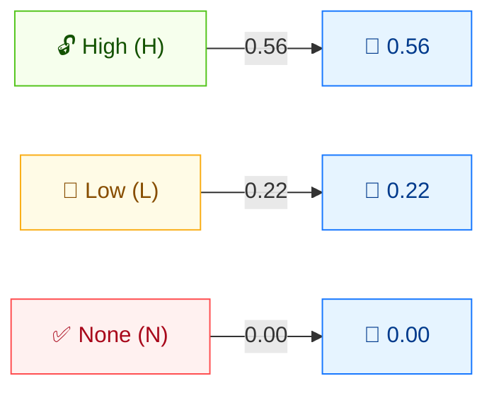

# 🔒 Confidentiality (C)

🟦 Base Metric · 📐 Impact sub-score

## Definition

Confidentiality (C) measures the impact on confidentiality within the impacted component — the degree to which information is disclosed to unauthorized parties. It is one of the three CIA impact metrics that together form the **Impact** sub-score.

## Values

| Short Value | Long Value | Score | Description |
| ----------- | ---------- | ----- | ----------- |
| `H` | High | 0.56 | Total loss of confidentiality, or disclosure of restricted information with a direct, serious impact (e.g. admin password, private keys stolen). |
| `L` | Low  | 0.22 | Some loss of confidentiality; access to some restricted information is obtained but the disclosure is limited and not directly serious. |
| `N` | None | 0.00 | No loss of confidentiality within the impacted component. |

Scores are taken from `pkg/vector/confidentiality.go`.

## Score Map



C, I, and A share the **same score scale** (H=0.56, L=0.22, N=0.00). They feed the ISC (Impact) sub-score: higher values = greater impact. Total loss (H) maximizes impact; no loss (N) contributes nothing.

## Scoring Impact

C feeds the **Impact** sub-score (alongside I and A). The three impact scores are summed: `Impact = 1 − (1 − C) × (1 − I) × (1 − A)`. With C as the only impact, `C:H` yields an Impact of 0.56, `C:L` yields 0.22, and `C:N` yields 0 (no impact, zero score).

## Example

Isolate C by setting I and A to `None`:

```bash
cvss score "CVSS:3.1/AV:N/AC:L/PR:N/UI:N/S:U/C:H/I:N/A:N"  # C:High
cvss score "CVSS:3.1/AV:N/AC:L/PR:N/UI:N/S:U/C:L/I:N/A:N"  # C:Low
cvss score "CVSS:3.1/AV:N/AC:L/PR:N/UI:N/S:U/C:N/I:N/A:N"  # C:None
```

```text
7.5 (High)     # C:H
5.3 (Medium)   # C:L
0.0 (None)     # C:N
```

Go SDK:

```go
package main

import (
    "fmt"

    "github.com/scagogogo/cvss-skills/pkg/vector"
)

func main() {
    h, _ := vector.GetConfidentiality('H')
    l, _ := vector.GetConfidentiality('L')
    n, _ := vector.GetConfidentiality('N')
    fmt.Printf("C:H=%.2f  C:L=%.2f  C:N=%.2f\n", h.GetScore(), l.GetScore(), n.GetScore())
}
```

## Source

[`pkg/vector/confidentiality.go`](https://github.com/scagogogo/cvss-skills/blob/main/pkg/vector/confidentiality.go) — defines `ConfidentialityHigh` (0.56), `ConfidentialityLow` (0.22), `ConfidentialityNone` (0), plus the `MC` modified variants.

## Related

- [Metrics Overview](./)
- [Integrity (I)](./integrity)
- [Availability (A)](./availability)
- [Requirements (CR/IR/AR)](./requirements)
- [Modified Metrics (M*)](./modified)
