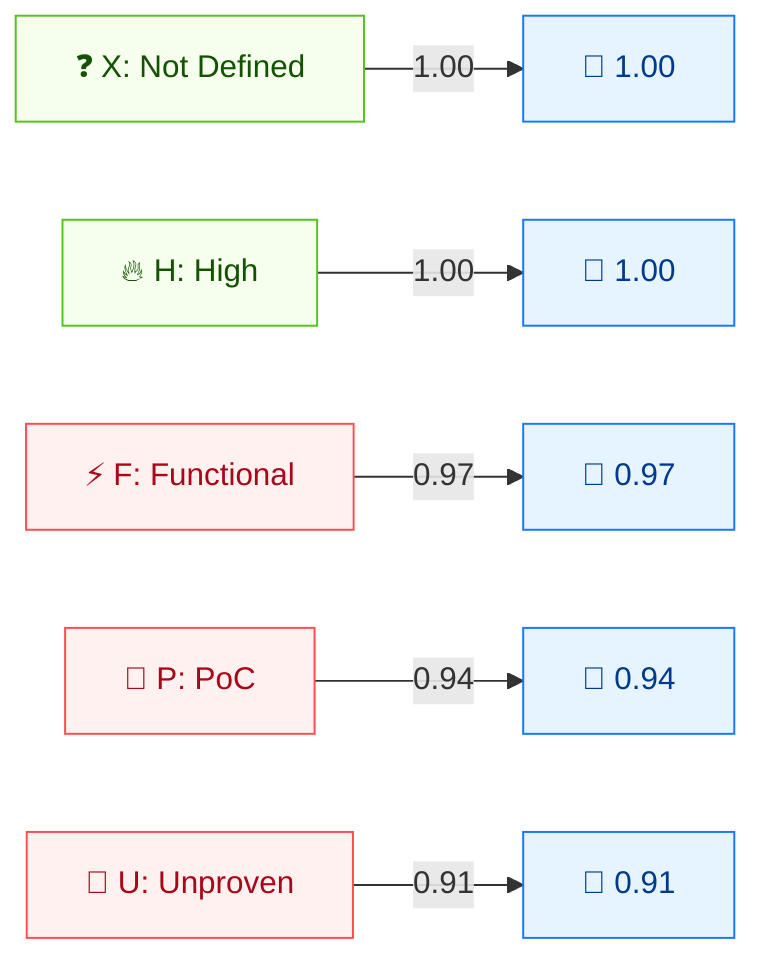

# 🧪 Exploit Code Maturity (E)

🟨 Temporal Metric · 📐 Temporal multiplier

## Definition

Exploit Code Maturity (E) measures the current state of exploit technique or code availability for the vulnerability. It is a **temporal** metric: it changes as exploit code matures over time, from theoretical to reliable, automated attack tools.

## Values

| Short Value | Long Value       | Score | Description |
| ----------- | ---------------- | ----- | ----------- |
| `X` | Not Defined      | 1.00  | Insufficient information; has the same effect as `High`. |
| `H` | High             | 1.00  | Functional autonomous code exists, or no exploit is required; reliable, easy-to-use automated tools are available. |
| `F` | Functional       | 0.97  | Functional exploit code is available that works in most situations. |
| `P` | Proof-of-Concept | 0.94  | Proof-of-concept code exists, or an attack demonstration is not practical for most systems; may need substantial modification. |
| `U` | Unproven         | 0.91  | No exploit code is available, or the exploit is theoretical. |

Scores are taken from `pkg/vector/exploit_code_maturity.go`.

## Score Map



Temporal metrics are **multipliers (≤1)** that can only reduce the Base score. X/H = 1.00 (no reduction). F/P/U = progressively lower, reflecting less mature exploit code.

## Scoring Impact

E is a **multiplier** on the Temporal Score: `Temporal = Base × E × RL × RC`. `High` and `Not Defined` both act as `1.0` (no change); lower maturity values progressively reduce the score. Because `X` (Not Defined) behaves identically to `High`, omitting E leaves the Base Score unchanged through this multiplier.

## Example

Compare E values on a base Critical vulnerability:

```bash
cvss score "CVSS:3.1/AV:N/AC:L/PR:N/UI:N/S:U/C:H/I:H/A:H/E:X"  # Not Defined
cvss score "CVSS:3.1/AV:N/AC:L/PR:N/UI:N/S:U/C:H/I:H/A:H/E:H"  # High
cvss score "CVSS:3.1/AV:N/AC:L/PR:N/UI:N/S:U/C:H/I:H/A:H/E:F"  # Functional
cvss score "CVSS:3.1/AV:N/AC:L/PR:N/UI:N/S:U/C:H/I:H/A:H/E:P"  # Proof-of-Concept
cvss score "CVSS:3.1/AV:N/AC:L/PR:N/UI:N/S:U/C:H/I:H/A:H/E:U"  # Unproven
```

```text
9.8 (Critical)   # E:X  (== High)
9.8 (Critical)   # E:H
9.6 (Critical)   # E:F
9.3 (Critical)   # E:P
9.0 (Critical)   # E:U
```

Go SDK:

```go
package main

import (
    "fmt"

    "github.com/scagogogo/cvss-skills/pkg/vector"
)

func main() {
    for _, v := range []rune{'X', 'H', 'F', 'P', 'U'} {
        e, _ := vector.GetExploitCodeMaturity(v)
        fmt.Printf("E:%c=%.2f\n", v, e.GetScore())
    }
}
```

## Source

[`pkg/vector/exploit_code_maturity.go`](https://github.com/scagogogo/cvss-skills/blob/main/pkg/vector/exploit_code_maturity.go) — defines `ExploitCodeMaturityNotDefined` (1), `ExploitCodeMaturityHigh` (1), `ExploitCodeMaturityFunctional` (0.97), `ExploitCodeMaturityProofOfConcept` (0.94), `ExploitCodeMaturityUnproven` (0.91).

## Related

- [Metrics Overview](./)
- [Remediation Level (RL)](./remediation-level)
- [Report Confidence (RC)](./report-confidence)
