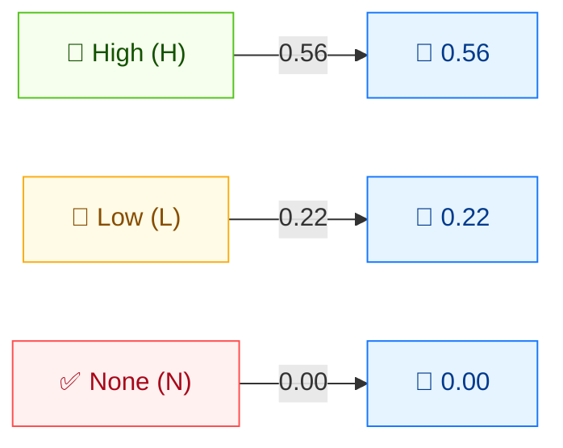

# ✏️ Integrity (I)

🟦 Base Metric · 📐 Impact sub-score

## Definition

Integrity (I) measures the impact on integrity within the impacted component — the degree to which an attacker can modify data, and the seriousness of that modification. It is one of the three CIA impact metrics that together form the **Impact** sub-score.

## Values

| Short Value | Long Value | Score | Description |
| ----------- | ---------- | ----- | ----------- |
| `H` | High | 0.56 | Total loss of integrity, or complete loss of protection (e.g. attacker can modify any/all files protected by the impacted component). |
| `L` | Low  | 0.22 | Modification of data is possible, but the attacker has limited control or the modification is not directly serious. |
| `N` | None | 0.00 | No loss of integrity within the impacted component. |

Scores are taken from `pkg/vector/integrity.go`.

## Score Map



C, I, and A share the **same score scale** (H=0.56, L=0.22, N=0.00). They feed the ISC (Impact) sub-score: higher values = greater impact. Total loss (H) maximizes impact; no loss (N) contributes nothing.

## Scoring Impact

I feeds the **Impact** sub-score. The three impact metrics combine as `Impact = 1 − (1 − C) × (1 − I) × (1 − A)`. With I as the only impact, `I:H` yields an Impact of 0.56, `I:L` yields 0.22, and `I:N` yields 0.

## Example

Isolate I by setting C and A to `None`:

```bash
cvss score "CVSS:3.1/AV:N/AC:L/PR:N/UI:N/S:U/C:N/I:H/A:N"  # I:High
cvss score "CVSS:3.1/AV:N/AC:L/PR:N/UI:N/S:U/C:N/I:L/A:N"  # I:Low
cvss score "CVSS:3.1/AV:N/AC:L/PR:N/UI:N/S:U/C:N/I:N/A:N"  # I:None
```

```text
7.5 (High)     # I:H
5.3 (Medium)   # I:L
0.0 (None)     # I:N
```

Go SDK:

```go
package main

import (
    "fmt"

    "github.com/scagogogo/cvss-skills/pkg/vector"
)

func main() {
    h, _ := vector.GetIntegrity('H')
    l, _ := vector.GetIntegrity('L')
    n, _ := vector.GetIntegrity('N')
    fmt.Printf("I:H=%.2f  I:L=%.2f  I:N=%.2f\n", h.GetScore(), l.GetScore(), n.GetScore())
}
```

## Source

[`pkg/vector/integrity.go`](https://github.com/scagogogo/cvss-skills/blob/main/pkg/vector/integrity.go) — defines `IntegrityHigh` (0.56), `IntegrityLow` (0.22), `IntegrityNone` (0), plus the `MI` modified variants.

## Related

- [Metrics Overview](./)
- [Confidentiality (C)](./confidentiality)
- [Availability (A)](./availability)
- [Requirements (CR/IR/AR)](./requirements)
- [Modified Metrics (M*)](./modified)
