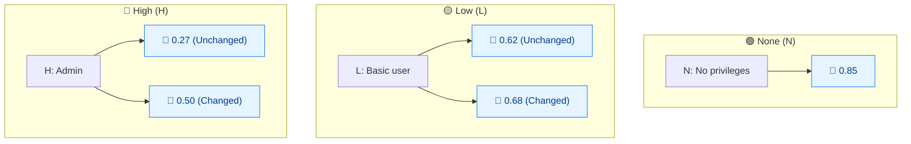

# 🔑 Privileges Required (PR)

🟦 Base Metric · 📐 Scoring impact (Scope-dependent)

## Definition

Privileges Required (PR) describes the level of privileges an attacker must possess before successfully exploiting the vulnerability. `None` means the attacker is unauthenticated; `Low` means a basic user; `High` means administrative control over the vulnerable component.

## Values

PR is unique among Base metrics: its score depends on whether **Scope** is `Changed`. The table lists both values.

| Short Value | Long Value | Score (Scope Unchanged) | Score (Scope Changed) | Description |
| ----------- | ---------- | ----------------------- | --------------------- | ----------- |
| `N` | None  | 0.85 | 0.85 | The attacker is unauthorized prior to attack; no access to settings or files is required. |
| `L` | Low   | 0.62 | 0.68 | The attacker requires basic user privileges affecting only their own settings/files. |
| `H` | High  | 0.27 | 0.50 | The attacker requires significant (administrative) control over the vulnerable component. |

Scores are taken from `pkg/vector/privileges_required.go` (the `GetPrivilegesRequiredScore` helper).

## Score Map



PR is **scope-aware**: L/H scores differ based on Scope. Unchanged = lower scores for L/H (harder to exploit). Changed = higher scores (impact spills beyond vulnerable component).

## Scoring Impact

PR is a multiplier on the **Exploitability** sub-score. Requiring no privileges (`None`, 0.85) keeps the score highest; requiring admin (`High`) dramatically lowers it. Because the value changes with Scope, a vulnerability that crosses a security boundary (`S:C`) is penalised less for requiring privileges — the cross-boundary impact already captures the severity.

Use `GetPrivilegesRequiredScore(pr, scopeChanged)` to get the correct value; the static `Score` field on `PrivilegesRequiredLow`/`High` holds only the Scope-Unchanged value (0.62 / 0.27).

## Example

Compare PR values with Scope Unchanged vs Changed:

```bash
# Scope Unchanged
cvss score "CVSS:3.1/AV:N/AC:L/PR:N/UI:N/S:U/C:H/I:H/A:H"  # PR:N
cvss score "CVSS:3.1/AV:N/AC:L/PR:L/UI:N/S:U/C:H/I:H/A:H"  # PR:L
cvss score "CVSS:3.1/AV:N/AC:L/PR:H/UI:N/S:U/C:H/I:H/A:H"  # PR:H

# Scope Changed
cvss score "CVSS:3.1/AV:N/AC:L/PR:N/UI:N/S:C/C:H/I:H/A:H"  # PR:N
cvss score "CVSS:3.1/AV:N/AC:L/PR:L/UI:N/S:C/C:H/I:H/A:H"  # PR:L
cvss score "CVSS:3.1/AV:N/AC:L/PR:H/UI:N/S:C/C:H/I:H/A:H"  # PR:H
```

```text
9.8 (Critical)   # PR:N  S:U
8.8 (High)       # PR:L  S:U
7.2 (High)       # PR:H  S:U
10.0 (Critical)  # PR:N  S:C
10.0 (Critical)  # PR:L  S:C
9.1 (Critical)   # PR:H  S:C
```

Go SDK — always use the scope-aware helper:

```go
package main

import (
    "fmt"

    "github.com/scagogogo/cvss-skills/pkg/vector"
)

func main() {
    low, _ := vector.GetPrivilegesRequired('L')
    // Correct value, scope-aware:
    fmt.Println(vector.GetPrivilegesRequiredScore(low, false)) // 0.62 (S:U)
    fmt.Println(vector.GetPrivilegesRequiredScore(low, true))  // 0.68 (S:C)
}
```

## Source

[`pkg/vector/privileges_required.go`](https://github.com/scagogogo/cvss-skills/blob/main/pkg/vector/privileges_required.go) — defines the presets and the `GetPrivilegesRequiredScore(pr, scopeChanged)` helper that resolves the correct value. Also see `IsScopeChanged` / `IsModifiedScopeChanged`.

## Related

- [Metrics Overview](./)
- [Scope (S)](./scope)
- [Modified Metrics (M*)](./modified)
