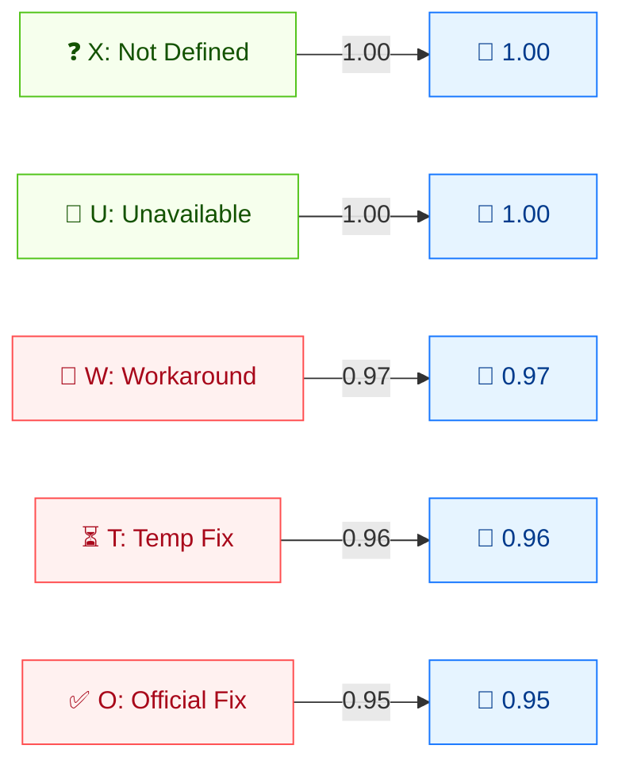

# 🛠️ Remediation Level (RL)

🟨 Temporal Metric · 📐 Temporal multiplier

## Definition

Remediation Level (RL) captures the state of remediation available for the vulnerability. It is a **temporal** metric: as fixes are released (workaround → temporary fix → official fix), the score decreases, reflecting reduced real-world risk.

## Values

| Short Value | Long Value    | Score | Description |
| ----------- | ------------- | ----- | ----------- |
| `X` | Not Defined  | 1.00  | Insufficient information; same effect as `Unavailable`. |
| `U` | Unavailable  | 1.00  | No solution is available or it is impossible to apply. |
| `W` | Workaround   | 0.97  | An unofficial, non-vendor solution exists (user patch or mitigation steps). |
| `T` | Temporary Fix | 0.96  | An official but temporary fix exists (vendor hotfix, tool, or workaround). |
| `O` | Official Fix | 0.95  | A complete vendor solution is available (official patch or upgrade). |

Scores are taken from `pkg/vector/remediation_level.go`.

## Score Map



Temporal multipliers (≤1): the more remediation available, the **lower** the score. X/U = 1.00 (no fix, no reduction). W/T/O = progressively lower, reflecting reduced urgency.

## Scoring Impact

RL is a **multiplier** on the Temporal Score: `Temporal = Base × E × RL × RC`. `Unavailable` and `Not Defined` both act as `1.0` (no change); better remediation progressively reduces the score. Because `X` (Not Defined) behaves identically to `Unavailable`, omitting RL leaves the Base Score unchanged through this multiplier.

## Example

```bash
cvss score "CVSS:3.1/AV:N/AC:L/PR:N/UI:N/S:U/C:H/I:H/A:H/RL:X"  # Not Defined
cvss score "CVSS:3.1/AV:N/AC:L/PR:N/UI:N/S:U/C:H/I:H/A:H/RL:U"  # Unavailable
cvss score "CVSS:3.1/AV:N/AC:L/PR:N/UI:N/S:U/C:H/I:H/A:H/RL:W"  # Workaround
cvss score "CVSS:3.1/AV:N/AC:L/PR:N/UI:N/S:U/C:H/I:H/A:H/RL:T"  # Temporary Fix
cvss score "CVSS:3.1/AV:N/AC:L/PR:N/UI:N/S:U/C:H/I:H/A:H/RL:O"  # Official Fix
```

```text
9.8 (Critical)   # RL:X  (== Unavailable)
9.8 (Critical)   # RL:U
9.6 (Critical)   # RL:W
9.5 (Critical)   # RL:T
9.4 (Critical)   # RL:O
```

Go SDK:

```go
package main

import (
    "fmt"

    "github.com/scagogogo/cvss-skills/pkg/vector"
)

func main() {
    for _, v := range []rune{'X', 'U', 'W', 'T', 'O'} {
        rl, _ := vector.GetRemediationLevel(v)
        fmt.Printf("RL:%c=%.2f\n", v, rl.GetScore())
    }
}
```

## Source

[`pkg/vector/remediation_level.go`](https://github.com/scagogogo/cvss-skills/blob/main/pkg/vector/remediation_level.go) — defines `RemediationLevelNotDefined` (1), `RemediationLevelUnavailable` (1), `RemediationLevelWorkaround` (0.97), `RemediationLevelTemporaryFix` (0.96), `RemediationLevelOfficialFix` (0.95).

## Related

- [Metrics Overview](./)
- [Exploit Code Maturity (E)](./exploit-code-maturity)
- [Report Confidence (RC)](./report-confidence)
