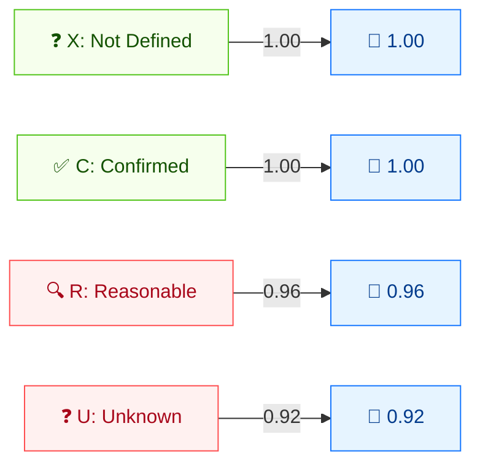

# 🔎 Report Confidence (RC)

🟨 Temporal Metric · 📐 Temporal multiplier

## Definition

Report Confidence (RC) captures the degree of confidence in the existence of the vulnerability and the credibility of the technical details. It is a **temporal** metric: as a report is independently reproduced and confirmed, RC rises.

## Values

| Short Value | Long Value   | Score | Description |
| ----------- | ------------ | ----- | ----------- |
| `X` | Not Defined | 1.00  | Insufficient information; same effect as `Confirmed`. |
| `C` | Confirmed   | 1.00  | Detailed reports exist or functional reproduction is possible; source is independently verified or vendor-confirmed. |
| `R` | Reasonable  | 0.96  | Significant details are published with reasonable confidence the bug is reproducible, but not fully confirmed. |
| `U` | Unknown     | 0.92  | Reports indicate a vulnerability but the cause is unknown or reports differ; little confidence in validity. |

Scores are taken from `pkg/vector/report_confidence.go`.

## Score Map



Temporal multipliers (≤1): lower confidence = lower score. X/C = 1.00 (fully trusted). R/U = reduce score, reflecting uncertainty.

## Scoring Impact

RC is a **multiplier** on the Temporal Score: `Temporal = Base × E × RL × RC`. `Confirmed` and `Not Defined` both act as `1.0` (no change); lower confidence progressively reduces the score. Because `X` (Not Defined) behaves identically to `Confirmed`, omitting RC leaves the Base Score unchanged through this multiplier.

## Example

```bash
cvss score "CVSS:3.1/AV:N/AC:L/PR:N/UI:N/S:U/C:H/I:H/A:H/RC:X"  # Not Defined
cvss score "CVSS:3.1/AV:N/AC:L/PR:N/UI:N/S:U/C:H/I:H/A:H/RC:C"  # Confirmed
cvss score "CVSS:3.1/AV:N/AC:L/PR:N/UI:N/S:U/C:H/I:H/A:H/RC:R"  # Reasonable
cvss score "CVSS:3.1/AV:N/AC:L/PR:N/UI:N/S:U/C:H/I:H/A:H/RC:U"  # Unknown
```

```text
9.8 (Critical)   # RC:X  (== Confirmed)
9.8 (Critical)   # RC:C
9.5 (Critical)   # RC:R
9.1 (Critical)   # RC:U
```

Go SDK:

```go
package main

import (
    "fmt"

    "github.com/scagogogo/cvss-skills/pkg/vector"
)

func main() {
    for _, v := range []rune{'X', 'C', 'R', 'U'} {
        rc, _ := vector.GetReportConfidence(v)
        fmt.Printf("RC:%c=%.2f\n", v, rc.GetScore())
    }
}
```

## Source

[`pkg/vector/report_confidence.go`](https://github.com/scagogogo/cvss-skills/blob/main/pkg/vector/report_confidence.go) — defines `ReportConfidenceNotDefined` (1), `ReportConfidenceConfirmed` (1), `ReportConfidenceReasonable` (0.96), `ReportConfidenceUnknown` (0.92).

## Related

- [Metrics Overview](./)
- [Exploit Code Maturity (E)](./exploit-code-maturity)
- [Remediation Level (RL)](./remediation-level)
