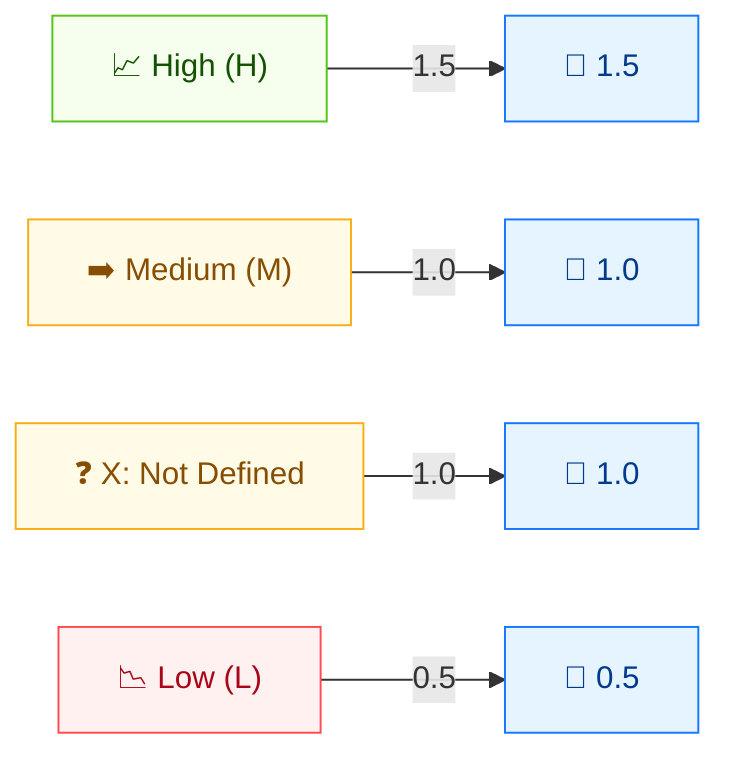

# ⚖️ Security Requirements (CR / IR / AR)

🟩 Environmental Metric · 📐 Impact weight (1.5 / 1 / 0.5 / 1)

## Definition

The three Requirement metrics — **CR** (Confidentiality Requirement), **IR** (Integrity Requirement), and **AR** (Availability Requirement) — let an organization express how important each CIA dimension is to *its* environment. They are **environmental** metrics: they re-weight the base CIA impact to reflect the organization's actual priorities, not the generic worst case.

## Values

Each of CR, IR, AR takes the same four values with the same scores.

| Short Value | Long Value   | Score | Description |
| ----------- | ------------ | ----- | ----------- |
| `X` | Not Defined | 1.0   | Insufficient information; same effect as `Medium`. |
| `H` | High        | 1.5   | Loss of this dimension is likely to have a **catastrophic** adverse effect on the organization. |
| `M` | Medium      | 1.0   | Loss is likely to have a **serious** adverse effect. |
| `L` | Low         | 0.5   | Loss is likely to have only a **limited** adverse effect. |

Scores are taken from `pkg/vector/confidentiality_requirement.go`, `integrity_requirement.go`, and `availability_requirement.go`.

## Score Map



CR/IR/AR are **Environmental weight modifiers**. H=1.5 **amplifies** impact; L=0.5 **reduces** it; M/X=1.0 leave it unchanged. They scale the corresponding CIA values.

## Scoring Impact

The Requirement metrics are **weights** multiplied onto the corresponding base impact value during the Environmental Score computation. `High` (1.5) amplifies that impact dimension; `Low` (0.5) dampens it; `Medium` and `Not Defined` (1.0) leave it unchanged. A `CR:H` on a confidentiality-impacting vulnerability can lift a High base score into Critical territory for that environment.

Because `X` (Not Defined) behaves identically to `Medium` (both 1.0), omitting a Requirement metric leaves the impact unchanged.

## Example

Isolate CR by setting I and A impacts to `None`:

```bash
cvss score "CVSS:3.1/AV:N/AC:L/PR:N/UI:N/S:U/C:H/I:N/A:N/CR:X"  # Not Defined (== Medium)
cvss score "CVSS:3.1/AV:N/AC:L/PR:N/UI:N/S:U/C:H/I:N/A:N/CR:H"  # High
cvss score "CVSS:3.1/AV:N/AC:L/PR:N/UI:N/S:U/C:H/I:N/A:N/CR:M"  # Medium
cvss score "CVSS:3.1/AV:N/AC:L/PR:N/UI:N/S:U/C:H/I:N/A:N/CR:L"  # Low
```

```text
7.5 (High)       # CR:X  (== Medium)
9.3 (Critical)   # CR:H  (weight 1.5)
7.5 (High)       # CR:M  (weight 1.0)
5.7 (Medium)     # CR:L  (weight 0.5)
```

`CR:H` lifts the base 7.5 (High) up to 9.3 (Critical); `CR:L` pulls it down to 5.7 (Medium) — the same vulnerability scored very differently depending on the environment's need for confidentiality.

Go SDK:

```go
package main

import (
    "fmt"

    "github.com/scagogogo/cvss-skills/pkg/vector"
)

func main() {
    cr, _ := vector.GetConfidentialityRequirement('H')
    fmt.Println(cr.GetScore()) // 1.5
}
```

## Source

- [`pkg/vector/confidentiality_requirement.go`](https://github.com/scagogogo/cvss-skills/blob/main/pkg/vector/confidentiality_requirement.go) — `CR`: High 1.5 / Medium 1 / Low 0.5 / Not Defined 1.
- [`pkg/vector/integrity_requirement.go`](https://github.com/scagogogo/cvss-skills/blob/main/pkg/vector/integrity_requirement.go) — `IR`: same scale.
- [`pkg/vector/availability_requirement.go`](https://github.com/scagogogo/cvss-skills/blob/main/pkg/vector/availability_requirement.go) — `AR`: same scale.

## Related

- [Metrics Overview](./)
- [Confidentiality (C)](./confidentiality)
- [Integrity (I)](./integrity)
- [Availability (A)](./availability)
- [Modified Metrics (M*)](./modified)
