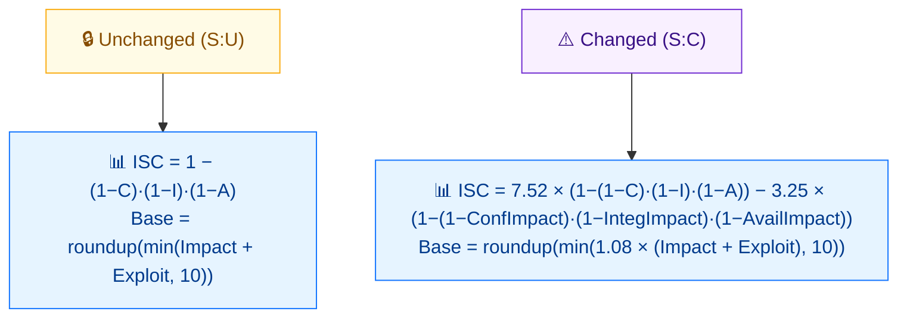

# 🔀 Scope (S)

🟦 Base Metric · 📐 Scoring impact (rewires the formula)

## Definition

Scope (S) captures whether a vulnerability affects resources managed by the **same** security authority as the vulnerable component (`Unchanged`) or resources managed by a **different** security authority (`Changed`). When the impacted component differs from the vulnerable component and is governed by a different authority, Scope is `Changed`.

## Values

| Short Value | Long Value | Score | Description |
| ----------- | ---------- | ----- | ----------- |
| `U` | Unchanged | 0 | An exploited vulnerability can only affect resources managed by the same security authority as the vulnerable component. |
| `C` | Changed   | 0 | An exploited vulnerability can affect resources beyond the security authority of the vulnerable component (vulnerable and impacted components differ and are managed by different authorities). |

Scope itself has no direct numeric score (both are `0`); its effect is structural.

## Score Map



Scope is **structural**, not numeric (both values = 0). But it changes the **ISC (Impact) formula** and applies a **`1.08` multiplier** when Changed — so S:C produces markedly higher scores for the same C/I/A values.

## Scoring Impact

Scope does not contribute a multiplier of its own. Instead it **rewires the scoring formula**:

1. It changes which **Privileges Required (PR)** value is used — `S:C` uses higher PR scores (e.g. `PR:L` 0.68 instead of 0.62). See [PR](./privileges-required).
2. The Base Score formula has separate branches for `S:U` and `S:C`; the `S:C` branch applies a different rounding (`ceil` of `min(...)` after a different combine step), which is why `S:C` typically yields a higher score than `S:U` for the same other metrics.

## Example

```bash
cvss score "CVSS:3.1/AV:N/AC:L/PR:N/UI:N/S:U/C:H/I:H/A:H"  # Scope Unchanged
cvss score "CVSS:3.1/AV:N/AC:L/PR:N/UI:N/S:C/C:H/I:H/A:H"  # Scope Changed
```

```text
9.8 (Critical)   # S:U
10.0 (Critical)  # S:C
```

Go SDK — detect the scope to feed PR correctly:

```go
package main

import (
    "fmt"

    "github.com/scagogogo/cvss-skills/pkg/vector"
)

func main() {
    scope, _ := vector.GetScope('C')
    fmt.Println(vector.IsScopeChanged(scope)) // true
}
```

## Source

[`pkg/vector/scope.go`](https://github.com/scagogogo/cvss-skills/blob/main/pkg/vector/scope.go) — defines `ScopeUnchanged` and `ScopeChanged`, plus the `MS` modified variants. The `IsScopeChanged` / `IsModifiedScopeChanged` helpers live in [`pkg/vector/privileges_required.go`](https://github.com/scagogogo/cvss-skills/blob/main/pkg/vector/privileges_required.go).

## Related

- [Metrics Overview](./)
- [Privileges Required (PR)](./privileges-required)
- [Modified Metrics (M*)](./modified)
