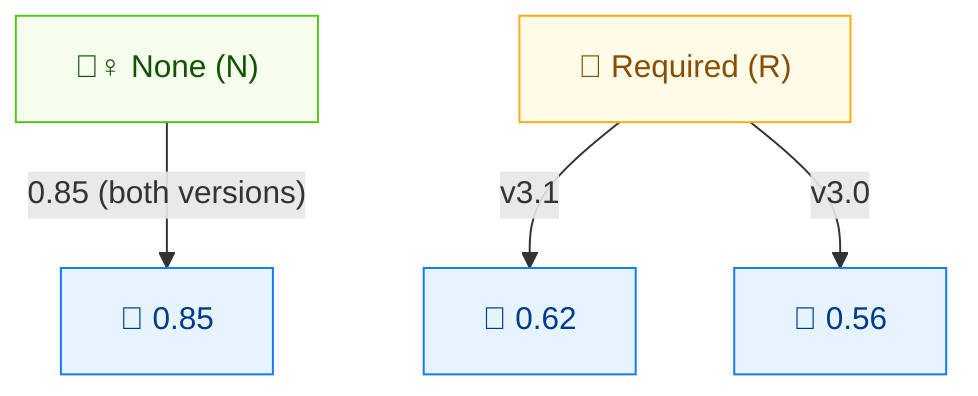

# 🤝 User Interaction (UI)

🟦 Base Metric · 📐 Scoring impact (version-dependent)

## Definition

User Interaction (UI) captures whether exploitation requires a user (other than the attacker) to perform some action. `None` means the vulnerable system can be exploited without any user involvement; `Required` means a user must take some action (e.g. open a document, click a link) before the vulnerability can be exploited.

## Values

| Short Value | Long Value | Score (v3.1) | Score (v3.0) | Description |
| ----------- | ---------- | ------------ | ------------ | ----------- |
| `N` | None     | 0.85 | 0.85 | The vulnerable system can be exploited without interaction from any user. |
| `R` | Required | 0.62 | 0.56 | Successful exploitation requires a user to take some action before the vulnerability can be exploited. |

Scores are taken from `pkg/vector/user_interaction.go` (the `GetUserInteractionScore` helper). The static `Score` field on `UserInteractionRequired` is the v3.1 value (0.62).

## Score Map



None = no user interaction needed (0.85, more dangerous). Required = a user must act first. **Version-aware**: UI:R scores 0.62 in v3.1 but 0.56 in v3.0 (v3.0 penalizes Required more heavily).

## Scoring Impact

UI is a multiplier on the **Exploitability** sub-score. The key subtlety: **`UI:R` scores 0.56 in CVSS v3.0 but 0.62 in CVSS v3.1**. The v3.1 specification raised the value to better reflect that requiring user interaction is a milder deterrent than originally modelled. `UI:N` is identical in both versions (0.85).

Always read the version prefix from the vector string and call `GetUserInteractionScore(ui, minorVersion)` — `minorVersion` is `0` for v3.0 and `1` for v3.1.

## Example

Compare `UI:N` vs `UI:R` across both CVSS versions:

```bash
# CVSS v3.1
cvss score "CVSS:3.1/AV:N/AC:L/PR:N/UI:N/S:U/C:H/I:H/A:H"  # UI:N
cvss score "CVSS:3.1/AV:N/AC:L/PR:N/UI:R/S:U/C:H/I:H/A:H"  # UI:R (0.62)

# CVSS v3.0
cvss score "CVSS:3.0/AV:N/AC:L/PR:N/UI:N/S:U/C:H/I:H/A:H"  # UI:N
cvss score "CVSS:3.0/AV:N/AC:L/PR:N/UI:R/S:U/C:H/I:H/A:H"  # UI:R (0.56)
```

```text
9.8 (Critical)   # UI:N  v3.1
8.8 (High)       # UI:R  v3.1  (0.62)
9.8 (Critical)   # UI:N  v3.0
8.5 (High)       # UI:R  v3.0  (0.56)
```

Note the 0.3-point gap between `UI:R` in v3.0 (8.5) and v3.1 (8.8) — entirely due to the score change from 0.56 → 0.62.

Go SDK — pass the CVSS minor version:

```go
package main

import (
    "fmt"

    "github.com/scagogogo/cvss-skills/pkg/vector"
)

func main() {
    req, _ := vector.GetUserInteraction('R')
    fmt.Println(vector.GetUserInteractionScore(req, 0)) // 0.56 (v3.0)
    fmt.Println(vector.GetUserInteractionScore(req, 1)) // 0.62 (v3.1)
}
```

## Source

[`pkg/vector/user_interaction.go`](https://github.com/scagogogo/cvss-skills/blob/main/pkg/vector/user_interaction.go) — defines `UserInteractionNone` (0.85) and `UserInteractionRequired` (static 0.62), plus the `GetUserInteractionScore(ui, minorVersion)` helper that handles the v3.0/v3.1 difference.

## Related

- [Metrics Overview](./)
- [Attack Vector (AV)](./attack-vector)
- [Modified Metrics (M*)](./modified)
