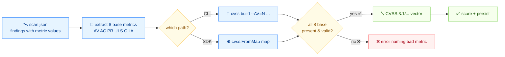

# 🛠️ Build a CVSS vector from scan results

## Problem

Your scanner emits raw metric values (attack vector, complexity, privileges, …) rather than a CVSS vector string. You need to assemble them into a canonical `CVSS:3.1/...` vector you can score and persist.

## Solution

Here's the flow:



### 1. Represent the scan output

`scan.json` — one finding per item, each with the 8 base metric values using CVSS short codes:

```json
{
  "target": "web-server-01",
  "findings": [
    {
      "id": "CVE-2024-1234",
      "attack_vector": "N", "attack_complexity": "L",
      "privileges_required": "N", "user_interaction": "N",
      "scope": "U", "confidentiality": "H",
      "integrity": "H", "availability": "H"
    },
    {
      "id": "CVE-2024-5678",
      "attack_vector": "L", "attack_complexity": "H",
      "privileges_required": "H", "user_interaction": "R",
      "scope": "U", "confidentiality": "L",
      "integrity": "L", "availability": "L"
    }
  ]
}
```

### 2. CLI: `build` per finding

`build` takes every metric as a flag and emits the canonical vector:

```bash
cvss build \
  --AV=N --AC=L --PR=N --UI=N --S=U --C=H --I=H --A=H
```

```text
CVSS:3.1/AV:N/AC:L/PR:N/UI:N/S:U/C:H/I:H/A:H
```

Temporal and environmental metrics are optional flags. Pass them to extend the vector:

```bash
cvss build \
  --AV=N --AC=L --PR=N --UI=N --S=U --C=H --I=H --A=H \
  --E=F --RL=T --RC=C
```

```text
CVSS:3.1/AV:N/AC:L/PR:N/UI:N/S:U/C:H/I:H/A:H/E:F/RL:T/RC:C
```

Use `--cvss-version 3.0` for a v3.0 vector.

### 3. Go SDK: `FromMap` for each finding

`cvss.FromMap` takes a `map[string]string` keyed by short metric name (e.g. `"AV": "N"`) plus a `"version"` entry. It's the natural fit for a JSON finding decoded into a map.

```go
package main

import (
	"encoding/json"
	"fmt"

	"github.com/scagogogo/cvss-skills/pkg/cvss"
)

type scanReport struct {
	Target   string    `json:"target"`
	Findings []finding `json:"findings"`
}

type finding struct {
	ID                string `json:"id"`
	AttackVector      string `json:"attack_vector"`
	AttackComplexity  string `json:"attack_complexity"`
	PrivilegesRequired string `json:"privileges_required"`
	UserInteraction   string `json:"user_interaction"`
	Scope             string `json:"scope"`
	Confidentiality   string `json:"confidentiality"`
	Integrity         string `json:"integrity"`
	Availability      string `json:"availability"`
}

func main() {
	raw := []byte(`{
	  "target": "web-server-01",
	  "findings": [
	    {"id":"CVE-2024-1234","attack_vector":"N","attack_complexity":"L","privileges_required":"N","user_interaction":"N","scope":"U","confidentiality":"H","integrity":"H","availability":"H"},
	    {"id":"CVE-2024-5678","attack_vector":"L","attack_complexity":"H","privileges_required":"H","user_interaction":"R","scope":"U","confidentiality":"L","integrity":"L","availability":"L"}
	  ]
	}`)

	var report scanReport
	if err := json.Unmarshal(raw, &report); err != nil {
		panic(err)
	}

	for _, f := range report.Findings {
		cv, err := cvss.FromMap(map[string]string{
			"version": "3.1",
			"AV": f.AttackVector, "AC": f.AttackComplexity,
			"PR": f.PrivilegesRequired, "UI": f.UserInteraction,
			"S": f.Scope, "C": f.Confidentiality,
			"I": f.Integrity, "A": f.Availability,
		})
		if err != nil {
			fmt.Printf("%s: %v\n", f.ID, err)
			continue
		}
		fmt.Printf("%s -> %s\n", f.ID, cv.String())
	}
}
```

```text
CVE-2024-1234 -> CVSS:3.1/AV:N/AC:L/PR:N/UI:N/S:U/C:H/I:H/A:H
CVE-2024-5678 -> CVSS:3.1/AV:L/AC:H/PR:H/UI:R/S:U/C:L/I:L/A:L
```

`FromMap` validates every value, so a typo like `"AV": "X"` returns an error naming the bad metric — no silent garbage vectors.

## Discussion

- **All 8 base metrics are required.** `build` errors if any base flag is missing; `FromMap` returns an error listing every bad/missing metric. Partial vectors are a different tool — see [Score a partial vector](/recipes/score-partial-vector).
- **Metric names are the short codes.** Use `AV`, `AC`, `PR`, `UI`, `S`, `C`, `I`, `A` for base; `E`, `RL`, `RC` for temporal; `CR`, `IR`, `AR`, `MAV`, `MAC`, `MPR`, `MUI`, `MS`, `MC`, `MI`, `MA` for environmental. See [`enumerate`](/cli/commands/enumerate) for the full table.
- **`FromVectorValues` for positional args.** If you have `key:value` pairs rather than a map, `cvss.FromVectorValues("3.1", "AV:N", "AC:L", ...)` does the same thing without a map.
- **Not what you want?** To turn a vector *back* into a map (the reverse), use [`map`](/cli/commands/map) on the CLI or `Cvss3x.ToMap()` in Go.

## See Also

- [`build`](/cli/commands/build) — the CLI command
- [From Map](/sdk/from-map) — `FromMap` / `FromVectorValues` / `ToMap` reference
- [`enumerate`](/cli/commands/enumerate) — valid metric names and values
- [Score a partial vector](/recipes/score-partial-vector)
- [Export to JSON](/recipes/export-to-json)
