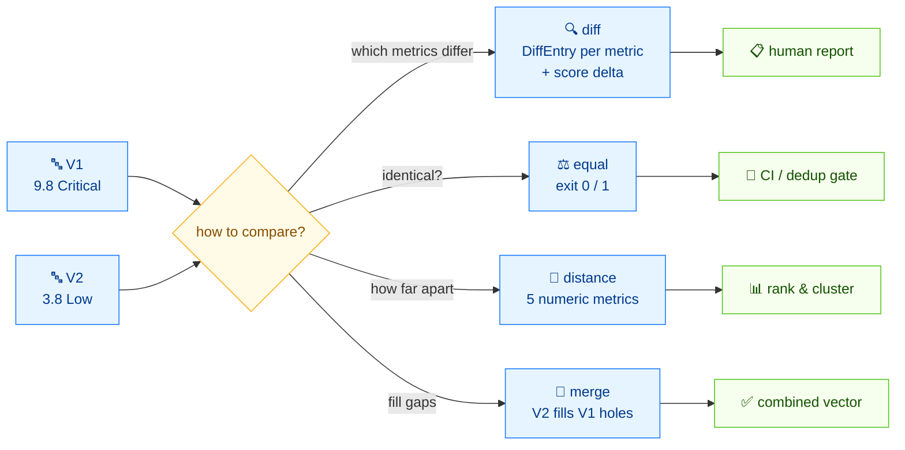

# 🔀 Compare two CVSS vectors and score the delta

## Problem

Two advisories describe the same CVE with slightly different vectors — or a re-analysis changed a metric — and you need to see exactly which metrics differ and how much the score moved.

## Solution

Here's the flow — two vectors, four ways to compare:



### CLI: `diff`

```bash
cvss diff \
  "CVSS:3.1/AV:N/AC:L/PR:N/UI:N/S:U/C:H/I:H/A:H" \
  "CVSS:3.1/AV:L/AC:H/PR:H/UI:R/S:U/C:L/I:L/A:L"
```

```text
Found 7 difference(s):

  AV: N (Network) → L (Local)
  AC: L (Low) → H (High)
  PR: N (None) → H (High)
  UI: N (None) → R (Required)
  C: H (High) → L (Low)
  I: H (High) → L (Low)
  A: H (High) → L (Low)

Score: 9.8 (Critical) → 3.8 (Low)  [Δ=-6.0]
```

For machine-readable output, use `--format json`:

```bash
cvss diff --format json \
  "CVSS:3.1/AV:N/AC:L/PR:N/UI:N/S:U/C:H/I:H/A:H" \
  "CVSS:3.1/AV:L/AC:H/PR:H/UI:R/S:U/C:L/I:L/A:L"
```

```json
{
  "differences": [
    { "metric": "AV", "v1": "N", "v1_long": "Network", "v2": "L", "v2_long": "Local" },
    { "metric": "AC", "v1": "L", "v1_long": "Low", "v2": "H", "v2_long": "High" },
    { "metric": "PR", "v1": "N", "v1_long": "None", "v2": "H", "v2_long": "High" },
    { "metric": "UI", "v1": "N", "v1_long": "None", "v2": "R", "v2_long": "Required" },
    { "metric": "C", "v1": "H", "v1_long": "High", "v2": "L", "v2_long": "Low" },
    { "metric": "I", "v1": "H", "v1_long": "High", "v2": "L", "v2_long": "Low" },
    { "metric": "A", "v1": "H", "v1_long": "High", "v2": "L", "v2_long": "Low" }
  ],
  "score1": 9.8,
  "score2": 3.8,
  "score_delta": -6.000000000000001,
  "severity1": "Critical",
  "severity2": "Low"
}
```

### Go SDK: `Cvss3x.Diff`

`Diff(other *Cvss3x) []DiffEntry` walks base, temporal, and environmental metrics and returns one entry per metric where the short values differ (including set-vs-unset differences).

```go
package main

import (
	"fmt"

	"github.com/scagogogo/cvss-skills/pkg/parser"
)

func main() {
	a, _ := parser.ParseString("CVSS:3.1/AV:N/AC:L/PR:N/UI:N/S:U/C:H/I:H/A:H")
	b, _ := parser.ParseString("CVSS:3.1/AV:L/AC:H/PR:H/UI:R/S:U/C:L/I:L/A:L")

	for _, d := range a.Diff(b) {
		fmt.Println(d.String()) // e.g. "AV: N vs L"
	}
}
```

```text
AV: N vs L
AC: L vs H
PR: N vs H
UI: N vs R
C: H vs L
I: H vs L
A: H vs L
```

`DiffEntry` carries `Metric`, `V1`, `V2`, `V1Long`, `V2Long`, so you can build your own report format from the struct fields rather than the `.String()` form.

## Discussion

- **A metric set on one side but not the other counts as a diff.** `Diff` emits an entry with `"-"` for the unset side, so comparing a base-only vector against one with temporal metrics flags E/RL/RC.
- **Score delta sign.** `score_delta` is `score2 - score1` (here `3.8 - 9.8 = -6.0`); a negative delta means the second vector is less severe.
- **`Diff` compares short values, not scores.** Two `PR:L` values are "equal" to `Diff` even though PR's score depends on Scope — use the [distance metrics](/recipes/measure-similarity) when you care about score-space differences.
- **Not what you want?** For a numeric distance/similarity, see [Measure similarity](/recipes/measure-similarity). For merging two vectors into one, use [`merge`](/cli/commands/merge) / `Cvss3x.Merge`.

## See Also

- [`diff`](/cli/commands/diff) — the CLI command
- [Distance & Comparison](/sdk/diff) — `Diff` / `DiffEntry` reference
- [Measure similarity](/recipes/measure-similarity)
- [`merge`](/cli/commands/merge) — combine two vectors
