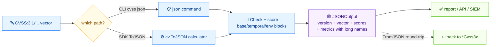

# 📄 Export a CVSS vector to structured JSON

## Problem

You need a structured JSON document for one vector — the vector string, base score, severity, and every metric with its long name — to feed a dashboard, an API response, or a SIEM ingestion pipeline.

## Solution

Here's the flow:



### CLI: `json`

```bash
cvss json "CVSS:3.1/AV:N/AC:L/PR:N/UI:N/S:U/C:H/I:H/A:H"
```

```json
{
  "version": "3.1",
  "vectorString": "CVSS:3.1/AV:N/AC:L/PR:N/UI:N/S:U/C:H/I:H/A:H",
  "baseScore": 9.8,
  "baseSeverity": "Critical",
  "metrics": {
    "base": {
      "attackVector": "Network",
      "attackComplexity": "Low",
      "privilegesRequired": "None",
      "userInteraction": "None",
      "scope": "Unchanged",
      "confidentiality": "High",
      "integrity": "High",
      "availability": "High",
      "exploitabilityScore": 3.8870427750000003,
      "impactScore": 5.873118720000001
    }
  }
}
```

The output is compact. Pipe through `jq .` to pretty-print, or `jq -c .` to force one-line NDJSON:

```bash
cvss json "CVSS:3.1/AV:N/AC:L/PR:N/UI:N/S:U/C:H/I:H/A:H" | jq -c .
```

A vector with temporal metrics adds `temporalScore`, `temporalSeverity`, and a `metrics.temporal` block; environmental metrics add the `environmental` block and `environmentalScore`.

### Go SDK: `Cvss3x.ToJSON`

`ToJSON` returns the same structure as `encoding/json`-compatible bytes. Pass `nil` for the calculator and it builds one internally.

```go
package main

import (
	"fmt"

	"github.com/scagogogo/cvss-skills/pkg/cvss"
	"github.com/scagogogo/cvss-skills/pkg/parser"
)

func main() {
	cv, err := parser.ParseString("CVSS:3.1/AV:N/AC:L/PR:N/UI:N/S:U/C:H/I:H/A:H")
	if err != nil {
		panic(err)
	}

	calc := cvss.NewCalculator(cv)
	raw, err := cv.ToJSON(calc)
	if err != nil {
		panic(err)
	}
	fmt.Println(string(raw))
}
```

`ToJSON` calls `calculator.cvss.Check()` first, so it returns an error on incomplete base metrics — the same guarantee as `json` on the CLI.

::: tip Round-trip with FromJSON
`cvss.FromJSON(data []byte) (*Cvss3x, error)` parses JSON produced by `ToJSON` back into a `Cvss3x`. Useful for storing enriched records and reloading them without re-parsing the vector string.
:::

## Discussion

- **Score field is always base.** `baseScore` is the base score even when temporal/environmental metrics are present; `temporalScore` and `environmentalScore` are separate optional fields. Don't read `baseScore` as "the score" when you need the environmental score.
- **Long names, not short codes.** The JSON uses `"Network"`, not `"N"`. If you need short codes, use `cvss map` on the CLI or `Cvss3x.ToMap()` in Go.
- **Pretty-printing in Go.** `ToJSON` returns compact bytes. For indented output, unmarshal into `interface{}` and re-marshal with `json.MarshalIndent`.
- **Not what you want?** For a scored CSV instead of JSON, see [Parse from CSV](/recipes/parse-from-csv). For bulk JSON over many vectors, score with `batch score --format json` (see [Filter Critical vulns](/recipes/filter-critical-vulns)).

## See Also

- [`json`](/cli/commands/json) — the CLI command
- [JSON Serialization](/sdk/json) — `ToJSON` / `FromJSON` / `JSONOutput` reference
- [`map`](/cli/commands/map) — key=value output with short codes
- [Parse from CSV](/recipes/parse-from-csv)
- [Filter Critical vulns](/recipes/filter-critical-vulns)
