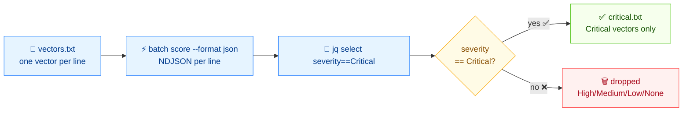

# 🚨 Filter Critical vulnerabilities from a vector file

## Problem

You have a plain-text file of CVSS vectors (one per line, scraped from advisories or exported by a scanner) and you want to keep only the **Critical** ones for triage.

## Solution

Here's the flow:



### 1. Prepare the input file

`vectors.txt` — one CVSS vector per line:

```text
CVSS:3.1/AV:N/AC:L/PR:N/UI:N/S:U/C:H/I:H/A:H
CVSS:3.1/AV:N/AC:L/PR:N/UI:N/S:U/C:N/I:N/A:L
CVSS:3.1/AV:L/AC:H/PR:H/UI:R/S:U/C:L/I:L/A:L
CVSS:3.1/AV:N/AC:L/PR:N/UI:N/S:C/C:H/I:H/A:H
CVSS:3.0/AV:N/AC:L/PR:N/UI:N/S:U/C:H/I:H/A:H
CVSS:3.1/AV:P/AC:H/PR:H/UI:R/S:U/C:N/I:N/A:N
```

### 2. Score every vector as JSON

`batch score` parses, scores, and emits one JSON object per line (NDJSON). `--workers 4` parses in parallel:

```bash
cvss batch score vectors.txt --format json
```

```json
{
  "line": 1,
  "score": 9.8,
  "severity": "Critical",
  "vector": "CVSS:3.1/AV:N/AC:L/PR:N/UI:N/S:U/C:H/I:H/A:H"
}
{
  "line": 2,
  "score": 5.3,
  "severity": "Medium",
  "vector": "CVSS:3.1/AV:N/AC:L/PR:N/UI:N/S:U/C:N/I:N/A:L"
}
{
  "line": 3,
  "score": 3.8,
  "severity": "Low",
  "vector": "CVSS:3.1/AV:L/AC:H/PR:H/UI:R/S:U/C:L/I:L/A:L"
}
{
  "line": 4,
  "score": 10,
  "severity": "Critical",
  "vector": "CVSS:3.1/AV:N/AC:L/PR:N/UI:N/S:C/C:H/I:H/A:H"
}
{
  "line": 5,
  "score": 9.8,
  "severity": "Critical",
  "vector": "CVSS:3.0/AV:N/AC:L/PR:N/UI:N/S:U/C:H/I:H/A:H"
}
{
  "line": 6,
  "score": 0,
  "severity": "None",
  "vector": "CVSS:3.1/AV:P/AC:H/PR:H/UI:R/S:U/C:N/I:N/A:N"
}
```

### 3. Filter with `jq`

Select objects whose `severity` is `Critical`:

```bash
cvss batch score vectors.txt --format json \
  | jq -r 'select(.severity == "Critical") | "\(.score)\t\(.vector)"'
```

```text
9.8	CVSS:3.1/AV:N/AC:L/PR:N/UI:N/S:U/C:H/I:H/A:H
10	CVSS:3.1/AV:N/AC:L/PR:N/UI:N/S:C/C:H/I:H/A:H
9.8	CVSS:3.0/AV:N/AC:L/PR:N/UI:N/S:U/C:H/I:H/A:H
```

::: tip Filter by score threshold instead
`jq -r 'select(.score >= 9) | ...'` keeps anything 9.0+, which is the numeric boundary of Critical (≥ 9.0). Use the score form when you also want to catch High-severity vectors that round up to 8.9+ under your own policy.
:::

### 4. Save the filtered list

```bash
cvss batch score vectors.txt --format json \
  | jq -r 'select(.severity == "Critical") | .vector' \
  > critical.txt
```

`critical.txt` now contains only Critical vectors, one per line, ready to feed into `cvss diff`, `cvss sort`, or your ticketing system.

## Discussion

- **Why JSON + jq, not a `--severity` flag?** `batch score` outputs all vectors; `jq` lets you pick *any* cut (`>= 7`, a specific severity, a regex on the vector string) without re-scoring. Score once, slice many ways.
- **Mixed versions are fine.** The input above mixes `3.0` and `3.1` vectors — `batch score` scores each against its own spec, so the v3.0 line scores 9.8 correctly.
- **Invalid rows abort the batch.** `batch score` stops on the first unparseable line. Pre-check with `cvss batch validate vectors.txt`, or clean the file first.
- **Not what you want?** If you need *sorted* output rather than filtered, see [Sort by severity](/recipes/sort-by-severity). If your input is CSV, see [Parse from CSV](/recipes/parse-from-csv).

## See Also

- [`batch score`](/cli/commands/batch-score) — the scoring command used here
- [`batch validate`](/cli/commands/batch-validate) — pre-check a file before scoring
- [`severity`](/cli/commands/severity) — single-score severity lookup
- [Sort by severity](/recipes/sort-by-severity)
- [Parse from CSV](/recipes/parse-from-csv)
