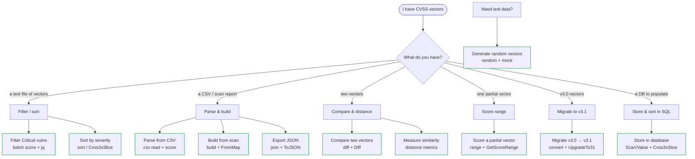

# 📚 Recipes

Each recipe solves one concrete problem with the `cvss` CLI and the `github.com/scagogogo/cvss-skills` Go SDK. Pick the task you actually have — filter, sort, parse CSV, export JSON, compare, migrate, or persist — and copy the commands and code straight into your project.

## Problem map

## All recipes

| Recipe | What it solves | Tools |
| --- | --- | --- |
| [Filter Critical vulns](/recipes/filter-critical-vulns) | Keep only Critical vectors from a file | `batch score --format json` + `jq` |
| [Sort by severity](/recipes/sort-by-severity) | Order a batch of vectors by score | `sort` + `Cvss3xSlice` |
| [Parse from CSV](/recipes/parse-from-csv) | Score every vector in a CSV file | `csv read` + `csv write` |
| [Export to JSON](/recipes/export-to-json) | Emit a structured JSON report | `json` + `Cvss3x.ToJSON` |
| [Compare two vectors](/recipes/compare-two-vectors) | Show metric + score deltas | `diff` + `Cvss3x.Diff` |
| [Measure similarity](/recipes/measure-similarity) | Distance/similarity between two vectors | `distance` + `DistanceCalculator` |
| [Build from scan](/recipes/build-from-scan) | Turn a scan result into a CVSS vector | `build` + `FromMap` |
| [Migrate v3.0 → v3.1](/recipes/migrate-v3-to-v31) | Upgrade old vectors to v3.1 | `convert --to 3.1` + `UpgradeTo31` |
| [Score a partial vector](/recipes/score-partial-vector) | Score range for an incomplete vector | `range` + `GetScoreRange`/`GetWorstCase` |
| [Generate test data](/recipes/generate-test-data) | Make random CVSS vectors | `random` + `mock.RandomCvss3xFull` |
| [Store in a database](/recipes/store-in-database) | Persist vectors and sort by score in SQL | `Scan`/`Value` + `Cvss3xSlice` |

::: tip Each recipe is self-contained
The "Solution" section is a step-by-step you can run as-is. The "Discussion" covers when *not* to use it, and "See Also" links to the matching CLI command page and SDK reference.
:::
