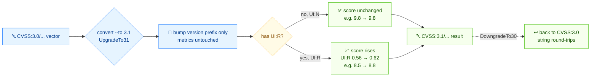

# 🔁 Migrate CVSS v3.0 vectors to v3.1

## Problem

Your backlog of advisories is tagged with CVSS v3.0 vectors, but your tooling now expects v3.1. You need to convert them — and know when the score changes.

## Solution

Here's the flow:



### CLI: `convert --to 3.1`

The vector `AV:N/AC:L/PR:N/UI:N/S:U/C:H/I:H/A:H` has identical metrics in both versions, so its score is unchanged:

```bash
cvss convert --to 3.1 "CVSS:3.0/AV:N/AC:L/PR:N/UI:N/S:U/C:H/I:H/A:H"
```

```text
Original:  CVSS:3.0/AV:N/AC:L/PR:N/UI:N/S:U/C:H/I:H/A:H (9.8)
Converted: CVSS:3.1/AV:N/AC:L/PR:N/UI:N/S:U/C:H/I:H/A:H (9.8)
```

But `UI:R` (User Interaction: Required) scores **0.56 in v3.0** and **0.62 in v3.1**, so any vector with `UI:R` moves:

```bash
cvss convert --to 3.1 "CVSS:3.0/AV:N/AC:L/PR:N/UI:R/S:U/C:H/I:H/A:H"
```

```text
Original:  CVSS:3.0/AV:N/AC:L/PR:N/UI:R/S:U/C:H/I:H/A:H (8.5)
Converted: CVSS:3.1/AV:N/AC:L/PR:N/UI:R/S:U/C:H/I:H/A:H (8.8)
```

The downgrade goes the other way (8.8 → 8.5):

```bash
cvss convert --to 3.0 "CVSS:3.1/AV:N/AC:L/PR:N/UI:R/S:U/C:H/I:H/A:H"
```

```text
Original:  CVSS:3.1/AV:N/AC:L/PR:N/UI:R/S:U/C:H/I:H/A:H (8.8)
Converted: CVSS:3.0/AV:N/AC:L/PR:N/UI:R/S:U/C:H/I:H/A:H (8.5)
```

### Go SDK: `UpgradeTo31`

`UpgradeTo31` is sugar for `ConvertToVersion(3, 1)`. It clones the vector and bumps the version — metric values are untouched, but the calculator uses the v3.1 weights on the result.

```go
package main

import (
	"fmt"

	"github.com/scagogogo/cvss-skills/pkg/cvss"
	"github.com/scagogogo/cvss-skills/pkg/parser"
)

func main() {
	v30, _ := parser.ParseString("CVSS:3.0/AV:N/AC:L/PR:N/UI:R/S:U/C:H/I:H/A:H")

	v31, err := v30.UpgradeTo31()
	if err != nil {
		panic(err)
	}
	fmt.Println(v31.String()) // CVSS:3.1/AV:N/AC:L/PR:N/UI:R/S:U/C:H/I:H/A:H

	// Downgrade is symmetric.
	back, _ := v31.DowngradeTo30()
	fmt.Println(back.String()) // CVSS:3.0/AV:N/AC:L/PR:N/UI:R/S:U/C:H/I:H/A:H

	_ = cvss.NewCalculator
}
```

`ConvertToVersion` only accepts `3.0` and `3.1`; any other version returns `unsupported version: %d.%d`.

## Discussion

- **Only `UI:R` changes the score.** The v3.0→v3.1 spec change that affects scoring is the `UI:Required` weight (0.56 → 0.62). Vectors with `UI:N` (the common case) keep their exact score after conversion.
- **Severity band may shift.** A v3.0 vector at 8.9 (High) with `UI:R` can become 9.x (Critical) after upgrade. Always re-check the severity, not just the score, after migrating.
- **Metric values are not changed.** `convert` is a version bump, not a metric re-interpretation — if your v3.0 vector had `E:F`, the v3.1 result still has `E:F`.
- **Bulk migration.** Wrap `convert` in a shell loop over `vectors.txt`, or call `UpgradeTo31` in a `ReadCSV`→`WriteCSV` pipeline. Score the converted vectors with [Parse from CSV](/recipes/parse-from-csv) afterward.
- **Not what you want?** If you're comparing a v3.0 and a v3.1 vector of the same CVE, use [Compare two vectors](/recipes/compare-two-vectors) — `diff` works across versions.

## See Also

- [`convert`](/cli/commands/convert) — the CLI command
- [Conversion](/sdk/conversion) — `ConvertToVersion` / `UpgradeTo31` / `DowngradeTo30` reference
- [Compare two vectors](/recipes/compare-two-vectors)
- [Parse from CSV](/recipes/parse-from-csv)
