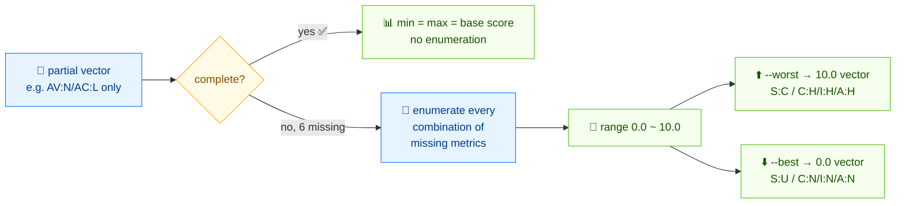

# 🎯 Score a partial (incomplete) CVSS vector

## Problem

A scanner or analyst gave you a vector with only some base metrics filled in — say `AV:N/AC:L` and nothing else. You can't score it exactly, but you need to know the *range* of possible scores and the worst-case completion.

## Solution

Here's the flow:



### CLI: `range`

For a complete vector, `range` reports `min = max = actual score`:

```bash
cvss range "CVSS:3.1/AV:N/AC:L/PR:N/UI:N/S:U/C:H/I:H/A:H"
```

```text
Score range: 9.8 (Critical) ~ 9.8 (Critical)
Complete: true, Missing metrics: 0
```

For a partial vector, it tries every combination of the missing metrics and reports the full range:

```bash
cvss range "CVSS:3.1/AV:N/AC:L"
```

```text
Score range: 0.0 (None) ~ 10.0 (Critical)
Complete: false, Missing metrics: 6
```

`--worst` and `--best` print the filled-in vector that produces the high and low ends:

```bash
cvss range --worst "CVSS:3.1/AV:N/AC:L"
```

```text
Score range: 0.0 (None) ~ 10.0 (Critical)
Complete: false, Missing metrics: 6
Worst case: CVSS:3.1/AV:N/AC:L/PR:N/UI:N/S:C/C:H/I:H/A:H (10.0)
```

```bash
cvss range --best "CVSS:3.1/AV:N/AC:L"
```

```text
Score range: 0.0 (None) ~ 10.0 (Critical)
Complete: false, Missing metrics: 6
Best case: CVSS:3.1/AV:N/AC:L/PR:N/UI:N/S:U/C:N/I:N/A:N (0.0)
```

For machine reading, `--format json`:

```bash
cvss range --format json "CVSS:3.1/AV:N/AC:L"
```

```json
{
  "MinScore": 0,
  "MaxScore": 10,
  "MinSeverity": "None",
  "MaxSeverity": "Critical",
  "IsComplete": false,
  "MissingCount": 6
}
```

### Go SDK: `GetScoreRange` / `GetWorstCase` / `GetBestCase`

Parse the partial vector with `parser.ParseRelaxed` (which accepts a vector without the `CVSS:` prefix and a default version), then compute the range and the extreme-case completions.

```go
package main

import (
	"fmt"

	"github.com/scagogogo/cvss-skills/pkg/cvss"
	"github.com/scagogogo/cvss-skills/pkg/parser"
)

func main() {
	partial, err := parser.ParseRelaxed("AV:N/AC:L", "3.1")
	if err != nil {
		panic(err)
	}

	rng := cvss.GetScoreRange(partial)
	fmt.Println(rng.String())
	// 0.0 (None) ~ 10.0 (Critical) [6 metrics missing]

	worst, score, err := cvss.GetWorstCase(partial)
	if err != nil {
		panic(err)
	}
	fmt.Printf("worst: %s (%.1f)\n", worst.String(), score)
	// worst: CVSS:3.1/AV:N/AC:L/PR:N/UI:N/S:C/C:H/I:H/A:H (10.0)

	best, score, err := cvss.GetBestCase(partial)
	if err != nil {
		panic(err)
	}
	fmt.Printf("best : %s (%.1f)\n", best.String(), score)
	// best : CVSS:3.1/AV:N/AC:L/PR:N/UI:N/S:U/C:N/I:N/A:N (0.0)
}
```

## Discussion

- **Combinatorial cost.** `GetScoreRange` enumerates every value of every missing metric, so a vector missing all 8 base metrics tries `4×2×3×2×2×3×3×3 = 2592` combinations — fast, but if you call it in a tight loop over thousands of partials, cache the result.
- **`IsComplete` short-circuits.** When no metrics are missing, `GetScoreRange` returns `min == max == actual base score` without enumeration.
- **Worst-case is the conservative triage answer.** When you must decide whether to patch from a partial vector, score the worst case (`GetWorstCase`) and treat the finding as at-least-that-severe.
- **`GetWorstCase`/`GetBestCase` return the filled vector too.** Use the returned `*Cvss3x` to see *which* metric values produce the extreme — useful to explain "why could this be a 10?"
- **Not what you want?** If you want to fill in defaults and score deterministically, use [Build from scan](/recipes/build-from-scan) with explicit values rather than ranging over unknowns.

## See Also

- [`range`](/cli/commands/range) — the CLI command
- [Score Range](/sdk/score-range) — `GetScoreRange` / `GetWorstCase` / `GetBestCase` / `ScoreRange` reference
- [Build from scan](/recipes/build-from-scan)
- [Scoring (calculator)](/sdk/calculator) — `GetBaseScore` for complete vectors
