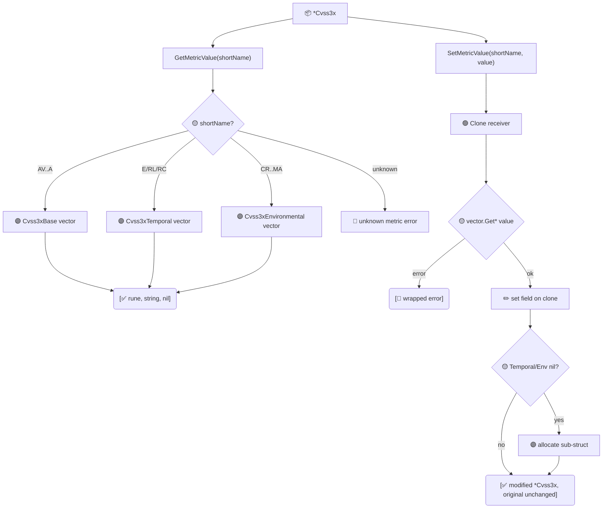

# 🔧 Metric Accessor

🔧 Feature · `pkg/cvss`

`GetMetricValue` and `SetMetricValue` read and write a single metric on a `*Cvss3x` by its short name (`AV`, `AC`, `PR`, `UI`, `S`, `C`, `I`, `A`, `E`, `RL`, `RC`, `CR`, `IR`, `AR`, and the `M*` series). `SetMetricValue` returns a modified **copy** — the receiver is never mutated — which keeps the immutable style consistent with the `With*Method` family.

## Synopsis

```go
shortVal, longVal, _ := cv.GetMetricValue("AV")   // 'N', "Network", nil
modified, _ := cv.SetMetricValue("AV", 'L')        // new *Cvss3x, AV:N -> AV:L
```

Both methods work across all three metric groups. When you set a Temporal or Environmental metric, the corresponding sub-struct (`Cvss3xTemporal` / `Cvss3xEnvironmental`) is lazily allocated on the returned copy. An unknown short name or an invalid value is reported as an `error` wrapping the underlying `pkg/vector` factory error.

## How It Works

`GetMetricValue` reads through `getVectorByShortName`; `SetMetricValue` clones the receiver, resolves the value via the `pkg/vector` factory, and writes it onto the clone — the original object is untouched.



## API Reference

### GetMetricValue

```go
func (x *Cvss3x) GetMetricValue(shortName string) (rune, string, error)
```

Returns the short value (e.g. `'N'`) and long value (e.g. `"Network"`) of the named metric. Reading a Temporal metric when `Cvss3xTemporal` is `nil` returns the error `no temporal metrics`; reading an Environmental metric when `Cvss3xEnvironmental` is `nil` returns `no environmental metrics`. An unknown name returns `unknown metric: <name>`.

```go
short, long, err := cv.GetMetricValue("C")
// short = 'H', long = "High"
```

### SetMetricValue

```go
func (x *Cvss3x) SetMetricValue(shortName string, value rune) (*Cvss3x, error)
```

Returns a **modified copy** of `x` with the named metric set to `value`. The receiver is left untouched. `value` is validated by the matching `vector.Get*` factory; on failure the error is wrapped as `<shortName>: <cause>` (for example `AV: unknown attack vector value: Z`).

```go
modified, err := cv.SetMetricValue("AV", 'L')
if err != nil { /* e.g. AV: unknown attack vector value: Q */ }
```

::: tip Supported short names
Base: `AV AC PR UI S C I A` · Temporal: `E RL RC` · Environmental: `CR IR AR MAV MAC MPR MUI MS MC MI MA`. The full list mirrors the CVSS v3.1 specification.
:::

::: warning SetMetricValue never mutates the receiver
Because `SetMetricValue` clones the receiver first, chaining calls on the original is a no-op. Reassign the result: `cv, _ = cv.SetMetricValue("AV", 'L')`.
:::

## Example

```go
package main

import (
    "fmt"

    "github.com/scagogogo/cvss-skills/pkg/parser"
)

func main() {
    cv, err := parser.ParseString("CVSS:3.1/AV:N/AC:L/PR:N/UI:N/S:U/C:H/I:H/A:H")
    if err != nil {
        panic(err)
    }

    // Read a single metric.
    short, long, err := cv.GetMetricValue("AV")
    if err != nil {
        panic(err)
    }
    fmt.Printf("AV = %c (%s)\n", short, long) // AV = N (Network)

    // Set a single metric on a copy; the original is unchanged.
    modified, err := cv.SetMetricValue("AV", 'L')
    if err != nil {
        panic(err)
    }
    fmt.Println(cv.String())       // still .../AV:N/...
    fmt.Println(modified.String()) // .../AV:L/...

    // Setting a Temporal metric lazily allocates the group on the copy.
    correct, err := cv.SetMetricValue("E", 'F')
    if err != nil {
        panic(err)
    }
    fmt.Println(correct.HasTemporalMetrics()) // true

    // An unknown name surfaces as an error.
    _, err = cv.SetMetricValue("ZZ", 'N')
    fmt.Println(err) // unknown metric: ZZ
}
```

## Related

- [With-Method](/sdk/with-method) — the immutable, per-metric setter family this mirrors
- [From-Map](/sdk/from-map) — bulk construction from a `map[string]string`
- [pkg/vector](/sdk/vector) — the `Get*` factories that validate each value
- CLI: [`get`](/cli/commands/get) and [`modify`](/cli/commands/modify)
