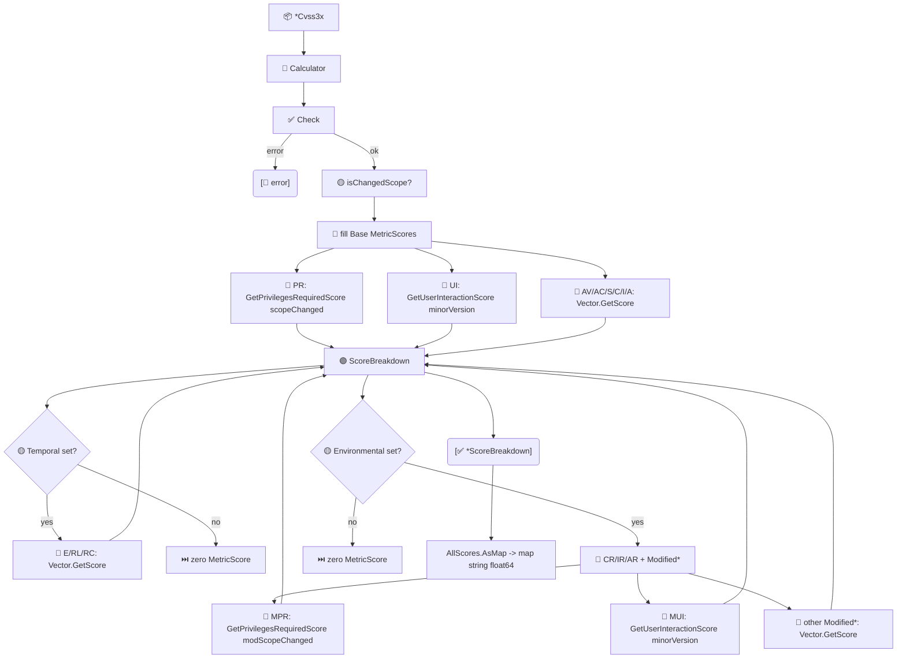

# 📊 Score Breakdown

📊 Feature · `pkg/cvss`

`GetScoreBreakdown` returns the **effective score** contributed by every metric on a `*Cvss3x`, after the context adjustments the spec applies to `PR` (Scope) and `UI` (version). Together with `AllScores.AsMap`, it gives you both a structured per-metric view and a flat `map[string]float64` for serialization.

## Synopsis

```go
calc := cvss.NewCalculator(cv)
bd, err := calc.GetScoreBreakdown() // each MetricScore has ShortName/LongName/Value/Score
fmt.Println(bd.AttackVector.String()) // AV:N=0.85
```

A `MetricScore` records the short name (`AV`), long name (`Attack Vector`), value (`N`), and the score that value actually earns in this vector's context. `ScoreBreakdown` is a plain struct with one `MetricScore` field per CVSS metric; unset metrics come back as zero-valued `MetricScore{}` (empty `ShortName`).

## How It Works

`GetScoreBreakdown` validates the vector, then fills Base metrics directly from each `Vector.GetScore()` — except `PR` (adjusted by Scope via `GetPrivilegesRequiredScore`) and `UI` (adjusted by version via `GetUserInteractionScore`). Temporal/Environmental Modified metrics use the same Scope/version-aware helpers against the modified scope.



## API Reference

### MetricScore

```go
type MetricScore struct {
    ShortName string  // e.g. "AV"
    LongName  string  // e.g. "Attack Vector"
    Value     string  // e.g. "N"
    Score     float64 // effective score, context-adjusted for PR/UI
}

func (m MetricScore) String() string // "AV:N=0.85"
```

### ScoreBreakdown

```go
type ScoreBreakdown struct {
    // Base
    AttackVector, AttackComplexity, PrivilegesRequired,
    UserInteraction, Scope, Confidentiality, Integrity, Availability MetricScore
    // Temporal
    ExploitCodeMaturity, RemediationLevel, ReportConfidence MetricScore
    // Environmental requirements
    ConfidentialityRequirement, IntegrityRequirement, AvailabilityRequirement MetricScore
    // Modified metrics
    ModifiedAttackVector, ModifiedAttackComplexity, ModifiedPrivilegesRequired,
    ModifiedUserInteraction, ModifiedScope, ModifiedConfidentiality,
    ModifiedIntegrity, ModifiedAvailability MetricScore
}
```

### GetScoreBreakdown

```go
func (c *Calculator) GetScoreBreakdown() (*ScoreBreakdown, error)
```

Returns the breakdown. It first runs `cv.Check()`, so an incomplete base vector surfaces its error here. The `PrivilegesRequired` score is computed with `vector.GetPrivilegesRequiredScore(pr, scopeChanged)` and `UserInteraction` with `vector.GetUserInteractionScore(ui, minorVersion)` — the two metrics whose value depends on context.

```go
bd, err := calc.GetScoreBreakdown()
fmt.Printf("PR=%.2f UI=%.2f\n", bd.PrivilegesRequired.Score, bd.UserInteraction.Score)
```

::: tip PR and UI are context-adjusted
`PR` depends on Scope: `PR:L` is `0.62` under Scope Unchanged but `0.68` under Scope Changed (`PR:N` is `0.85` regardless). `UI:R` depends on version: `0.56` in v3.0, `0.62` in v3.1 (`UI:N` is `0.85` in both). `GetScoreBreakdown` always returns the value effective for *this* vector.
:::

### AllScores.AsMap

```go
func (s *AllScores) AsMap() map[string]float64
```

Flattens an `*AllScores` into a `map[string]float64` keyed `baseScore`, `impactSubScore`, `exploitabilitySubScore`, plus `temporalScore` (only when temporal metrics exist) and `environmentalScore`, `modifiedImpactSubScore`, `modifiedExploitabilitySubScore` (only when environmental metrics exist). Convenient for JSON/template rendering.

```go
m := all.AsMap()
// {"baseScore":9.8, "impactSubScore":5.87, "exploitabilitySubScore":3.89}
```

::: warning AsMap omits absent keys
`temporalScore` is absent (not `0`) when no temporal metrics are set, and the three `modified*` keys are absent without environmental metrics. Check presence with the comma-ok form, not against zero.
:::

## Example

```go
package main

import (
    "encoding/json"
    "fmt"

    "github.com/scagogogo/cvss-skills/pkg/cvss"
    "github.com/scagogogo/cvss-skills/pkg/parser"
)

func main() {
    cv, err := parser.ParseString(
        "CVSS:3.1/AV:N/AC:L/PR:N/UI:N/S:U/C:H/I:H/A:H")
    if err != nil {
        panic(err)
    }
    calc := cvss.NewCalculator(cv)

    bd, err := calc.GetScoreBreakdown()
    if err != nil {
        panic(err)
    }
    // PR and UI are context-adjusted; AV/AC/C/I/A use the metric's own score.
    for _, m := range []cvss.MetricScore{
        bd.AttackVector, bd.PrivilegesRequired, bd.UserInteraction, bd.Confidentiality,
    } {
        fmt.Println(m.String())
    }

    // AsMap gives a serialization-friendly view of the aggregate scores.
    all, err := calc.GetAllScores()
    if err != nil {
        panic(err)
    }
    raw, _ := json.MarshalIndent(all.AsMap(), "", "  ")
    fmt.Println(string(raw))
}
```

Running against `CVSS:3.1/AV:N/AC:L/PR:N/UI:N/S:U/C:H/I:H/A:H`, the CLI's `score --breakdown` reports the same per-metric numbers, e.g. `AV:N = 0.85`, `PR:N = 0.85`, `UI:N = 0.85`, `C:H = 0.56`.

## Related

- [Scoring (calculator)](/sdk/calculator) — `GetScoreBreakdown` lives on `*Calculator`
- [Scores](/sdk/scores) — `AllScores` and `GetAllScores`, the source of `AsMap`
- [Impact & Sensitivity](/sdk/impact) — sensitivity analysis built on per-metric scores
- CLI: [`score --breakdown`](/cli/commands/score) and [`subs`](/cli/commands/subs)
