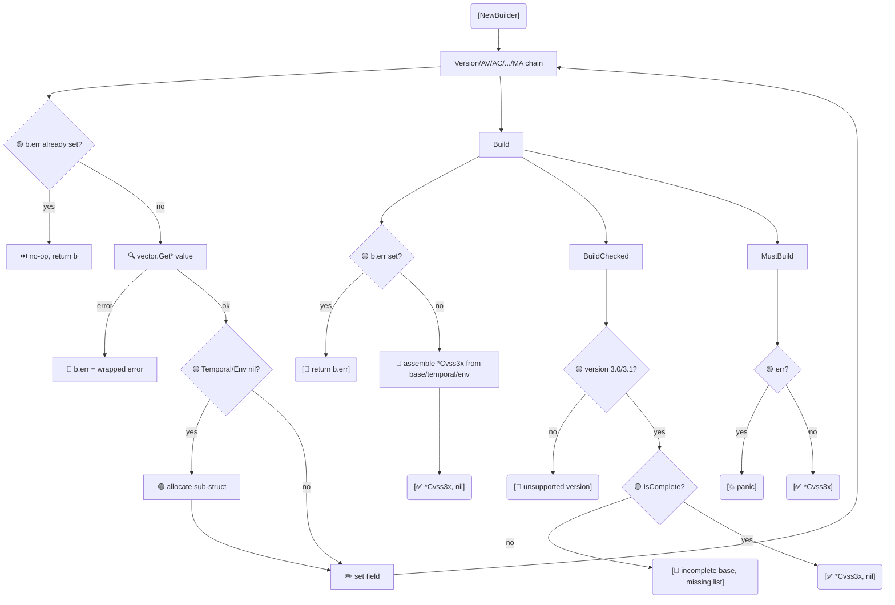

# 🔧 Builder Pattern

`cvss.Cvss3xBuilder` is a fluent builder for `*Cvss3x`. Chain `Version(...).AV('N').AC('L')...` calls, then call `Build` (lenient), `BuildChecked` (validates completeness) or `MustBuild` (panics on error).

## Synopsis

```go
cv, err := cvss.NewBuilder().
    Version(3, 1).
    AV('N').AC('L').PR('N').UI('N').S('U').C('H').I('H').A('H').
    Build()
```

The builder defaults to v3.1 and lazily allocates the Temporal/Environmental groups the first time you set a metric in that group.

## How It Works

Each chainable setter resolves the value through the `pkg/vector` factory and stores it on the builder's `base`/`temporal`/`env` struct; any factory error is stashed in `b.err` and short-circuits later setters. `Build` assembles a `*Cvss3x`; `BuildChecked` additionally enforces version and base-metric completeness; `MustBuild` panics on error.



## API Reference

### Construction

```go
func NewBuilder() *Cvss3xBuilder
func (b *Cvss3xBuilder) Version(major, minor int) *Cvss3xBuilder
```

### Base metric setters

```go
func (b *Cvss3xBuilder) AV(val rune) *Cvss3xBuilder  // Attack Vector
func (b *Cvss3xBuilder) AC(val rune) *Cvss3xBuilder  // Attack Complexity
func (b *Cvss3xBuilder) PR(val rune) *Cvss3xBuilder  // Privileges Required
func (b *Cvss3xBuilder) UI(val rune) *Cvss3xBuilder  // User Interaction
func (b *Cvss3xBuilder) S(val rune)   *Cvss3xBuilder  // Scope
func (b *Cvss3xBuilder) C(val rune)  *Cvss3xBuilder  // Confidentiality
func (b *Cvss3xBuilder) I(val rune)  *Cvss3xBuilder  // Integrity
func (b *Cvss3xBuilder) A(val rune)  *Cvss3xBuilder  // Availability
```

### Temporal metric setters

```go
func (b *Cvss3xBuilder) E(val rune)  *Cvss3xBuilder  // Exploit Code Maturity
func (b *Cvss3xBuilder) RL(val rune) *Cvss3xBuilder  // Remediation Level
func (b *Cvss3xBuilder) RC(val rune) *Cvss3xBuilder  // Report Confidence
```

### Environmental metric setters

```go
func (b *Cvss3xBuilder) CR(val rune) *Cvss3xBuilder  // Confidentiality Requirement
func (b *Cvss3xBuilder) IR(val rune) *Cvss3xBuilder  // Integrity Requirement
func (b *Cvss3xBuilder) AR(val rune) *Cvss3xBuilder  // Availability Requirement
func (b *Cvss3xBuilder) MAV(val rune) *Cvss3xBuilder // Modified Attack Vector
func (b *Cvss3xBuilder) MAC(val rune) *Cvss3xBuilder // Modified Attack Complexity
func (b *Cvss3xBuilder) MPR(val rune) *Cvss3xBuilder // Modified Privileges Required
func (b *Cvss3xBuilder) MUI(val rune) *Cvss3xBuilder // Modified User Interaction
func (b *Cvss3xBuilder) MS(val rune)  *Cvss3xBuilder // Modified Scope
func (b *Cvss3xBuilder) MC(val rune)  *Cvss3xBuilder // Modified Confidentiality
func (b *Cvss3xBuilder) MI(val rune)  *Cvss3xBuilder // Modified Integrity
func (b *Cvss3xBuilder) MA(val rune)  *Cvss3xBuilder // Modified Availability
```

Each setter delegates to the matching `vector.Get*` factory and stashes any error on the builder (`b.err`). Once `b.err` is set, subsequent setters become no-ops, so the error surfaces exactly once at `Build`.

### Terminal methods

```go
func (b *Cvss3xBuilder) Build() (*Cvss3x, error)
func (b *Cvss3xBuilder) BuildChecked() (*Cvss3x, error)
func (b *Cvss3xBuilder) MustBuild() *Cvss3x
```

| Method | Validates value? | Validates version? | Validates completeness? | Panics? |
| --- | --- | --- | --- | --- |
| `Build` | yes | no | no | no |
| `BuildChecked` | yes | yes (3.0/3.1) | yes (all 8 base metrics set) | no |
| `MustBuild` | yes | no | no | yes |

`BuildChecked` reports the missing metrics by name: `incomplete base metrics, missing: [AV PR]`.

::: tip Compare with Functional Options
The builder and `NewCvss3xWithOptions` (see [Options](/sdk/options)) do the same job. The builder reads more linearly for many metrics; options compose better when you want reusable presets like `WithCriticalBase()`.
:::

## Example

```go
package main

import (
    "fmt"

    "github.com/scagogogo/cvss-skills/pkg/cvss"
)

func main() {
    // Full fluent build, including temporal + environmental.
    cv, err := cvss.NewBuilder().
        Version(3, 1).
        AV('N').AC('L').PR('N').UI('N').S('C').C('H').I('H').A('H').
        E('F').RL('U').RC('C').
        CR('H').IR('H').AR('H').
        MAV('N').MC('H').MI('H').MA('H').
        Build()
    if err != nil {
        panic(err)
    }
    fmt.Println(cv.String())

    // BuildChecked catches incomplete base metrics.
    _, err = cvss.NewBuilder().
        Version(3, 1).
        AV('N').AC('L'). // forgot PR/UI/S/C/I/A
        BuildChecked()
    fmt.Println(err) // incomplete base metrics, missing: [PR UI S C I A]

    // An invalid value is captured, not panicked, by Build.
    _, err = cvss.NewBuilder().AV('Z').Build()
    fmt.Println(err) // AV: unknown attack vector value: Z
}
```

## Related

- [Functional Options](/sdk/options) — the alternative construction style
- [pkg/vector](/sdk/vector) — the `Get*` factories the setters call
- [Validation](/sdk/validation) — what `BuildChecked` enforces
