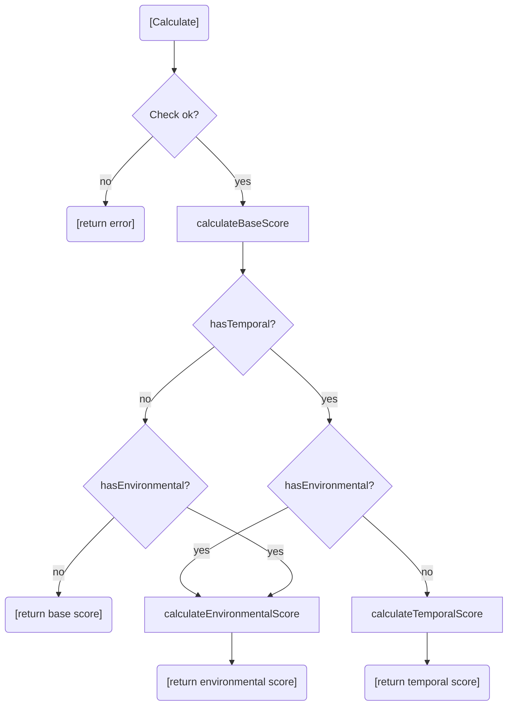

# 🧮 Scoring (calculator)

`cvss.Calculator` turns a `*Cvss3x` into numeric scores following the CVSS v3.0/v3.1 specification, including the version-specific UI:R quirk (0.56 vs 0.62) and the Scope-dependent PR scoring.

## Synopsis

```go
calc := cvss.NewCalculator(cv)
score, err := calc.Calculate()                 // the "active" score
all, _    := calc.GetAllScores()               // base + temporal + environmental + sub-scores
bd, _     := calc.GetScoreBreakdown()          // per-metric effective scores
```

## Scoring flow

`Calculate` picks the most refined score available based on which metric groups are present:



- **Base** = `Roundup(Min(ImpactSub + ExploitSub, 10))`, with a `1.08*` factor when Scope is Changed.
- **Temporal** = `Roundup(Base × E × RL × RC)`, unset temporals default to 1.0.
- **Environmental** = `Roundup(Min(1.08*(ModImpact+ModExploit), 10)) × E × RL × RC`, using modified metrics and CR/IR/AR requirement factors (H=1.5, M=1.0, L=0.5).

## Types

### `Calculator`

```go
type Calculator struct { cvss *Cvss3x }
```
Opaque — create with `NewCalculator`, no exported fields.

### `AllScores`

| Field | Type | Meaning |
| --- | --- | --- |
| `BaseScore` | `float64` | Always present |
| `TemporalScore` | `float64` | Only meaningful when `HasTemporal` |
| `EnvironmentalScore` | `float64` | Only meaningful when `HasEnvironmental` |
| `BaseSeverity` | `Severity` | |
| `TemporalSeverity` | `Severity` | Defaults to `SeverityNone` when absent |
| `EnvironmentalSeverity` | `Severity` | Defaults to `SeverityNone` when absent |
| `ImpactSubScore` | `float64` | ISC |
| `ExploitabilitySubScore` | `float64` | ESC |
| `ModifiedImpactSubScore` | `float64` | Set only when `HasEnvironmental` |
| `ModifiedExploitabilitySubScore` | `float64` | Set only when `HasEnvironmental` |
| `HasTemporal` | `bool` | |
| `HasEnvironmental` | `bool` | |

Has a `String()` summary and `AsMap() map[string]float64` for serialization.

### `ScoreBreakdown` and `MetricScore`

`GetScoreBreakdown` returns a `*ScoreBreakdown` with one `MetricScore` per metric. `MetricScore` carries `ShortName`, `LongName`, `Value` (the short value char as string) and the effective `Score` — for PR and UI this is the context-adjusted score, not the static preset score.

## API Reference

```go
func NewCalculator(cvss *Cvss3x) *Calculator

func (c *Calculator) Calculate() (float64, error)
func (c *Calculator) GetBaseScore() (float64, error)
func (c *Calculator) GetTemporalScore() (float64, error)
func (c *Calculator) GetEnvironmentalScore() (float64, error)
func (c *Calculator) GetImpactSubScore() (float64, error)
func (c *Calculator) GetExploitabilitySubScore() (float64, error)
func (c *Calculator) GetModifiedImpactSubScore() (float64, error)
func (c *Calculator) GetModifiedExploitabilitySubScore() (float64, error)

func (c *Calculator) GetAllScores() (*AllScores, error)
func (c *Calculator) GetScoreBreakdown() (*ScoreBreakdown, error)

func (c *Calculator) GetSeverityRating(score float64) Severity
func RoundUp(x float64) float64
```

Every method calls `cvss.Check()` first and returns its error if the base metrics are incomplete.

::: tip Prefer GetAllScores over repeated calls
`GetAllScores` computes every score in one pass. Calling `GetBaseScore` + `GetTemporalScore` + `GetEnvironmentalScore` separately recomputes the base score each time — fine for one-offs, wasteful in loops.
:::

::: warning Calculate is not the same as GetEnvironmentalScore
`Calculate` returns the **most refined** score available (base → temporal → environmental). `GetEnvironmentalScore` returns the environmental score specifically, but falls back to temporal/base when environmental metrics are absent. For "the score a human would quote", use `Calculate`.
:::

## Example

```go
package main

import (
    "fmt"

    "github.com/scagogogo/cvss-skills/pkg/cvss"
    "github.com/scagogogo/cvss-skills/pkg/parser"
)

func main() {
    cv, _ := parser.ParseString(
        "CVSS:3.1/AV:N/AC:L/PR:N/UI:N/S:U/C:H/I:H/A:H/E:F/RL:U/RC:C")

    calc := cvss.NewCalculator(cv)

    // The headline score (environmental, since env temporal is set).
    score, _ := calc.Calculate()
    fmt.Printf("active score: %.1f (%s)\n", score, calc.GetSeverityRating(score))

    // Everything at once.
    all, _ := calc.GetAllScores()
    fmt.Printf("base=%.1f temporal=%.1f environmental=%.1f\n",
        all.BaseScore, all.TemporalScore, all.EnvironmentalScore)

    // Per-metric effective scores (PR/UI are context-adjusted).
    bd, _ := calc.GetScoreBreakdown()
    fmt.Printf("PR effective=%.2f  UI effective=%.2f\n",
        bd.PrivilegesRequired.Score, bd.UserInteraction.Score)

    // RoundUp follows the spec's integer-arithmetic definition.
    fmt.Printf("RoundUp(7.318) = %.1f\n", cvss.RoundUp(7.318)) // 7.4
}
```

## Related

- [pkg/cvss](/sdk/cvss) — the input type
- [pkg/vector](/sdk/vector) — why PR/UI scores are context-dependent
- [Score Range](/sdk/score-range) — best/worst case for incomplete vectors
