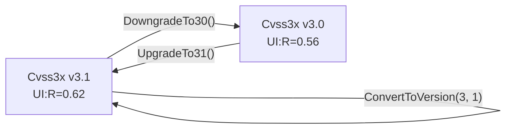

# 🔄 Version Conversion & Grouping

🔄 Feature · `pkg/cvss`

The conversion API flips a `*Cvss3x` between v3.0 and v3.1 (returning a copy — only the version number changes, metric values are preserved, but scores recompute because `UI:R` differs by version). The grouping API splits a vector into `Base` / `Temporal` / `Environmental` metric groups and renders partial vector strings.

## Synopsis

```go
v30, _ := cv.ConvertToVersion(3, 0)  // 3.1 -> 3.0 copy
v31, _ := v30.UpgradeTo31()          // back to 3.1

groups := cv.GetMetricGroups()        // []MetricGroup{Base, Temporal?, Environmental?}
baseStr := cv.GetBaseVectorString()   // "CVSS:3.1/AV:N/.../A:H"
```

## API Reference

### Version conversion

```go
func (x *Cvss3x) ConvertToVersion(major, minor int) (*Cvss3x, error) // 3.0 <-> 3.1
func (x *Cvss3x) UpgradeTo31() (*Cvss3x, error)                      // == ConvertToVersion(3, 1)
func (x *Cvss3x) DowngradeTo30() (*Cvss3x, error)                    // == ConvertToVersion(3, 0)
```

`ConvertToVersion` clones the receiver and sets `MajorVersion`/`MinorVersion`. Only `3.0` and `3.1` are supported — any other version returns `unsupported version: <m>.<n> (only 3.0 and 3.1 supported)`. Metric values are not touched.

::: warning UI:R changes value across versions
`UI:Required` scores `0.56` in v3.0 and `0.62` in v3.1. Conversion keeps the metric value but the **score** recomputes, so a downgraded then upgraded vector may show a different base score than the original if it contains `UI:R`.
:::



### Grouping

```go
type MetricGroup struct {
    Name    string            // "Base", "Temporal", "Environmental"
    Metrics []MetricValuePair
}
type MetricValuePair struct {
    ShortName, LongName, Value, LongValue string
}

func (mg MetricGroup) String() string
func (x *Cvss3x) GetMetricGroups() []MetricGroup
```

`GetMetricGroups` always emits a `Base` group (its metrics may be empty if the base is `nil`), and conditionally emits `Temporal` / `Environmental` groups only when `HasTemporalMetrics` / `HasEnvironmentalMetrics` is true. Each `MetricValuePair` records the short name, long name, short value, and long value (e.g. `AV` / `Attack Vector` / `N` / `Network`); unset metrics in a present group still appear with empty value fields.

```go
for _, g := range cv.GetMetricGroups() {
    fmt.Println(g.String())
}
```

### Partial vector strings

```go
func (x *Cvss3x) GetBaseVectorString() string         // "CVSS:3.1/AV:.../A:H"
func (x *Cvss3x) GetTemporalVectorString() string     // base + temporal
func (x *Cvss3x) GetEnvironmentalVectorString() string // == String() (full)
```

`GetBaseVectorString` returns just the base portion with the version prefix. `GetTemporalVectorString` appends the temporal segment if present, otherwise returns the base string. `GetEnvironmentalVectorString` is the full vector and is equivalent to `x.String()`. All three return `""` for a nil receiver or nil base.

::: tip Three granularities, one source
These are pure projections over the same struct. Use `GetBaseVectorString` when you want to compare two vectors ignoring temporal/env drift, and `GetTemporalVectorString` to render the temporal-equivalent form.
:::

## Example

```go
package main

import (
    "fmt"

    "github.com/scagogogo/cvss-skills/pkg/parser"
)

func main() {
    cv, err := parser.ParseString(
        "CVSS:3.1/AV:N/AC:L/PR:N/UI:N/S:U/C:H/I:H/A:H/E:F/RL:U/RC:C")
    if err != nil {
        panic(err)
    }

    // Version round-trip: values preserved, version number flipped.
    v30, err := cv.DowngradeTo30()
    if err != nil {
        panic(err)
    }
    fmt.Println(v30.Version())           // 3.0
    fmt.Println(cv.Equal(v30))           // false — different versions
    back, _ := v30.UpgradeTo31()
    fmt.Println(cv.Equal(back))          // true — same version, same metrics

    // Unsupported version is an error.
    _, err = cv.ConvertToVersion(4, 0)
    fmt.Println(err) // unsupported version: 4.0 (only 3.0 and 3.1 supported)

    // Group the metrics by Base / Temporal / Environmental.
    for _, g := range cv.GetMetricGroups() {
        fmt.Println(g.String())
    }

    // Three granularities of vector string.
    fmt.Println(cv.GetBaseVectorString())        // CVSS:3.1/AV:N/AC:L/PR:N/UI:N/S:U/C:H/I:H/A:H
    fmt.Println(cv.GetTemporalVectorString())    // base + E:F/RL:U/RC:C
    fmt.Println(cv.GetEnvironmentalVectorString() == cv.String()) // true
}
```

## Related

- [Convenience](/sdk/convenience) — `Version` / `Is30` / `Is31` / `HasTemporalMetrics` used here
- [Vector](/sdk/vector) — the underlying metric values that survive a conversion
- [Scores](/sdk/scores) — where the version-dependent `UI:R` score surfaces
- CLI: [`convert`](/cli/commands/convert) and [`groups`](/cli/commands/groups)
