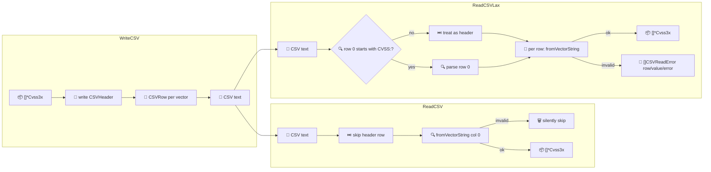

# 📊 CSV I/O

Read and write CVSS vectors as CSV. `WriteCSV` emits a header plus one scored row per vector; `ReadCSV` parses the first column back into `*Cvss3x`; `ReadCSVLax` is the tolerant variant that collects per-row errors instead of failing fast.

## Synopsis

```go
var buf bytes.Buffer
cvss.WriteCSV(&buf, []*cvss.Cvss3x{a, b})
vectors, _ := cvss.ReadCSV(&buf)
```

## How It Works

`WriteCSV` scores each vector and emits one row; the two read paths differ only in error handling — `ReadCSV` silently skips bad rows, `ReadCSVLax` records them as `CSVReadError` entries.



## CSV schema

`CSVHeader()` returns the canonical column order:

| # | Column | Example |
| --- | --- | --- |
| 1 | `vector_string` | `CVSS:3.1/AV:N/...` |
| 2 | `version` | `3.1` |
| 3 | `base_score` | `9.8` |
| 4 | `base_severity` | `High` |
| 5 | `temporal_score` | (empty if none) |
| 6 | `temporal_severity` | (empty if none) |
| 7 | `environmental_score` | (empty if none) |
| 8 | `environmental_severity` | (empty if none) |
| 9 | `impact_sub_score` | `5.9` (4 decimals) |
| 10 | `exploitability_sub_score` | `3.9` (4 decimals) |

## API Reference

```go
func CSVHeader() []string
func (x *Cvss3x) CSVRow(calc *Calculator) ([]string, error)
func WriteCSV(w io.Writer, vectors []*Cvss3x) error
func ReadCSV(r io.Reader) ([]*Cvss3x, error)
func ReadCSVLax(r io.Reader) ([]*Cvss3x, []CSVReadError, error)

type CSVReadError struct {
    Row   int
    Value string
    Error error
}
func (e CSVReadError) String() string
```

- `CSVRow(nil)` builds its own `Calculator`. Scores come from `GetAllScores`; empty strings fill the temporal/environmental columns when those groups are absent.
- `WriteCSV` writes the header then one row per vector, skipping `nil` entries. Returns the first row-generation error.
- `ReadCSV` skips the header row, then parses column 0 of each subsequent row. **Invalid rows are silently skipped** — use `ReadCSVLax` if you need to know which rows failed.
- `ReadCSVLax` auto-detects whether the first row is a header (by checking for the `CVSS:` prefix) and collects a `CSVReadError` per bad row, including the row number and original value.

::: tip ReadCSVLax for messy data
When ingesting CSV exported from external tools, rows may be malformed, contain comments, or hold non-vector strings. `ReadCSVLax` returns the valid vectors alongside a `[]CSVReadError` log so you can report problems without aborting the whole batch.
:::

::: warning ReadCSV reads only column 0
Both readers parse only the first column as the vector string. The score/severity columns are not round-tripped — they are recomputed on write and discarded on read.
:::

## Example

```go
package main

import (
    "bytes"
    "fmt"

    "github.com/scagogogo/cvss-skills/pkg/cvss"
)

func main() {
    a := cvss.HighV31()
    b := cvss.MediumV31()

    var buf bytes.Buffer
    if err := cvss.WriteCSV(&buf, []*cvss.Cvss3x{a, b}); err != nil {
        panic(err)
    }
    fmt.Println(buf.String())

    // Tolerant read: inject a bad row.
    buf.WriteString("not-a-vector\n")
    vectors, errs, _ := cvss.ReadCSVLax(&buf)
    fmt.Printf("parsed %d vectors, %d errors\n", len(vectors), len(errs))
    for _, e := range errs {
        fmt.Println("  ", e.String())
    }
}
```

## Related

- [JSON Serialization](/sdk/json) — structured serialization
- [pkg/cvss](/sdk/cvss) — `ToMap`/`FromMap` for key-value forms
- [Scoring (calculator)](/sdk/calculator) — `GetAllScores` powers the score columns
