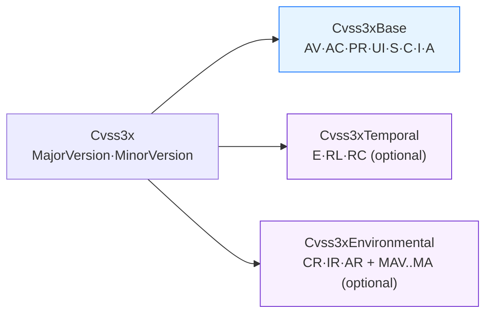

# 🧱 pkg/cvss

The `pkg/cvss` package holds the central model: the `Cvss3x` struct and its three embedded metric groups (Base / Temporal / Environmental), plus the constructors, accessors and serialization hooks every other SDK feature builds on.

## Synopsis

A CVSS v3.x vector such as `CVSS:3.1/AV:N/AC:L/PR:N/UI:N/S:U/C:H/I:H/A:H/E:F/RL:U/RC:C` is modeled as a `Cvss3x` composed of three optional stages. Base metrics are required; Temporal and Environmental are optional and lazily allocated.



## Core Types

### `Cvss3x`

| Field | Type | Notes |
| --- | --- | --- |
| `Cvss3xBase` | `*Cvss3xBase` | Embedded; the 8 base metrics. Required for scoring. |
| `Cvss3xTemporal` | `*Cvss3xTemporal` | Embedded; `nil` until a Temporal metric is set. |
| `Cvss3xEnvironmental` | `*Cvss3xEnvironmental` | Embedded; `nil` until an Environmental metric is set. |
| `MajorVersion` | `int` | Always `3`. |
| `MinorVersion` | `int` | `0` (v3.0) or `1` (v3.1). Affects UI:R scoring. |

### `Cvss3xBase` fields

| Field | Vector type | Short name |
| --- | --- | --- |
| `AttackVector` | `vector.Vector` | AV |
| `AttackComplexity` | `vector.Vector` | AC |
| `PrivilegesRequired` | `vector.Vector` | PR |
| `UserInteraction` | `vector.Vector` | UI |
| `Scope` | `vector.Vector` | S |
| `Confidentiality` | `vector.Vector` | C |
| `Integrity` | `vector.Vector` | I |
| `Availability` | `vector.Vector` | A |

`Cvss3xTemporal` holds `ExploitCodeMaturity` (E), `RemediationLevel` (RL), `ReportConfidence` (RC). `Cvss3xEnvironmental` holds `ConfidentialityRequirement`/`IntegrityRequirement`/`AvailabilityRequirement` (CR/IR/AR) plus the eight `Modified*` metrics (MAV, MAC, MPR, MUI, MS, MC, MI, MA). All fields are `vector.Vector` pointers and may be `nil` (treated as "Not Defined").

## API Reference

### Constructors

```go
func NewCvss3x() *Cvss3x
```
Returns an empty v3.1 `Cvss3x` with an allocated `Cvss3xBase` and `nil` Temporal/Environmental groups.

```go
func FromMap(m map[string]string) (*Cvss3x, error)
func MustFromMap(m map[string]string) *Cvss3x
func FromVectorValues(version string, pairs ...string) (*Cvss3x, error)
```
Build from a `map` (`"version": "3.1"`, `"AV": "N"`, ...) or from `"AV:N"`-style pairs prefixed by a version string.

### Validation & serialization

```go
func (x *Cvss3x) Check() error
func (x *Cvss3x) Validate() error
func (x *Cvss3x) IsComplete() bool
func (x *Cvss3x) MissingMetrics() []string
func (x *Cvss3x) String() string
```
`Check` short-circuits at the first problem; `Validate` collects every problem into `ValidationErrors`. `String` emits the canonical `CVSS:3.1/AV:.../...` form, with metrics in spec order.

```go
func (x *Cvss3x) MarshalJSON() ([]byte, error)
func (x *Cvss3x) UnmarshalJSON(data []byte) error
func (x *Cvss3x) MarshalText() ([]byte, error)
func (x *Cvss3x) UnmarshalText(data []byte) error
```
JSON serializes to the vector string (`"CVSS:3.1/..."`); the Text hooks cover XML, `mapstructure` and database drivers.

### Accessors & mutation

```go
func (x *Cvss3x) GetMetricValue(shortName string) (rune, string, error)
func (x *Cvss3x) SetMetricValue(shortName string, value rune) (*Cvss3x, error)
func (x *Cvss3x) Clone() *Cvss3x
func (x *Cvss3x) BaseOnly() *Cvss3x
func (x *Cvss3x) Merge(other *Cvss3x) *Cvss3x
func (x *Cvss3x) Diff(other *Cvss3x) []DiffEntry
func (x *Cvss3x) Equal(other *Cvss3x) bool
```
`SetMetricValue` returns a modified **copy** — the original is untouched. `Merge` fills only the receiver's empty slots from `other`.

### Version & group helpers

```go
func (x *Cvss3x) Version() string        // "3.1"
func (x *Cvss3x) Is30() bool
func (x *Cvss3x) Is31() bool
func (x *Cvss3x) HasTemporalMetrics() bool
func (x *Cvss3x) HasEnvironmentalMetrics() bool
func (x *Cvss3x) GetMetricGroups() []MetricGroup
func (x *Cvss3x) Description() string
func (x *Cvss3x) GetBaseVectorString() string
func (x *Cvss3x) GetTemporalVectorString() string
func (x *Cvss3x) GetEnvironmentalVectorString() string
```

::: tip String() is already canonical
`String()` always emits metrics in CVSS spec order (AV, AC, PR, UI, S, C, I, A, then E/RL/RC, then CR/IR/AR + MAV..MA). You do not need a separate canonicalization step for objects you build yourself.
:::

## Example

```go
package main

import (
    "encoding/json"
    "fmt"

    "github.com/scagogogo/cvss-skills/pkg/cvss"
    "github.com/scagogogo/cvss-skills/pkg/vector"
)

func main() {
    // Construct a v3.1 High vector directly.
    cv := &cvss.Cvss3x{
        MajorVersion: 3,
        MinorVersion: 1,
        Cvss3xBase: &cvss.Cvss3xBase{
            AttackVector:       vector.AttackVectorNetwork,
            AttackComplexity:   vector.AttackComplexityLow,
            PrivilegesRequired: vector.PrivilegesRequiredNone,
            UserInteraction:    vector.UserInteractionNone,
            Scope:              vector.ScopeUnchanged,
            Confidentiality:    vector.ConfidentialityHigh,
            Integrity:          vector.IntegrityHigh,
            Availability:       vector.AvailabilityHigh,
        },
    }

    fmt.Println(cv.String())     // CVSS:3.1/AV:N/AC:L/PR:N/UI:N/S:U/C:H/I:H/A:H
    fmt.Println(cv.IsComplete()) // true

    // Mutate a copy — original stays intact.
    scoped, _ := cv.SetMetricValue("S", 'C')
    fmt.Println(scoped.String()) // .../S:C/...

    // JSON round-trips through the vector string.
    raw, _ := json.Marshal(cv)
    fmt.Printf("%s\n", raw)      // "CVSS:3.1/AV:N/AC:L/PR:N/UI:N/S:U/C:H/I:H/A:H"
}
```

## Related

- [pkg/parser](/sdk/parser) — build `*Cvss3x` from strings instead of struct literals
- [Scoring (calculator)](/sdk/calculator) — turn a `Cvss3x` into a numeric score
- [Validation](/sdk/validation) — the `Validate` / `MissingMetrics` error model in depth
