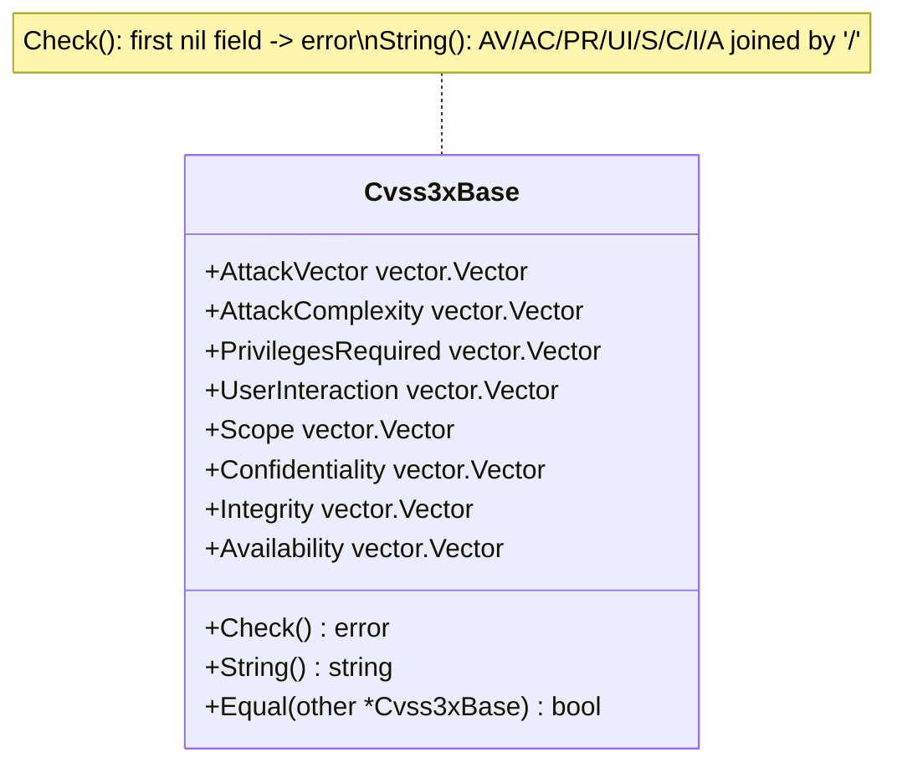

# 🧱 Cvss3xBase

`pkg/cvss/cvss3x_base.go` · Base metrics · 8 vector fields

## Synopsis

`Cvss3xBase` is the mandatory foundation of every CVSS 3.x vector. It owns the eight base metrics — Attack Vector, Attack Complexity, Privileges Required, User Interaction, Scope, Confidentiality, Integrity and Availability — each typed as a `vector.Vector`. `Check()` enforces that none of them is `nil`; `String()` joins the set ones with `/`.

```go
base := cvss.NewCvss3x().Cvss3xBase // populated via parser/builder in practice
base.AttackVector = vector.AttackVectorNetwork
base.Confidentiality = vector.ConfidentialityNone
// ...
fmt.Println(base.String()) // AV:N/AC:.../...
fmt.Println(base.Check())  // <nil> when all eight are set
```

## How It Works

`Cvss3xBase` is a plain struct of eight `vector.Vector` fields. `Check` walks them in order and returns at the first `nil`; `String` collects the non-nil ones in spec order (AV/AC/PR/UI/S/C/I/A) and joins with `/`.



## API Reference

### `Cvss3xBase` struct

```go
type Cvss3xBase struct {
    AttackVector      vector.Vector // AV
    AttackComplexity  vector.Vector // AC
    PrivilegesRequired vector.Vector // PR
    UserInteraction   vector.Vector // UI
    Scope             vector.Vector // S
    Confidentiality   vector.Vector // C
    Integrity         vector.Vector // I
    Availability      vector.Vector // A
}
```

| Field | Short name | Typical values |
| --- | --- | --- |
| `AttackVector` | `AV` | `N` / `A` / `L` / `P` |
| `AttackComplexity` | `AC` | `L` / `H` |
| `PrivilegesRequired` | `PR` | `N` / `L` / `H` |
| `UserInteraction` | `UI` | `N` / `R` |
| `Scope` | `S` | `U` / `C` |
| `Confidentiality` | `C` | `N` / `L` / `H` |
| `Integrity` | `I` | `N` / `L` / `H` |
| `Availability` | `A` | `N` / `L` / `H` |

All fields hold preset variables from `pkg/vector` (e.g. `vector.AttackVectorNetwork`). A `nil` field means "not set".

### `Check`

```go
func (x *Cvss3xBase) Check() error
```

Returns an error if the receiver is `nil` or any of the eight base-metric fields is `nil`. The base metrics are mandatory — unlike temporal/environmental metrics, every field must be populated for the vector to be valid. Error messages are produced via `fmt.Errorf` (e.g. `"Attack Vector can not empty"`).

### `String`

```go
func (x *Cvss3xBase) String() string
```

Serializes the set fields in fixed order `AV/AC/PR/UI/S/C/I/A`, each rendered by `vector.Vector.String()` as `SHORT:VALUE` (e.g. `AV:N`). `nil` fields are skipped. The result is `/`-joined and contains no leading or trailing separator.

## Example

```go
package main

import (
	"fmt"

	"github.com/scagogogo/cvss-skills/pkg/cvss"
	"github.com/scagogogo/cvss-skills/pkg/vector"
)

func main() {
	base := &cvss.Cvss3xBase{
		AttackVector:       vector.AttackVectorLocal,
		AttackComplexity:   vector.AttackComplexityLow,
		PrivilegesRequired: vector.PrivilegesRequiredLow,
		UserInteraction:    vector.UserInteractionNone,
		Scope:              vector.ScopeUnchanged,
		Confidentiality:    vector.ConfidentialityNone,
		Integrity:          vector.IntegrityHigh,
		Availability:       vector.AvailabilityHigh,
	}

	fmt.Println(base.String())
	// AV:L/AC:L/PR:L/UI:N/S:U/C:N/I:H/A:H

	fmt.Println(base.Check()) // <nil>
}
```

## Related

- [/sdk/cvss](/sdk/cvss) — top-level `Cvss3x` overview (embeds `Cvss3xBase`)
- [/sdk/cvss3x](/sdk/cvss3x) — the main `Cvss3x` type and serialization
- [/sdk/vector](/sdk/vector) — the `vector.Vector` interface and preset variables
- [/sdk/cvss3x-temporal](/sdk/cvss3x-temporal) — temporal metrics
- [/sdk/cvss3x-environmental](/sdk/cvss3x-environmental) — environmental metrics
