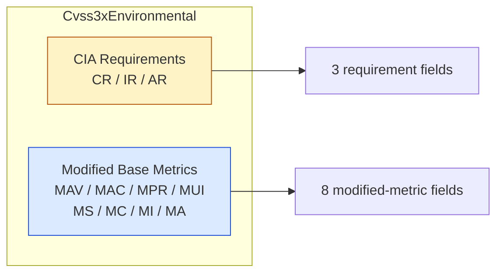

# 🌍 Cvss3xEnvironmental

`pkg/cvss/cvss3x_environmental.go` · Environmental metrics · 11 vector fields

## Synopsis

`Cvss3xEnvironmental` is the optional environmental segment of a CVSS 3.x vector. It owns the three CIA requirements (`CR`/`IR`/`AR`) and the eight modified base metrics (`MAV`/`MAC`/`MPR`/`MUI`/`MS`/`MC`/`MI`/`MA`) — 11 fields in total, each typed as a `vector.Vector`. Every field is optional; `Check()` only verifies that a set field carries the correct short name, and `String()` joins the set ones with `/`.

```go
env := &cvss.Cvss3xEnvironmental{
    ConfidentialityRequirement: vector.ConfidentialityRequirementHigh,
    ModifiedAttackVector:       vector.ModifiedAttackVectorNetwork,
}
fmt.Println(env.String()) // CR:H/MAV:N
fmt.Println(env.Check())  // <nil>
```

## Structure



## API Reference

### `Cvss3xEnvironmental` struct

```go
type Cvss3xEnvironmental struct {
    ConfidentialityRequirement vector.Vector // CR
    IntegrityRequirement       vector.Vector // IR
    AvailabilityRequirement    vector.Vector // AR

    ModifiedAttackVector       vector.Vector // MAV
    ModifiedAttackComplexity   vector.Vector // MAC
    ModifiedPrivilegesRequired vector.Vector // MPR
    ModifiedUserInteraction    vector.Vector // MUI
    ModifiedScope              vector.Vector // MS
    ModifiedConfidentiality    vector.Vector // MC
    ModifiedIntegrity          vector.Vector // MI
    ModifiedAvailability       vector.Vector // MA
}
```

| Group | Field | Short name | Values |
| --- | --- | --- | --- |
| Requirements | `ConfidentialityRequirement` | `CR` | `X` / `L` / `M` / `H` |
| Requirements | `IntegrityRequirement` | `IR` | `X` / `L` / `M` / `H` |
| Requirements | `AvailabilityRequirement` | `AR` | `X` / `L` / `M` / `H` |
| Modified | `ModifiedAttackVector` | `MAV` | `X` / `N` / `A` / `L` / `P` |
| Modified | `ModifiedAttackComplexity` | `MAC` | `X` / `L` / `H` |
| Modified | `ModifiedPrivilegesRequired` | `MPR` | `X` / `N` / `L` / `H` |
| Modified | `ModifiedUserInteraction` | `MUI` | `X` / `N` / `R` |
| Modified | `ModifiedScope` | `MS` | `X` / `U` / `C` |
| Modified | `ModifiedConfidentiality` | `MC` | `X` / `N` / `L` / `H` |
| Modified | `ModifiedIntegrity` | `MI` | `X` / `N` / `L` / `H` |
| Modified | `ModifiedAvailability` | `MA` | `X` / `N` / `L` / `H` |

All fields are optional — a `nil` field means "not set". The `X` (Not Defined) value on a modified metric means "do not modify the base metric"; see [/sdk/vector-not-defined](/sdk/vector-not-defined).

### `Check`

```go
func (x *Cvss3xEnvironmental) Check() error
```

Validates that any non-nil field is of the correct metric category by checking `GetShortName()` against the expected short name (`CR`/`IR`/`AR` for requirements, `MAV`/`MAC`/`MPR`/`MUI`/`MS`/`MC`/`MI`/`MA` for modified metrics). A mismatch yields a `fmt.Errorf`. `nil` fields are accepted.

### `String`

```go
func (x *Cvss3xEnvironmental) String() string
```

Serializes the set fields in fixed order: requirements first (`CR`/`IR`/`AR`), then modified metrics (`MAV`/`MAC`/`MPR`/`MUI`/`MS`/`MC`/`MI`/`MA`), each rendered by `vector.Vector.String()` as `SHORT:VALUE` (e.g. `CR:H`). `nil` fields are skipped. The result is `/`-joined.

## Example

```go
package main

import (
	"fmt"

	"github.com/scagogogo/cvss-skills/pkg/cvss"
	"github.com/scagogogo/cvss-skills/pkg/vector"
)

func main() {
	env := &cvss.Cvss3xEnvironmental{
		ConfidentialityRequirement: vector.ConfidentialityRequirementHigh,
		IntegrityRequirement:       vector.IntegrityRequirementMedium,
		AvailabilityRequirement:    vector.AvailabilityRequirementLow,

		ModifiedAttackVector:    vector.ModifiedAttackVectorNetwork,
		ModifiedConfidentiality: vector.ModifiedConfidentialityLow,
		ModifiedAvailability:    vector.AvailabilityNotDefined, // X -> fallback to base
	}

	fmt.Println(env.String())
	// CR:H/IR:M/AR:L/MAV:N/MC:L/MA:X

	fmt.Println(env.Check()) // <nil>
}
```

## Related

- [/sdk/cvss](/sdk/cvss) — top-level `Cvss3x` overview (embeds `Cvss3xEnvironmental`)
- [/sdk/cvss3x-base](/sdk/cvss3x-base) — base metrics (mandatory)
- [/sdk/cvss3x-temporal](/sdk/cvss3x-temporal) — temporal metrics
- [/sdk/cvss3x](/sdk/cvss3x) — the main `Cvss3x` type and serialization
- [/sdk/vector-not-defined](/sdk/vector-not-defined) — the `X` (Not Defined) fallback semantics
