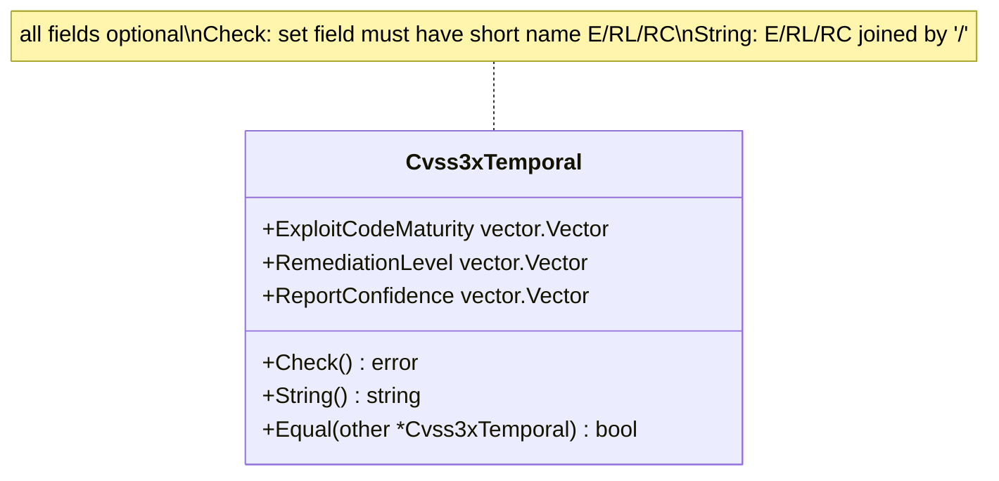

# ⏱️ Cvss3xTemporal

`pkg/cvss/cvss3x_temporal.go` · Temporal metrics · 3 vector fields

## Synopsis

`Cvss3xTemporal` is the optional temporal segment of a CVSS 3.x vector. It owns the three temporal metrics — Exploit Code Maturity (`E`), Remediation Level (`RL`) and Report Confidence (`RC`) — each typed as a `vector.Vector`. Every field is optional; `Check()` only verifies that a set field carries the correct short name, and `String()` joins the set ones with `/`.

```go
temp := &cvss.Cvss3xTemporal{
    ExploitCodeMaturity: vector.ExploitCodeMaturityFunctional,
    RemediationLevel:    vector.RemediationLevelOfficialFix,
    ReportConfidence:    vector.ReportConfidenceConfirmed,
}
fmt.Println(temp.String()) // E:F/RL:O/RC:C
fmt.Println(temp.Check())  // <nil>
```

## How It Works

`Cvss3xTemporal` is three optional `vector.Vector` fields. Unlike Base, `Check` does not require them — it only asserts that a non-nil field carries its expected short name (`E`/`RL`/`RC`), guarding against a misplaced preset. `String` emits the set ones in E/RL/RC order.



## API Reference

### `Cvss3xTemporal` struct

```go
type Cvss3xTemporal struct {
    ExploitCodeMaturity vector.Vector // E
    RemediationLevel    vector.Vector // RL
    ReportConfidence    vector.Vector // RC
}
```

| Field | Short name | Description | Values |
| --- | --- | --- | --- |
| `ExploitCodeMaturity` | `E` | Exploit code maturity | `X` / `U` / `P` / `F` / `H` |
| `RemediationLevel` | `RL` | Remediation level | `X` / `O` / `T` / `W` / `U` |
| `ReportConfidence` | `RC` | Report confidence | `X` / `U` / `R` / `C` |

All three are optional — a `nil` field means "not set", which is the CVSS "Not Defined" semantics for temporal metrics.

### `Check`

```go
func (x *Cvss3xTemporal) Check() error
```

Validates that any non-nil field is of the correct metric category: `ExploitCodeMaturity.GetShortName()` must be `"E"`, `RemediationLevel.GetShortName()` must be `"RL"`, `ReportConfidence.GetShortName()` must be `"RC"`. A mismatch (e.g. a base-metric preset assigned by mistake) yields a `fmt.Errorf`. `nil` fields are accepted.

### `String`

```go
func (x *Cvss3xTemporal) String() string
```

Serializes the set fields in fixed order `E/RL/RC`, each rendered by `vector.Vector.String()` as `SHORT:VALUE` (e.g. `E:F`). `nil` fields are skipped. The result is `/`-joined.

## Example

```go
package main

import (
	"fmt"

	"github.com/scagogogo/cvss-skills/pkg/cvss"
	"github.com/scagogogo/cvss-skills/pkg/vector"
)

func main() {
	temp := &cvss.Cvss3xTemporal{
		ExploitCodeMaturity: vector.ExploitCodeMaturityFunctional,
		RemediationLevel:    vector.RemediationLevelOfficialFix,
		ReportConfidence:    vector.ReportConfidenceConfirmed,
	}

	fmt.Println(temp.String()) // E:F/RL:O/RC:C
	fmt.Println(temp.Check())  // <nil>

	// An empty temporal segment is legal and serializes to "".
	empty := &cvss.Cvss3xTemporal{}
	fmt.Printf("%q %v\n", empty.String(), empty.Check()) // "" <nil>
}
```

## Related

- [/sdk/cvss](/sdk/cvss) — top-level `Cvss3x` overview (embeds `Cvss3xTemporal`)
- [/sdk/cvss3x-base](/sdk/cvss3x-base) — base metrics (mandatory)
- [/sdk/cvss3x-environmental](/sdk/cvss3x-environmental) — environmental metrics
- [/sdk/cvss3x](/sdk/cvss3x) — the main `Cvss3x` type and serialization
