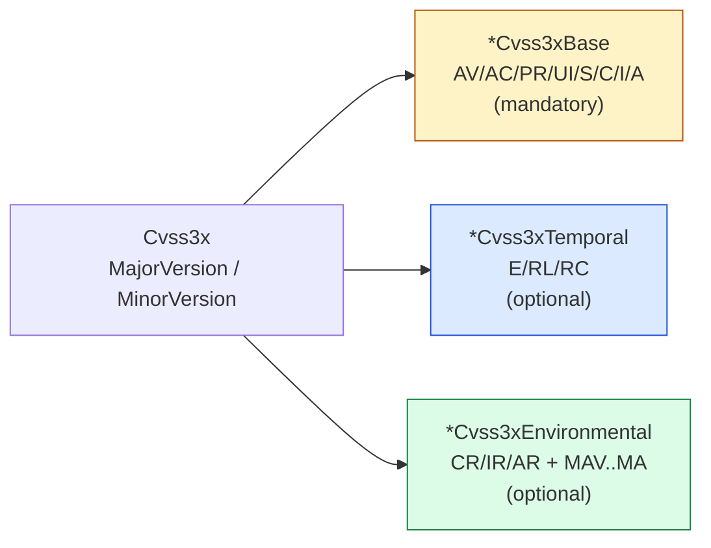

# 🧬 Cvss3x

`pkg/cvss/cvss3x.go` · Main type · Embeds three segments + version

> This page documents the `Cvss3x` type definition and its serialization interface implementations as written in `pkg/cvss/cvss3x.go`. For the higher-level overview of the `pkg/cvss` package (parsing, scoring, building), see [/sdk/cvss](/sdk/cvss).

## Synopsis

`Cvss3x` is the main CVSS 3.x value type. It embeds the three metric segments — `Cvss3xBase` (mandatory), `Cvss3xTemporal` and `Cvss3xEnvironmental` (both optional) — plus a major/minor version pair. `String()` renders the canonical `CVSS:3.1/AV:.../...` form, and the four `Marshal*/Unmarshal*` methods integrate it with `encoding/json`, `encoding/xml`, `mapstructure` and database drivers.

```go
cv := cvss.NewCvss3x()                  // base allocated, temporal/env nil
cv.MajorVersion, cv.MinorVersion = 3, 1
// populate via parser/builder in practice
fmt.Println(cv.String())                // CVSS:3.1/...
fmt.Println(cv.Check())                 // <nil> when valid
```

## Structure



## API Reference

### `Cvss3x` struct

```go
type Cvss3x struct {
    *Cvss3xBase
    *Cvss3xTemporal
    *Cvss3xEnvironmental

    MajorVersion int
    MinorVersion int
}
```

The embedded pointers give `Cvss3x` direct access to every metric field and method of the three segments. `MajorVersion`/`MinorVersion` form the `3.0` / `3.1` prefix.

### `NewCvss3x`

```go
func NewCvss3x() *Cvss3x
```

Returns a `*Cvss3x` with `Cvss3xBase` allocated (empty) and `Cvss3xTemporal` / `Cvss3xEnvironmental` left `nil`. The version fields are zero-valued — callers (or the parser) set them afterwards.

### `Check`

```go
func (x *Cvss3x) Check() error
```

Validates the whole vector in order:

1. nil receiver → `fmt.Errorf("Cvss3x is nil")`
2. `MajorVersion != 3` → error (only major version 3 is supported)
3. `MinorVersion` not in `{0, 1}` → error (only 3.0 and 3.1)
4. `Cvss3xBase` nil → error; otherwise `x.Cvss3xBase.Check()` (all eight base metrics must be set)
5. If `Cvss3xTemporal` is non-nil, `x.Cvss3xTemporal.Check()`
6. If `Cvss3xEnvironmental` is non-nil, `x.Cvss3xEnvironmental.Check()`

The temporal and environmental segments are optional; when present, only their *set* fields are validated.

### `String`

```go
func (x *Cvss3x) String() string
```

Builds the canonical vector string: `CVSS:<Major>.<Minor>` followed by `/`-prefixed segment outputs from `Cvss3xBase.String()`, `Cvss3xTemporal.String()` and `Cvss3xEnvironmental.String()` (each only when the segment is non-nil and non-empty). Example: `CVSS:3.1/AV:L/AC:L/PR:L/UI:N/S:U/C:N/I:H/A:H`.

### JSON serialization

```go
func (x *Cvss3x) MarshalJSON() ([]byte, error)
func (x *Cvss3x) UnmarshalJSON(data []byte) error
```

`MarshalJSON` implements `json.Marshaler`: a nil receiver yields `null`, otherwise the vector string is emitted as a JSON string (`"CVSS:3.1/..."`).

`UnmarshalJSON` implements `json.Unmarshaler`: `null` and `""` are no-ops; any other string is parsed via the internal `fromVectorString` (the same parser used by `pkg/parser`). A parse failure is wrapped as `failed to unmarshal Cvss3x: %w`.

### Text serialization

```go
func (x *Cvss3x) MarshalText() ([]byte, error)
func (x *Cvss3x) UnmarshalText(data []byte) error
```

`MarshalText` implements `encoding.TextMarshaler`: nil → `nil, nil`, otherwise the raw bytes of `x.String()`. `UnmarshalText` implements `encoding.TextUnmarshaler`: empty input is a no-op, otherwise it parses via `fromVectorString` (wrapped error: `failed to unmarshal Cvss3x from text: %w`).

The text pair is what makes `Cvss3x` usable as a map key, an `encoding/xml` attribute/element, a `mapstructure` target, or a `database/sql` scan value — anywhere the `encoding.Text*` interfaces are consulted.

## Example

```go
package main

import (
	"encoding/json"
	"fmt"

	"github.com/scagogogo/cvss-skills/pkg/cvss"
	"github.com/scagogogo/cvss-skills/pkg/parser"
)

func main() {
	// Parse a vector string into a Cvss3x.
	cv, err := parser.ParseString("CVSS:3.1/AV:L/AC:L/PR:L/UI:N/S:U/C:N/I:H/A:H")
	if err != nil {
		panic(err)
	}

	fmt.Println(cv.String()) // CVSS:3.1/AV:L/AC:L/PR:L/UI:N/S:U/C:N/I:H/A:H
	fmt.Println(cv.Check())  // <nil>

	// JSON round-trip via MarshalJSON / UnmarshalJSON.
	b, _ := json.Marshal(cv)
	fmt.Println(string(b)) // "CVSS:3.1/AV:L/AC:L/PR:L/UI:N/S:U/C:N/I:H/A:H"

	var cv2 cvss.Cvss3x
	if err := json.Unmarshal(b, &cv2); err != nil {
		panic(err)
	}
	fmt.Println(cv2.String()) // same vector

	// Text round-trip via MarshalText / UnmarshalText (works with xml/sql/mapstructure).
	txt, _ := cv.MarshalText()
	var cv3 cvss.Cvss3x
	_ = cv3.UnmarshalText(txt)
	fmt.Println(cv3.String())
}
```

## Related

- [/sdk/cvss](/sdk/cvss) — package-level overview (this page is the type-level complement)
- [/sdk/cvss3x-base](/sdk/cvss3x-base) · [/sdk/cvss3x-temporal](/sdk/cvss3x-temporal) · [/sdk/cvss3x-environmental](/sdk/cvss3x-environmental) — the three embedded segments
- [/sdk/json](/sdk/json) — JSON serialization helpers built on these methods
- [/sdk/parser](/sdk/parser) — the `fromVectorString` parser used by `UnmarshalJSON` / `UnmarshalText`
