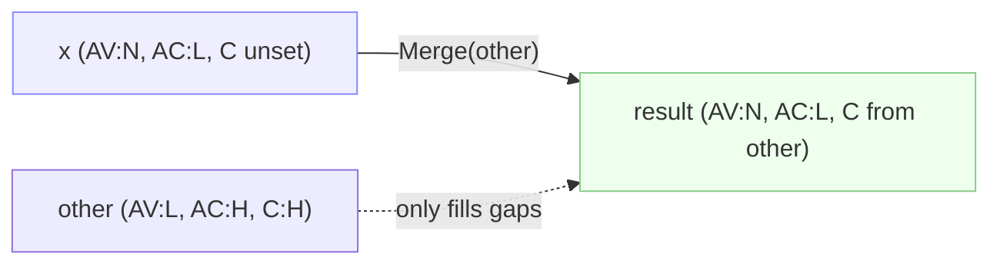

# 🔀 Diff, Merge & Description

🔀 Feature · `pkg/cvss`

`Diff` returns the metrics where two vectors differ; `Merge` produces a copy of one vector with its gaps filled from another (never overwriting set values); `Description` renders a flat, human-readable string of every set metric. Together they cover the three things you do when comparing vectors: see the deltas, reconcile them, and narrate them.

## Synopsis

```go
diffs := a.Diff(b)            // []DiffEntry — only the differing metrics
merged := a.Merge(b)          // a's gaps filled from b; a's set values kept
desc := a.Description()       // "Attack Vector: Network, Attack Complexity: Low, ..."
```

## API Reference

### DiffEntry

```go
type DiffEntry struct {
    Metric string // short name, e.g. "AV"
    V1, V2 string // short values, e.g. "N" / "L"; "-" when unset on one side
    V1Long, V2Long string // long names, e.g. "Network" / "Local"
}

func (d DiffEntry) String() string // "AV: N vs L"
```

### Diff

```go
func (x *Cvss3x) Diff(other *Cvss3x) []DiffEntry
```

Walks Base, Temporal, and Environmental metrics. A metric set on one side but not the other is a diff (the missing side shows `"-"` / `"-"`). A metric set on both but with different short values is a diff. A metric unset on both sides is **not** a diff. Returns `nil` if either receiver is `nil`.

```go
diffs := a.Diff(b)
for _, d := range diffs { fmt.Println(d) } // AV: N vs L
```

### Merge

```go
func (x *Cvss3x) Merge(other *Cvss3x) *Cvss3x
```

Returns a **copy** of `x` with every metric that is `nil` on `x` but set on `other` filled in from `other`. Metrics already set on `x` are **never overwritten** — Merge is a left-biased fill, not an overwrite. Sub-structs (`Cvss3xTemporal`, `Cvss3xEnvironmental`) are lazily allocated on the copy when `other` contributes a metric from that group. A `nil` receiver returns `other.Clone()`; a `nil` other returns `x.Clone()`.



::: warning Merge never overwrites
Because Merge only fills `nil` slots, calling `a.Merge(b)` then `a.Merge(c)` is order-independent for any metric set in `b` or `c`: the first contributor wins. To force an overwrite, use [`SetMetricValue`](/sdk/accessor) or the [`With*Method`](/sdk/with-method) family.
:::

### Description

```go
func (x *Cvss3x) Description() string
```

Returns `"Attack Vector: Network, Attack Complexity: Low, Privileges Required: None, ..."` — every set metric across all three groups, in CVSS canonical order, joined by `", "`. Unset metrics are skipped. Returns `""` for a nil receiver. This is the format the CLI `describe` command prints.

```go
fmt.Println(cv.Description())
// Attack Vector: Network, Attack Complexity: Low, Privileges Required: None, ...
```

## Example

```go
package main

import (
    "fmt"

    "github.com/scagogogo/cvss-skills/pkg/parser"
)

func main() {
    a, err := parser.ParseString("CVSS:3.1/AV:N/AC:L/PR:N/UI:N/S:U/C:H/I:H/A:H")
    if err != nil {
        panic(err)
    }
    b, err := parser.ParseString("CVSS:3.1/AV:L/AC:L/PR:N/UI:N/S:U/C:H/I:H/A:H/E:F/RL:U/RC:C")
    if err != nil {
        panic(err)
    }

    // Diff: AV differs (N vs L); E/RL/RC are set on b but not a.
    for _, d := range a.Diff(b) {
        fmt.Println(d)
    }
    // AV: N vs L
    // E: - vs F
    // RL: - vs U
    // RC: - vs C

    // Merge: a keeps AV:N, gains E/RL/RC from b.
    merged := a.Merge(b)
    fmt.Println(merged.GetTemporalVectorString()) // .../A:H/E:F/RL:U/RC:C
    fmt.Println(merged.Equal(a))                   // false — merged has temporal

    // Merge does not overwrite: AV stays N even though b has AV:L.
    s, _, _ := merged.GetMetricValue("AV")
    fmt.Printf("AV after merge: %c\n", s) // N

    // Description: a flat, human-readable summary.
    fmt.Println(a.Description())
    // Attack Vector: Network, Attack Complexity: Low, Privileges Required: None, ...
}
```

## Related

- [Accessor](/sdk/accessor) — `GetMetricValue` / `SetMetricValue` for forced overwrites
- [With-Method](/sdk/with-method) — immutable per-metric setters
- [Convenience](/sdk/convenience) — `Equal` for whole-vector equality
- CLI: [`diff`](/cli/commands/diff), [`merge`](/cli/commands/merge), [`describe`](/cli/commands/describe)
