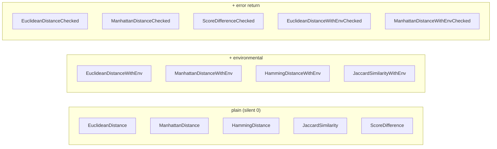

# 📏 Distance & Comparison

`cvss.DistanceCalculator` measures how far apart two CVSS vectors are. Five metrics are available, each in three flavors: plain (silent 0 on incomplete base metrics), `WithEnv` (adds environmental metrics), and `Checked` (returns an error instead of silently returning 0).

## Synopsis

```go
dc := cvss.NewDistanceCalculator(a, b)
fmt.Println(dc.EuclideanDistance())          // base + temporal
fmt.Println(dc.EuclideanDistanceWithEnv())   // + environmental
e, err := dc.EuclideanDistanceChecked()      // error if base incomplete
```

## Metric relationships



| Metric | What it counts | Range | Notes |
| --- | --- | --- | --- |
| Euclidean | √(Σ score-diff²) over metric dims | ≥ 0 | PR/UI diffs use context-adjusted scores |
| Manhattan | Σ \|score-diff\| over metric dims | ≥ 0 | same context adjustments |
| Hamming | count of differing metrics | int ≥ 0 | compares short values, not scores |
| Jaccard similarity | same / total metrics | 0–1 | 1 = identical; uses Hamming internally |
| Score difference | \|score(a) − score(b)\| | 0–10 | uses `Calculate`, so the most refined score |

## API Reference

```go
func NewDistanceCalculator(vector1, vector2 *Cvss3x) *DistanceCalculator
```

### Plain (silent 0 on incomplete base metrics)

```go
func (dc *DistanceCalculator) EuclideanDistance() float64
func (dc *DistanceCalculator) ManhattanDistance() float64
func (dc *DistanceCalculator) HammingDistance() int
func (dc *DistanceCalculator) JaccardSimilarity() float64
func (dc *DistanceCalculator) ScoreDifference() float64
```

### With environmental metrics

```go
func (dc *DistanceCalculator) EuclideanDistanceWithEnv() float64
func (dc *DistanceCalculator) ManhattanDistanceWithEnv() float64
func (dc *DistanceCalculator) HammingDistanceWithEnv() int
func (dc *DistanceCalculator) JaccardSimilarityWithEnv() float64
```
These add the 11 environmental dimensions (CR/IR/AR + MAV..MA) when both vectors have environmental metrics; otherwise they behave like the plain variants.

### Checked (return error instead of silent 0)

```go
func (dc *DistanceCalculator) EuclideanDistanceChecked() (float64, error)
func (dc *DistanceCalculator) ManhattanDistanceChecked() (float64, error)
func (dc *DistanceCalculator) ScoreDifferenceChecked() (float64, error)
func (dc *DistanceCalculator) EuclideanDistanceWithEnvChecked() (float64, error)
func (dc *DistanceCalculator) ManhattanDistanceWithEnvChecked() (float64, error)
```
The `*Checked` variants return `errIncompleteMetrics` ("base metrics incomplete, cannot compute distance") when either vector is missing required base metrics, instead of silently returning 0.

::: tip Jaccard is a similarity, not a distance
`JaccardSimilarity` returns 1.0 for identical vectors and 0.0 for fully disjoint ones. Convert to a distance with `1 - jaccard` if you need a dissimilarity.
:::

::: warning ScoreDifference returns 0 on either nil vector
`ScoreDifference` silently returns `0.0` if either vector is `nil` or if either `Calculate` errors. Use `ScoreDifferenceChecked` to surface those cases.
:::

## Example

```go
package main

import (
    "fmt"

    "github.com/scagogogo/cvss-skills/pkg/cvss"
    "github.com/scagogogo/cvss-skills/pkg/parser"
)

func main() {
    a, _ := parser.ParseString("CVSS:3.1/AV:N/AC:L/PR:N/UI:N/S:U/C:H/I:H/A:H")
    b, _ := parser.ParseString("CVSS:3.1/AV:L/AC:H/PR:H/UI:R/S:C/C:L/I:L/A:N")

    dc := cvss.NewDistanceCalculator(a, b)
    fmt.Printf("Euclidean : %.4f\n", dc.EuclideanDistance())
    fmt.Printf("Manhattan : %.4f\n", dc.ManhattanDistance())
    fmt.Printf("Hamming   : %d\n", dc.HammingDistance())        // 8
    fmt.Printf("Jaccard   : %.4f\n", dc.JaccardSimilarity())     // 0/8 -> 0.0
    fmt.Printf("ScoreDiff : %.1f\n", dc.ScoreDifference())       // |9.8 - 5.0| ...

    // Checked variant surfaces incomplete base metrics.
    partial, _ := parser.ParseRelaxed("AV:N/AC:L", "3.1") // only 2 of 8
    dc2 := cvss.NewDistanceCalculator(a, partial)
    if _, err := dc2.EuclideanDistanceChecked(); err != nil {
        fmt.Println("checked error:", err)
    }
}
```

## Related

- [pkg/cvss](/sdk/cvss) — `Diff` for a per-metric breakdown, `Equal` for equality
- [Scoring (calculator)](/sdk/calculator) — used by `ScoreDifference`
- [Impact & Sensitivity](/sdk/impact) — single-vector "which metric matters most" analysis
