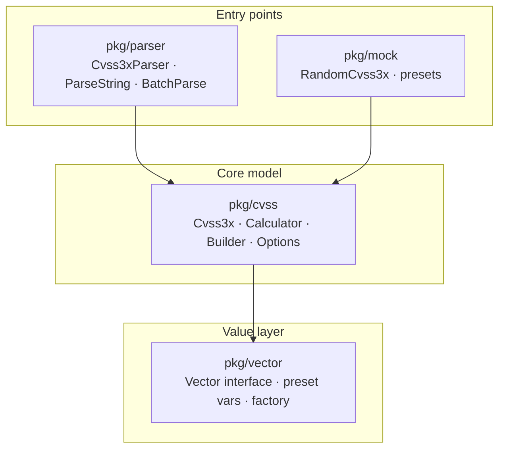

# 📦 Go SDK Overview

`pkg/cvss` · `pkg/parser` · `pkg/vector` · `pkg/mock` — spec-accurate CVSS v3.0/v3.1 scoring, parsing and comparison for Go.

## Package Structure

The SDK is split into four packages with a clear dependency direction: `pkg/parser` and `pkg/mock` sit on top of `pkg/cvss`, which in turn depends on `pkg/vector` for the immutable metric-value objects.



| Package | Responsibility | Key types |
| --- | --- | --- |
| `pkg/cvss` | The core: `Cvss3x` model, scoring, builder, options, presets, distance, impact, JSON/CSV, validation, SQL, enumeration | `Cvss3x`, `Calculator`, `Cvss3xBuilder`, `Option`, `DistanceCalculator` |
| `pkg/parser` | Turn vector strings into `*Cvss3x`, with strict, relaxed, batch and parse-and-score flavors | `Cvss3xParser`, `VectorParser`, `ParseString`, `BatchParse` |
| `pkg/vector` | Immutable metric-value objects and the factory that resolves a short name + value into a `Vector` | `Vector`, `VectorImpl`, `GetAttackVector`, `AttackVectorNetwork` |
| `pkg/mock` | Random vector generation and severity-preset fixtures for tests and demos | `RandomCvss3x`, `RandomCvss3xFull`, `CriticalCvss31` |

## Install

```bash
go get github.com/scagogogo/cvss-skills@latest
```

The module path is `github.com/scagogogo/cvss-skills` (Go 1.18+). Import the packages you need:

```go
import (
    "github.com/scagogogo/cvss-skills/pkg/cvss"
    "github.com/scagogogo/cvss-skills/pkg/parser"
    "github.com/scagogogo/cvss-skills/pkg/vector"
    "github.com/scagogogo/cvss-skills/pkg/mock"
)
```

## 5-Minute Quickstart

Three steps: **parse** a vector string, **score** it, and read its **severity**.

```go
package main

import (
    "fmt"

    "github.com/scagogogo/cvss-skills/pkg/cvss"
    "github.com/scagogogo/cvss-skills/pkg/parser"
)

func main() {
    // 1. Parse a CVSS vector string into a *Cvss3x.
    cv, err := parser.ParseString("CVSS:3.1/AV:N/AC:L/PR:N/UI:N/S:U/C:H/I:H/A:H")
    if err != nil {
        panic(err)
    }

    // 2. Score it with a Calculator.
    calc := cvss.NewCalculator(cv)
    score, err := calc.Calculate()
    if err != nil {
        panic(err)
    }

    // 3. Map the score to a severity rating.
    severity := calc.GetSeverityRating(score)

    fmt.Printf("vector    : %s\n", cv.String())
    fmt.Printf("score     : %.1f\n", score)       // 9.8
    fmt.Printf("severity  : %s\n", severity)       // High
}
```

::: tip One-shot parse + score
When you only need the score from a string, skip the intermediate steps with `parser.ParseAndScore`, which returns the object, score and severity in one call.
:::

## Where to Go Next

Each topic below is its own page with full API reference and runnable examples.

| Topic | What you'll learn |
| --- | --- |
| [pkg/cvss](/sdk/cvss) | The `Cvss3x` type and its Base / Temporal / Environmental three-part structure |
| [pkg/parser](/sdk/parser) | Strict, relaxed, validated and batched parsing |
| [pkg/vector](/sdk/vector) | The `Vector` interface, preset variables and the `Get*` factory |
| [pkg/mock](/sdk/mock) | Random vector generation and severity presets |
| [Scoring (calculator)](/sdk/calculator) | Base / Temporal / Environmental scores and breakdowns |
| [Builder Pattern](/sdk/builder) | Fluent `NewBuilder().AV('N')...Build()` construction |
| [Functional Options](/sdk/options) | `NewCvss3xWithOptions(WithAV('N'), ...)` |
| [Presets](/sdk/presets) | `CriticalV31()`, `HighV31()`, and the v3.0 family |
| [Distance & Comparison](/sdk/distance) | Euclidean, Manhattan, Hamming, Jaccard, score-delta |
| [Impact & Sensitivity](/sdk/impact) | Which metric moves the score the most |
| [JSON Serialization](/sdk/json) | `ToJSON` / `FromJSON` and the `JSONOutput` shape |
| [CSV I/O](/sdk/csv) | `WriteCSV` / `ReadCSV` / `ReadCSVLax` |
| [Validation](/sdk/validation) | `Validate`, `MissingMetrics`, sentinel errors |
| [Enumeration](/sdk/enumerate) | List metrics, iterate all 2592 base combinations |
| [Score Range](/sdk/score-range) | Best/worst case for partial vectors |
| [SQL & Sorting](/sdk/sql-sort) | `sql.Scanner` / `driver.Valuer`, sort by score, canonicalize |

## Related

- [CLI Reference](/cli/) — the `cvss-cli` is a thin shell over these same packages
- [API Reference (godoc)](/docs/api/) — generated, exhaustive symbol list
- [Integration Methods](/integration/) — pick between SDK, CLI, Skills and MCP
