# 🧾 JSON Serialization

Two JSON shapes coexist: a compact vector-string form (via `MarshalJSON`/`UnmarshalJSON`) and a rich structured form (via `ToJSON`/`FromJSON`). The compact form is what `*Cvss3x` marshals to by default; the structured form mirrors the FIRST.org JSON schema with per-metric long names and sub-scores.

## Synopsis

```go
compact, _ := json.Marshal(cv)        // "CVSS:3.1/AV:N/..."
rich, _    := cv.ToJSON(nil)          // structured JSONOutput
back, _    := cvss.FromJSON(rich)     // -> *Cvss3x
```

## How It Works

`ToJSON` validates the vector, then walks Base/Temporal/Environmental groups, calling the calculator for each score tier. `FromJSON` prefers the embedded `vectorString` and only falls back to rebuilding from per-metric long names when that field is absent.

```mermaid
flowchart TD
    subgraph Out[ToJSON]
        CV[📦 *Cvss3x] --> Calc[🧮 Calculator Check]
        Calc -- error --> OErr("[🔴 error]")
        Calc -- ok --> BaseS[🔢 calculateBaseScore]
        BaseS --> Build["🧱 JSONOutput{version,vectorString,baseScore,baseSeverity}"]
        Build --> TM{"🟡 hasTemporal?"}
        TM -- yes --> TS[🔢 temporalScore+severity, Metrics.Temporal]
        TM -- no --> SkipT[⏭️ omit temporal]
        TS --> EM{"🟡 hasEnvironmental?"}
        SkipT --> EM
        EM -- yes --> ES[🔢 envScore+severity, Metrics.Environmental + modified sub-scores]
        EM -- no --> SkipE[⏭️ omit environmental]
        ES --> Marshal("[✅ JSON bytes]")
        SkipE --> Marshal
    end
    subgraph In[FromJSON]
        Bytes[📄 JSON bytes] --> Unm["🔍 json.Unmarshal -> JSONOutput"]
        Unm --> VS{"🟡 vectorString present?"}
        VS -- yes --> Parse[🔍 fromVectorString]
        VS -- no --> Rebuild["🔧 fromJSONMetrics: LongValue -> ShortValue -> GetVectorByShortName"]
        Parse --> CVOut("[✅ *Cvss3x]")
        Rebuild --> CVOut
    end
```



## Types

### `JSONOutput` (top level)

| Field | Type | JSON tag |
| --- | --- | --- |
| `Version` | `string` | `version` |
| `VectorString` | `string` | `vectorString` |
| `BaseScore` | `float64` | `baseScore` |
| `TemporalScore` | `float64` | `temporalScore,omitempty` |
| `EnvironmentalScore` | `float64` | `environmentalScore,omitempty` |
| `BaseSeverity` | `Severity` | `baseSeverity` |
| `TemporalSeverity` | `Severity` | `temporalSeverity,omitempty` |
| `EnvironmentalSeverity` | `Severity` | `environmentalSeverity,omitempty` |
| `Metrics` | `*JSONMetrics` | `metrics` |

### `JSONMetrics`

| Field | Type | JSON tag |
| --- | --- | --- |
| `Base` | `*JSONBaseMetrics` | `base` |
| `Temporal` | `*JSONTemporalMetrics` | `temporal,omitempty` |
| `Environmental` | `*JSONEnvironmentalMetrics` | `environmental,omitempty` |

### `JSONBaseMetrics`

Long-name strings for AV/AC/PR/UI/S/C/I/A plus `ExploitabilityScore` and `ImpactScore` (the ESC and ISC sub-scores).

### `JSONTemporalMetrics`

`ExploitCodeMaturity`, `RemediationLevel`, `ReportConfidence` — long-name strings.

### `JSONEnvironmentalMetrics`

`ConfidentialityRequirement`/`IntegrityRequirement`/`AvailabilityRequirement` and the eight `Modified*` metrics (all long-name strings, `omitempty`), plus `ModifiedExploitabilityScore` and `ModifiedImpactScore`.

## API Reference

```go
func (x *Cvss3x) ToJSON(calculator *Calculator) ([]byte, error)
func FromJSON(data []byte) (*Cvss3x, error)

func (x *Cvss3x) MarshalJSON() ([]byte, error)
func (x *Cvss3x) UnmarshalJSON(data []byte) error
```

- `ToJSON(nil)` builds its own `Calculator`. It validates via `Check` and returns indented JSON (`MarshalIndent`).
- `FromJSON` prefers the `vectorString` field; if absent, it rebuilds the vector from the per-metric long-name fields using an internal long→short mapping.
- `MarshalJSON` emits the vector string quoted (`"CVSS:3.1/..."`); `UnmarshalJSON` parses it back through the internal vector parser. Both `null` and `""` decode to an empty `Cvss3x`.

::: tip Compact vs rich — which to use?
Store/transmit the compact vector string (`MarshalJSON`) when consumers just need the vector. Emit `ToJSON` when consumers want pre-computed scores and human-readable metric names (e.g. for an API response matching the FIRST.org shape).
:::

::: warning FromJSON needs valid long names when there's no vectorString
If `vectorString` is missing, `FromJSON` maps long names like `"Network"` back to short values. A typo or unknown long name produces an error (e.g. `unknown value Netwerk for metric AV`) rather than silently dropping the metric.
:::

## Example

```go
package main

import (
    "encoding/json"
    "fmt"

    "github.com/scagogogo/cvss-skills/pkg/cvss"
    "github.com/scagogogo/cvss-skills/pkg/parser"
)

func main() {
    cv, _ := parser.ParseString(
        "CVSS:3.1/AV:N/AC:L/PR:N/UI:N/S:U/C:H/I:H/A:H/E:F/RL:U/RC:C")

    // Compact vector-string JSON (default marshaling).
    compact, _ := json.Marshal(cv)
    fmt.Printf("compact: %s\n", compact)

    // Rich structured JSON.
    rich, _ := cv.ToJSON(nil)
    fmt.Printf("rich: %s\n", rich)

    // Round-trip rich JSON back to a *Cvss3x.
    back, _ := cvss.FromJSON(rich)
    fmt.Println(back.String())

    // Compact form also round-trips via UnmarshalJSON.
    var again cvss.Cvss3x
    _ = json.Unmarshal(compact, &again)
    fmt.Println(again.String())
}
```

## Related

- [CSV I/O](/sdk/csv) — tabular serialization
- [pkg/cvss](/sdk/cvss) — `MarshalText`/`UnmarshalText` for XML & DB drivers
- [Scoring (calculator)](/sdk/calculator) — `ToJSON` computes scores inline
