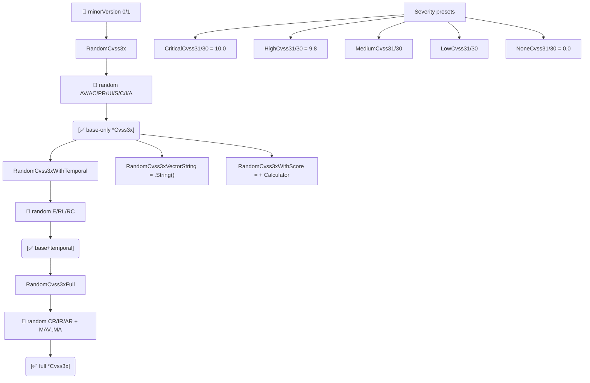

# 🎲 pkg/mock

Generate random `Cvss3x` vectors and grab ready-made severity presets. Handy for tests, benchmarks, demo data and property-based checks over the scoring engine.

## Synopsis

```go
cv := mock.RandomCvss3xFull(1)        // base + temporal + environmental
obj, score, _ := mock.RandomCvss3xWithScore(1)
preset := mock.CriticalCvss31()       // CVSS:3.1/.../S:C/C:H/I:H/A:H (10.0)
```

::: warning Not cryptographically random
`pkg/mock` uses `math/rand`. Vectors are suitable for test fixtures and demos, not for security-sensitive seeding.
:::

## How It Works

`RandomCvss3x` picks one preset per base metric from the `pkg/vector` catalog; `RandomCvss3xWithTemporal` and `RandomCvss3xFull` layer temporal and environmental groups on top. The `*Cvss3x`/`*Cvss30` severity presets return fixed, hand-picked vectors at each rating bucket for deterministic test data.



## API Reference

### Random generators

```go
func RandomCvss3x(minorVersion int) *cvss.Cvss3x
func RandomCvss3xWithTemporal(minorVersion int) *cvss.Cvss3x
func RandomCvss3xFull(minorVersion int) *cvss.Cvss3x
func RandomCvss3xVectorString(minorVersion int) string
func RandomCvss3xWithScore(minorVersion int) (*cvss.Cvss3x, float64, error)
```

| Function | Metrics populated | Returns |
| --- | --- | --- |
| `RandomCvss3x` | Base only | `*Cvss3x` |
| `RandomCvss3xWithTemporal` | Base + Temporal (E/RL/RC) | `*Cvss3x` |
| `RandomCvss3xFull` | Base + Temporal + Environmental (CR/IR/AR + MAV..MA) | `*Cvss3x` |
| `RandomCvss3xVectorString` | Base only | vector string |
| `RandomCvss3xWithScore` | Base only | `(*Cvss3x, score, error)` |

`minorVersion` must be `0` or `1`; any other value is coerced to `1`.

### Severity presets

Ready-made `*Cvss3x` fixtures at each severity band, for both v3.0 and v3.1:

```go
// CVSS 3.1
func CriticalCvss31() *cvss.Cvss3x  // AV:N/AC:L/PR:N/UI:N/S:C/C:H/I:H/A:H  (10.0)
func HighCvss31() *cvss.Cvss3x      // AV:N/AC:L/PR:N/UI:N/S:U/C:H/I:H/A:H  (9.8)
func MediumCvss31() *cvss.Cvss3x    // AV:N/AC:L/PR:N/UI:N/S:U/C:L/I:L/A:N  (6.5)
func LowCvss31() *cvss.Cvss3x       // AV:N/AC:H/PR:N/UI:N/S:U/C:L/I:N/A:N  (3.7)
func NoneCvss31() *cvss.Cvss3x      // AV:N/AC:L/PR:N/UI:N/S:U/C:N/I:N/A:N  (0.0)

// CVSS 3.0 — same set, minorVersion 0 (Medium uses UI:R)
func CriticalCvss30() *cvss.Cvss3x
func HighCvss30() *cvss.Cvss3x
func MediumCvss30() *cvss.Cvss3x
func LowCvss30() *cvss.Cvss3x
func NoneCvss30() *cvss.Cvss3x
```

These mirror the presets in `pkg/cvss` (`CriticalV31`, …) but live in the `mock` package for test ergonomics.

## Example

```go
package main

import (
    "fmt"

    "github.com/scagogogo/cvss-skills/pkg/cvss"
    "github.com/scagogogo/cvss-skills/pkg/mock"
)

func main() {
    // Generate a full random v3.1 vector and score it.
    cv := mock.RandomCvss3xFull(1)
    calc := cvss.NewCalculator(cv)
    score, _ := calc.Calculate()
    fmt.Printf("%s -> %.1f (%s)\n", cv.String(), score, cvss.GetSeverity(score))

    // Use a preset for a deterministic test case.
    high := mock.HighCvss31()
    fmt.Println(high.String()) // CVSS:3.1/AV:N/AC:L/PR:N/UI:N/S:U/C:H/I:H/A:H

    // Random vector + score in one call.
    _, s, _ := mock.RandomCvss3xWithScore(1)
    fmt.Printf("random score: %.1f\n", s)
}
```

## Related

- [Presets](/sdk/presets) — the `pkg/cvss` versions of the same fixtures
- [pkg/cvss](/sdk/cvss) — the type being generated
- [Enumeration](/sdk/enumerate) — exhaustive enumeration as an alternative to randomness
