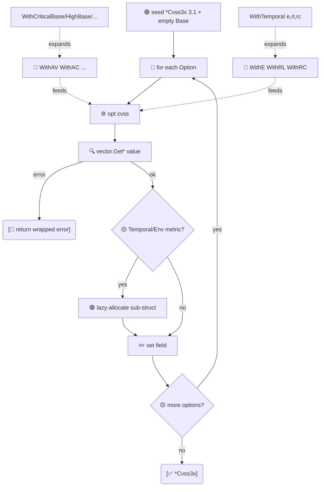

# ⚙️ Functional Options

The idiomatic Go Functional Options pattern for constructing `*Cvss3x`. Compose any combination of `With*` options; adding new options never breaks existing call sites.

## Synopsis

```go
cv, err := cvss.NewCvss3xWithOptions(
    cvss.WithVersion31(),
    cvss.WithAV('N'), cvss.WithAC('L'), cvss.WithPR('N'), cvss.WithUI('N'),
    cvss.WithS('U'), cvss.WithC('H'), cvss.WithI('H'), cvss.WithA('H'),
)
```

Or, using a base preset plus temporal tweaks:

```go
cv, _ := cvss.NewCvss3xWithOptions(
    cvss.WithCriticalBase(),
    cvss.WithTemporal('F', 'U', 'C'),
)
```

## How It Works

`NewCvss3xWithOptions` seeds a v3.1 `*Cvss3x` with an empty `Cvss3xBase`, then applies each `Option` in order; the first failing option aborts the chain. Each `With*` resolves its rune through the `pkg/vector` factory and lazily allocates the Temporal/Environmental sub-struct when needed. Composite options (`WithTemporal`, `WithRequirements`, `WithCriticalBase`…) just fan out to the single-metric options.



## API Reference

### Core

```go
type Option func(*Cvss3x) error

func NewCvss3xWithOptions(opts ...Option) (*Cvss3x, error)
func MustNewCvss3xWithOptions(opts ...Option) *Cvss3x
```
Each option is applied in order; the first error short-circuits. `Must*` panics on error. The returned object defaults to v3.1 with an allocated `Cvss3xBase`.

### Version

```go
func WithVersion(major, minor int) Option
func WithVersion31() Option  // = WithVersion(3, 1)
func WithVersion30() Option  // = WithVersion(3, 0)
```

### Base metrics

```go
func WithAV(val rune) Option
func WithAC(val rune) Option
func WithPR(val rune) Option
func WithUI(val rune) Option
func WithS(val rune) Option
func WithC(val rune) Option
func WithI(val rune) Option
func WithA(val rune) Option
```

### Temporal metrics

```go
func WithE(val rune) Option
func WithRL(val rune) Option
func WithRC(val rune) Option
func WithTemporal(e, rl, rc rune) Option  // sets all three at once
```

### Environmental metrics

```go
func WithCR(val rune) Option
func WithIR(val rune) Option
func WithAR(val rune) Option
func WithRequirements(cr, ir, ar rune) Option   // sets all three at once
func WithMAV(val rune) Option
func WithMAC(val rune) Option
func WithMPR(val rune) Option
func WithMUI(val rune) Option
func WithMS(val rune) Option
func WithMC(val rune) Option
func WithMI(val rune) Option
func WithMA(val rune) Option
```

### Base severity presets

```go
func WithCriticalBase() Option  // AV:N/AC:L/PR:N/UI:N/S:C/C:H/I:H/A:H
func WithHighBase() Option      // AV:N/AC:L/PR:N/UI:N/S:U/C:H/I:H/A:H
func WithMediumBase() Option    // AV:N/AC:L/PR:N/UI:N/S:U/C:L/I:L/A:N
func WithLowBase() Option       // AV:N/AC:H/PR:N/UI:R/S:U/C:L/I:N/A:N
func WithNoneBase() Option      // AV:N/AC:L/PR:N/UI:N/S:U/C:N/I:N/A:N
```
Each applies eight base-metric options in spec order. Combine with temporal/environmental options to layer on top.

::: tip Options are composable values
An `Option` is just a `func(*Cvss3x) error`. You can store them in slices, pass them around, and build your own presets: `var myPreset = []cvss.Option{cvss.WithHighBase(), cvss.WithE('F')}`.
:::

::: warning Presets overwrite, they don't merge with prior calls
`WithCriticalBase()` sets all eight base metrics. If you call `WithS('U')` before it, the preset's `WithS('C')` wins. Order your options so presets come first, refinements after.
:::

## Example

```go
package main

import (
    "fmt"

    "github.com/scagogogo/cvss-skills/pkg/cvss"
)

func main() {
    // Preset + refinement.
    cv, err := cvss.NewCvss3xWithOptions(
        cvss.WithHighBase(),   // S:U/C:H/I:H/A:H ...
        cvss.WithS('C'),       // ... but flip Scope to Changed -> Critical
    )
    if err != nil {
        panic(err)
    }
    fmt.Println(cv.String())

    // Temporal + requirements in one call each.
    full, _ := cvss.NewCvss3xWithOptions(
        cvss.WithCriticalBase(),
        cvss.WithTemporal('F', 'U', 'C'),
        cvss.WithRequirements('H', 'H', 'H'),
    )
    fmt.Println(full.HasTemporalMetrics(), full.HasEnvironmentalMetrics())

    // A reusable preset slice.
    highWithTemporal := []cvss.Option{
        cvss.WithHighBase(),
        cvss.WithTemporal('F', 'U', 'C'),
    }
    a, _ := cvss.NewCvss3xWithOptions(highWithTemporal...)
    fmt.Println(a.String())
}
```

## Related

- [Builder Pattern](/sdk/builder) — the fluent alternative
- [Presets](/sdk/presets) — `CriticalV31()` etc., ready-made full vectors
- [pkg/cvss](/sdk/cvss) — the type being constructed
