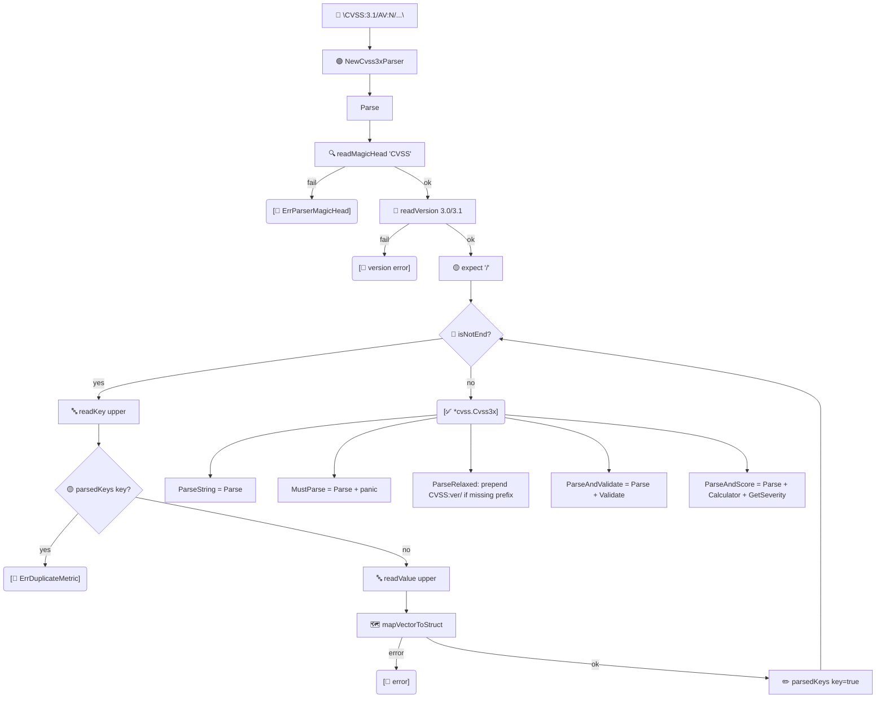

# 🔤 pkg/parser

Turn `CVSS:3.1/AV:N/...` strings into `*cvss.Cvss3x` objects. The package offers a low-level `Cvss3xParser`, one-shot convenience functions, parallel batch helpers, and the `VectorParser` registry that resolves metric short names to `vector.Vector` values.

## Synopsis

```go
cv, err := parser.ParseString("CVSS:3.1/AV:N/AC:L/PR:N/UI:N/S:U/C:H/I:H/A:H")
```

The strict parser requires the `CVSS:` magic head and a `3.0`/`3.1` version. `ParseRelaxed` accepts a bare `AV:N/...` tail. `ParseAndValidate` and `ParseAndScore` compose parse + validate / parse + score.

## How It Works

`Cvss3xParser.Parse` is a cursor-based scan: read the `CVSS` magic head, read the version, then loop over `/KEY:VALUE` pairs — upper-casing both halves, rejecting duplicate keys, and dispatching each pair through `mapVectorToStruct`. The convenience functions wrap `Parse` and post-process its result.



## Types

### `Cvss3xParser`

| Field | Type | Notes |
| --- | --- | --- |
| `cvss3xStr` | `string` | Trimmed input. |
| `cvss3x` | `*cvss.Cvss3x` | Populated during `Parse`. |
| `cvss3xRunes`, `i` | rune slice, int | Cursor state. |
| `parsedKeys` | `map[string]bool` | Duplicate-key detection. |

Created with `NewCvss3xParser(str)`; call `Parse()` to get `(*cvss.Cvss3x, error)`.

### `VectorParser`

A registry mapping `(shortName, shortValue)` to `vector.Vector`. `DefaultVectorParser` is preloaded with every base, temporal, environmental and modified metric value.

| Method | Signature |
| --- | --- |
| `Add` | `func (x *VectorParser) Add(v vector.Vector)` |
| `Parse` | `func (x *VectorParser) Parse(vectorName string, vectorValue rune) (vector.Vector, error)` |

### Result structs

| Struct | Fields |
| --- | --- |
| `BatchParseResult` | `Index int`, `Vector *cvss.Cvss3x`, `Error error` |
| `BatchValidateResult` | `Index int`, `Vector *cvss.Cvss3x`, `Valid bool`, `Errors []string`, `Error error` |

## API Reference

### One-shot parsing

```go
func ParseString(cvss3xStr string) (*cvss.Cvss3x, error)
func MustParse(cvss3xStr string) *cvss.Cvss3x
func ParseRelaxed(cvss3xStr string, defaultVersion string) (*cvss.Cvss3x, error)
func ParseAndValidate(cvss3xStr string) (*cvss.Cvss3x, error)
func ParseAndScore(cvss3xStr string) (*cvss.Cvss3x, float64, cvss.Severity, error)
```
- `MustParse` panics on failure — use only for compile-time-known vectors.
- `ParseRelaxed` auto-prefixes `CVSS:<version>/` when the `CVSS:` head is missing; `defaultVersion` of `""` defaults to `"3.1"`.
- `ParseAndScore` returns the object, the calculated score, and the severity in one call.

### Batch helpers (parallel)

```go
func BatchParse(vectors []string, workerCount int) []BatchParseResult
func BatchValidate(vectors []string, workerCount int) []BatchValidateResult
```
`workerCount <= 0` uses `len(vectors)`; capped to `len(vectors)`. Results preserve input order via the `Index` field.

### Low-level & registry

```go
func NewCvss3xParser(cvss3xStr string) *Cvss3xParser
func (x *Cvss3xParser) Parse() (*cvss.Cvss3x, error)

var DefaultVectorParser = NewVectorParser()
func NewVectorParser() *VectorParser
```

### Sentinel errors

```go
var ErrParserMagicHead = errors.New("...invalid magic head, it must equal 'CVSS'")
var ErrDuplicateMetric = errors.New("...duplicate metric key")
const CVSSMagicHead = "CVSS"
```

::: warning Duplicate keys are rejected
The parser tracks every key it has seen and returns an error wrapping `ErrDuplicateMetric` if the same metric appears twice — e.g. `.../AV:N/.../AV:L/`.
:::

## Example

```go
package main

import (
    "fmt"
    "log"

    "github.com/scagogogo/cvss-skills/pkg/parser"
)

func main() {
    // Strict parse.
    cv, err := parser.ParseString("CVSS:3.1/AV:N/AC:L/PR:N/UI:N/S:U/C:H/I:H/A:H")
    if err != nil {
        log.Fatal(err)
    }
    fmt.Println(cv.String())

    // Relaxed parse — no CVSS: prefix needed.
    relaxed, _ := parser.ParseRelaxed("AV:N/AC:L/PR:N/UI:N/S:U/C:H/I:H/A:H", "3.0")
    fmt.Println(relaxed.Version()) // 3.0

    // One-shot parse + score.
    _, score, severity, _ := parser.ParseAndScore(cv.String())
    fmt.Printf("%.1f %s\n", score, severity) // 9.8 High

    // Batch parse in parallel.
    results := parser.BatchParse([]string{
        "CVSS:3.1/AV:N/AC:L/PR:N/UI:N/S:U/C:H/I:H/A:H",
        "not-a-vector",
    }, 2)
    for _, r := range results {
        if r.Error != nil {
            fmt.Printf("index %d failed: %v\n", r.Index, r.Error)
        } else {
            fmt.Printf("index %d ok: %s\n", r.Index, r.Vector.String())
        }
    }
}
```

## Related

- [pkg/cvss](/sdk/cvss) — the object type `Parse` produces
- [Validation](/sdk/validation) — what `ParseAndValidate` checks under the hood
- [Scoring (calculator)](/sdk/calculator) — used by `ParseAndScore`
