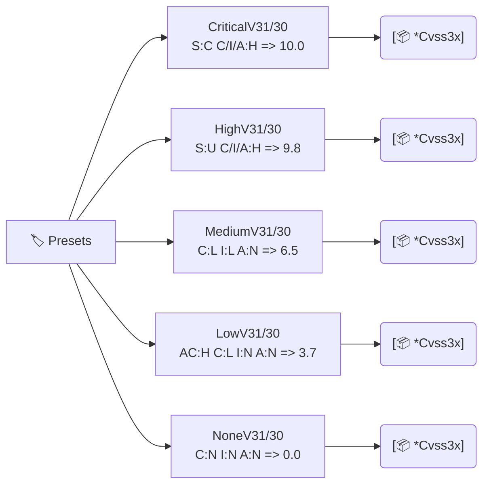

# 🏷️ Presets

Ready-made `*cvss.Cvss3x` vectors sitting at each severity band, for both CVSS v3.0 and v3.1. Use them as fixtures, baselines, or starting points you mutate with `SetMetricValue` / `With*Method`.

## Synopsis

```go
cv := cvss.CriticalV31()  // CVSS:3.1/AV:N/AC:L/PR:N/UI:N/S:C/C:H/I:H/A:H
fmt.Println(cv.String())
```

## How It Works

Each preset is a hand-picked, base-only `*Cvss3x` at a fixed severity band. The v3.1 and v3.0 families share the same metric choices except where the spec differs (e.g. `MediumV30` uses `UI:R` while `MediumV31` uses `UI:N`). All are network-attack (`AV:N`), no-privilege (`PR:N`) baselines.



## API Reference

### CVSS 3.1 presets

```go
func CriticalV31() *Cvss3x  // AV:N/AC:L/PR:N/UI:N/S:C/C:H/I:H/A:H  -> 10.0
func HighV31() *Cvss3x      // AV:N/AC:L/PR:N/UI:N/S:U/C:H/I:H/A:H  -> 9.8
func MediumV31() *Cvss3x    // AV:N/AC:L/PR:N/UI:N/S:U/C:L/I:L/A:N  -> 6.5
func LowV31() *Cvss3x       // AV:N/AC:H/PR:N/UI:N/S:U/C:L/I:N/A:N  -> 3.7
func NoneV31() *Cvss3x      // AV:N/AC:L/PR:N/UI:N/S:U/C:N/I:N/A:N  -> 0.0
```

### CVSS 3.0 presets

```go
func CriticalV30() *Cvss3x  // same metrics as CriticalV31, minorVersion 0 -> 10.0
func HighV30() *Cvss3x      // -> 9.8
func MediumV30() *Cvss3x    // AV:N/AC:L/PR:N/UI:R/S:U/C:L/I:L/A:N (note UI:R in v3.0)
func LowV30() *Cvss3x       // AV:N/AC:H/PR:N/UI:N/S:U/C:L/I:N/A:N
func NoneV30() *Cvss3x      // -> 0.0
```

All presets return base-metrics-only vectors (no Temporal or Environmental). The v3.0 and v3.1 families differ only in `MinorVersion` — and for `Medium`, in the `UI` value (v3.0 `Medium` uses `UI:R`, v3.1 uses `UI:N`).

::: tip The 3.0 vs 3.1 UI quirk
In v3.0, `UI:R` scores `0.56`; in v3.1 it scores `0.62`. The `Medium` preset highlights this: `MediumV30` uses `UI:R`, `MediumV31` uses `UI:N`. Same is true for the `pkg/mock` presets.
:::

::: warning Presets are shared pointers
Each preset returns the same `*Cvss3x` pointer on every call (the base metrics point at shared `vector.*` preset vars, which are immutable). Mutating the returned struct's own fields is fine, but if you need to mutate, prefer `Clone()` first to keep call sites isolated.
:::

## Example

```go
package main

import (
    "fmt"

    "github.com/scagogogo/cvss-skills/pkg/cvss"
)

func main() {
    for name, cv := range map[string]*cvss.Cvss3x{
        "Critical": cvss.CriticalV31(),
        "High":     cvss.HighV31(),
        "Medium":   cvss.MediumV31(),
        "Low":      cvss.LowV31(),
        "None":     cvss.NoneV31(),
    } {
        calc := cvss.NewCalculator(cv)
        score, _ := calc.Calculate()
        fmt.Printf("%-8s %.1f %s  %s\n",
            name, score, calc.GetSeverityRating(score), cv.String())
    }

    // Start from a preset and refine.
    high := cvss.HighV31()
    scoped, _ := high.SetMetricValue("S", 'C') // bump to Critical territory
    calc := cvss.NewCalculator(scoped)
    s, _ := calc.Calculate()
    fmt.Printf("refined: %.1f %s\n", s, calc.GetSeverityRating(s))
}
```

## Related

- [pkg/mock](/sdk/mock) — `CriticalCvss31()` etc., the same fixtures in the mock package
- [Functional Options](/sdk/options) — `WithCriticalBase()` etc. for constructing fresh vectors
- [Scoring (calculator)](/sdk/calculator) — score the presets
