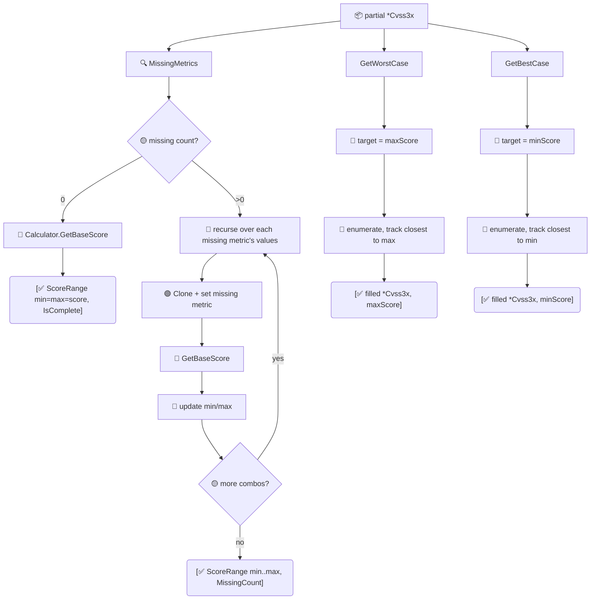

# 📈 Score Range

For a vector with missing base metrics, compute the range of scores it *could* have once the gaps are filled. `GetScoreRange` gives the bounds; `GetWorstCase` and `GetBestCase` return the filled-in vector that achieves each extreme.

## Synopsis

```go
partial, _ := parser.ParseRelaxed("AV:N/AC:L", "3.1") // 2 of 8 metrics
rng := cvss.GetScoreRange(partial)
fmt.Printf("%.1f ~ %.1f\n", rng.MinScore, rng.MaxScore)
worst, _, _ := cvss.GetWorstCase(partial)
```

## How It Works

`GetScoreRange` counts missing base metrics; if none, it returns the exact score as both min and max. Otherwise it recursively enumerates every value combination of the missing metrics, scoring each, and tracks the min/max. `GetWorstCase`/`GetBestCase` reuse that enumeration and pick the combination nearest the max/min target (tolerance-free, exact match preferred).



## Type

### `ScoreRange`

| Field | Type | Meaning |
| --- | --- | --- |
| `MinScore` | `float64` | Lowest achievable base score |
| `MaxScore` | `float64` | Highest achievable base score |
| `MinSeverity` | `Severity` | Severity at `MinScore` |
| `MaxSeverity` | `Severity` | Severity at `MaxScore` |
| `IsComplete` | `bool` | `true` when no base metrics are missing (Min == Max) |
| `MissingCount` | `int` | Number of missing base metrics |

`String()` renders either `"<score> (<sev>) [complete]"` or `"<min> (<sev>) ~ <max> (<sev>) [<n> metrics missing]"`.

## API Reference

```go
func GetScoreRange(cv *Cvss3x) ScoreRange
func GetWorstCase(cv *Cvss3x) (*Cvss3x, float64, error)
func GetBestCase(cv *Cvss3x) (*Cvss3x, float64, error)
```

- `GetScoreRange` returns `IsComplete: true` with a single score when all 8 base metrics are set. For incomplete vectors it exhaustively enumerates every combination of the missing metrics (using the legal value sets: AV `{N,A,L,P}`, AC `{L,H}`, PR `{N,L,H}`, UI `{N,R}`, S `{U,C}`, C/I/A `{H,L,N}`) and records the min/max base score.
- `GetWorstCase` returns the filled-in vector whose base score equals `MaxScore`, plus that score. `GetBestCase` does the inverse for `MinScore`.
- When the input is already complete, both return a clone of the input and its base score.
- A `nil` input to `GetWorstCase`/`GetBestCase` returns `ErrNilReceiver`.

::: tip Triage partial advisories
When an advisory lists only `AV:N/AC:L` (common in early disclosures), `GetScoreRange` tells you the realistic worst case without guessing — useful for prioritization queues before the full vector lands.
:::

::: warning Exhaustive search cost
The missing-metric enumeration is exponential in `MissingCount`. With all 8 metrics missing that's the full 2592-combination space — fine for one vector, but avoid calling `GetScoreRange` in a tight loop over many partial vectors. For complete vectors the cost is a single score calculation.
:::

## Example

```go
package main

import (
    "fmt"

    "github.com/scagogogo/cvss-skills/pkg/cvss"
    "github.com/scagogogo/cvss-skills/pkg/parser"
)

func main() {
    // Only 2 of 8 base metrics are known.
    partial, _ := parser.ParseRelaxed("AV:N/AC:L", "3.1")

    rng := cvss.GetScoreRange(partial)
    fmt.Println(rng.String())
    fmt.Printf("missing %d metrics; severity could be %s..%s\n",
        rng.MissingCount, rng.MinSeverity, rng.MaxSeverity)

    // The vector that achieves the worst case.
    worst, score, _ := cvss.GetWorstCase(partial)
    fmt.Printf("worst: %.1f  %s\n", score, worst.String())

    // The vector that achieves the best case.
    best, score, _ := cvss.GetBestCase(partial)
    fmt.Printf("best:  %.1f  %s\n", score, best.String())

    // A complete vector: range collapses to a point.
    full := cvss.HighV31()
    fmt.Println(cvss.GetScoreRange(full).String())
}
```

## Related

- [Scoring (calculator)](/sdk/calculator) — scores each candidate combination
- [Validation](/sdk/validation) — `MissingMetrics` drives the enumeration
- [Impact & Sensitivity](/sdk/impact) — single-vector "what if I change X"
