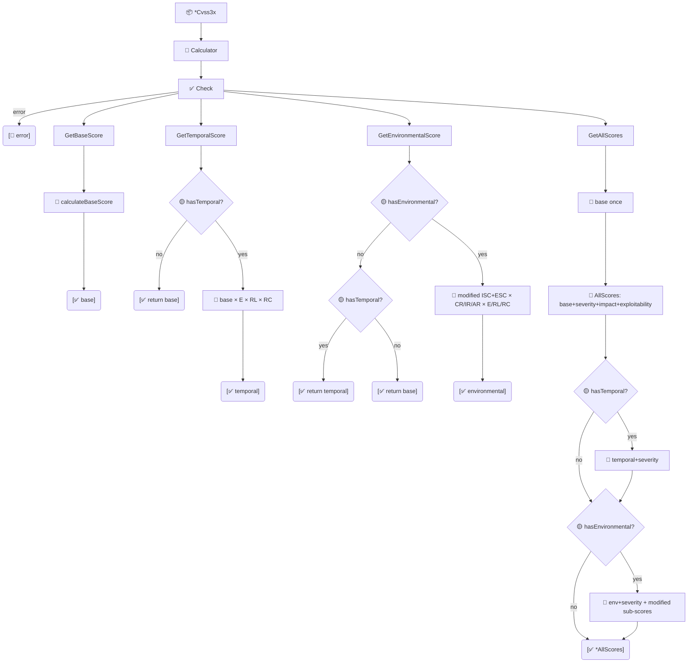

# 🎯 Scores

🎯 Feature · `pkg/cvss`

`pkg/cvss/scores.go` is the score-access layer on `*Calculator`. It exposes the three headline scores (base, temporal, environmental), the four sub-scores (impact, exploitability, and their modified variants), a one-shot `GetAllScores` that computes everything without re-walking the vector, and the public `RoundUp` helper that implements the spec's rounding rule.

## Synopsis

```go
calc := cvss.NewCalculator(cv)
base, _ := calc.GetBaseScore()                 // depends on AV/AC/PR/UI/S/C/I/A only
temporal, _ := calc.GetTemporalScore()         // base * E * RL * RC (or base if no temporal)
env, _ := calc.GetEnvironmentalScore()         // full environmental score
all, _ := calc.GetAllScores()                  // everything in one struct
fmt.Println(cvss.RoundUp(7.318))               // 7.4
```

Every accessor first calls `cv.Check()`, so an incomplete base vector surfaces as an error rather than a zero.

## How It Works

Each accessor guards with `Check()`, then computes its tier. Temporal/Environmental gracefully degrade: no temporal → return base; no environmental → return temporal (or base). `GetAllScores` computes base once and derives the rest, also filling `ImpactSubScore`/`ExploitabilitySubScore` and the modified variants.



## API Reference

### Headline scores

```go
func (c *Calculator) GetBaseScore() (float64, error)
func (c *Calculator) GetTemporalScore() (float64, error)
func (c *Calculator) GetEnvironmentalScore() (float64, error)
```

`GetBaseScore` uses only the eight base metrics. `GetTemporalScore` is `roundUp(baseScore * E * RL * RC)`; if no temporal metrics are set, it returns the base score unchanged. `GetEnvironmentalScore` computes the modified-impact / modified-exploitability path; if no environmental metrics are set it falls back to the temporal score (or base if no temporal either).

```go
base, _ := calc.GetBaseScore()
env, _ := calc.GetEnvironmentalScore() // == base when no temporal AND no environmental
```

### Sub-scores

```go
func (c *Calculator) GetImpactSubScore() (float64, error)               // ISC, scope-adjusted
func (c *Calculator) GetExploitabilitySubScore() (float64, error)       // 8.22 * AV * AC * PR * UI
func (c *Calculator) GetModifiedImpactSubScore() (float64, error)      // environmental only
func (c *Calculator) GetModifiedExploitabilitySubScore() (float64, error) // environmental only
```

`GetImpactSubScore` is `1 - (1-C)*(1-I)*(1-A)`, adjusted for Scope. `GetExploitabilitySubScore` is `8.22 * AV * AC * PR * UI`. The two `Modified*` variants read the `Cvss3xEnvironmental` sub-struct directly and treat a `nil` or `'X'` modified metric as "use the base value" — but the sub-struct itself must be non-nil, so only call them when `HasEnvironmentalMetrics()` is true (as `GetAllScores` does).

::: warning Modified* requires a non-nil Environmental group
`GetModifiedImpactSubScore` and `GetModifiedExploitabilitySubScore` dereference `c.cvss.Cvss3xEnvironmental` without a nil guard. Calling them on a vector whose environmental group is `nil` panics. Gate them behind `cv.HasEnvironmentalMetrics()` or use `GetAllScores`, which only computes them when `HasEnvironmental` is true.
:::

::: tip Sub-scores drive the CLI subs command
`cvss subs` prints `Impact Sub-Score`, `Exploitability Sub-Score`, and (when environmental is present) `Modified Impact Sub-Score` and `Modified Exploitability Sub-Score`. These four methods are exactly what populates that output.
:::

### AllScores & GetAllScores

```go
type AllScores struct {
    BaseScore, TemporalScore, EnvironmentalScore       float64
    BaseSeverity, TemporalSeverity, EnvironmentalSeverity Severity
    ImpactSubScore, ExploitabilitySubScore             float64
    ModifiedImpactSubScore, ModifiedExploitabilitySubScore float64
    HasTemporal, HasEnvironmental                       bool
}

func (c *Calculator) GetAllScores() (*AllScores, error)
func (s *AllScores) String() string
```

`GetAllScores` computes the base score once and derives everything from it, avoiding the repeated vector walks that separate calls would incur. The `HasTemporal` / `HasEnvironmental` flags tell you whether `TemporalScore` / `EnvironmentalScore` were actually computed (absent metrics mean the field holds the base score fallback, not a separately-computed value). `TemporalSeverity` and `EnvironmentalSeverity` default to `SeverityNone` when the corresponding group is absent.

```go
all, _ := calc.GetAllScores()
fmt.Println(all.String()) // Base: 9.8 (Critical), Temporal: 8.8 (High), ...
```

### RoundUp

```go
func RoundUp(x float64) float64
```

The CVSS spec's integer-arithmetic rounding: round up to one decimal place using the rule "if the input has more than one decimal digit, round up at the third decimal's ceiling". Exposed publicly so external code applies the same rounding as the calculator.

```go
cvss.RoundUp(7.318)  // 7.4
cvss.RoundUp(7.30)   // 7.3
```

::: warning Don't use math.Ceil(x*10)/10
The spec's rounding is an integer-arithmetic ceiling at the 4th decimal (the input is scaled by 100000 and ceiled to a 10000 multiple). It happens to agree with naive ceiling on most inputs, but the spec rule is the contract — always use `cvss.RoundUp` so future edge cases stay correct.
:::

## Example

```go
package main

import (
    "fmt"

    "github.com/scagogogo/cvss-skills/pkg/cvss"
    "github.com/scagogogo/cvss-skills/pkg/parser"
)

func main() {
    cv, err := parser.ParseString(
        "CVSS:3.1/AV:N/AC:L/PR:N/UI:N/S:U/C:H/I:H/A:H/CR:H/IR:H/AR:H/MAV:L")
    if err != nil {
        panic(err)
    }
    calc := cvss.NewCalculator(cv)

    // Headline scores degrade gracefully when groups are absent.
    base, _ := calc.GetBaseScore()
    temporal, _ := calc.GetTemporalScore()
    env, _ := calc.GetEnvironmentalScore()
    fmt.Printf("base=%.1f temporal=%.1f environmental=%.1f\n", base, temporal, env)

    // Sub-scores — the building blocks of the headline numbers.
    isc, _ := calc.GetImpactSubScore()
    esc, _ := calc.GetExploitabilitySubScore()
    misc, _ := calc.GetModifiedImpactSubScore()
    mesc, _ := calc.GetModifiedExploitabilitySubScore()
    fmt.Printf("ISC=%.4f ESC=%.4f MISc=%.4f MESC=%.4f\n", isc, esc, misc, mesc)

    // One-shot: compute everything once.
    all, _ := calc.GetAllScores()
    fmt.Println(all.HasTemporal, all.HasEnvironmental) // false true
    fmt.Println(all.String())

    // Spec rounding — use this, not math.Ceil.
    fmt.Printf("RoundUp(7.318)=%.1f\n", cvss.RoundUp(7.318)) // 7.4
}
```

Running that example prints `environmental=9.0` and `Modified Impact Sub-Score: 6.3937`, `Modified Exploitability Sub-Score: 2.5151` — the same numbers the CLI's `subs` command reports for this vector.

## Related

- [Scoring (calculator)](/sdk/calculator) — the `*Calculator` these methods live on
- [Score Breakdown](/sdk/breakdown) — per-metric effective scores and `AllScores.AsMap`
- [Severity](/sdk/severity) — the `Severity` fields on `AllScores`
- CLI: [`score`](/cli/commands/score), [`subs`](/cli/commands/subs)
