# 🗄️ SQL & Sorting

Persist CVSS vectors in a SQL column with `Scan`/`Value`, sort a collection by score with `Cvss3xSlice`, and normalize vector strings to spec order with `Canonicalize`.

## Synopsis

```go
// database/sql round-trip
var cv cvss.Cvss3x
rows.Scan(&cv)              // sql.Scanner
db.Exec("INSERT ... VALUES (?)", cvss.CriticalV31()) // driver.Valuer

// sort by score, worst first
slice := cvss.NewCvss3xSlice(v1, v2, v3).Sort()
for _, cv := range slice.Items() { ... }

// canonicalize a messy string
norm, _ := cvss.Canonicalize("CVSS:3.1/S:U/C:H/I:H/A:H/AV:N/AC:L/PR:N/UI:N")
```

## How It Works

`Value` serializes to the vector string for storage; `Scan` accepts `string`/`[]byte` (or `nil`) and re-parses via `fromVectorString`. `Cvss3xSlice` pre-computes each vector's score (invalid vectors score `-1` so they sort last) and implements `sort.Interface`; `Canonicalize` parses then re-emits `String()`, which already orders metrics Base→Temporal→Environmental.

```mermaid
flowchart TD
    subgraph DB["SQL round-trip"]
        CV[📦 *Cvss3x] --> Val["Value (driver.Valuer)"]
        Val --> Str1[📄 vector string]
        Str1 --> Col["🗄️ VARCHAR/TEXT column"]
        Col --> Scan["Scan (sql.Scanner)"]
        Scan --> Src{"🟡 src type?"}
        Src -- nil --> Empty[🟦 zero Cvss3x]
        Src -- string/[]byte --> Parse[🔍 fromVectorString]
        Src -- other --> SErr("[🔴 cannot scan %T]")
        Parse -- error --> PErr("[🔴 scan error]")
        Parse -- ok --> Back[✅ *Cvss3x repopulated]
        Empty --> Back
    end

    subgraph Sort["Cvss3xSlice"]
        Items["📦 []*Cvss3x"] --> New[🟢 NewCvss3xSlice]
        New --> Scores[🔢 pre-compute scores, invalid=-1]
        Scores --> Order{"🟡 desc?"}
        Order -- yes --> DescSort[📊 sort by score desc]
        Order -- no --> AscSort[📊 sort by score asc]
        DescSort --> Out1("[✅ Items sorted, Critical first]")
        AscSort --> Out2("[✅ Items sorted, None first]")
    end

    subgraph Canon["Canonicalize"]
        Messy[📄 messy vector string] --> Can["Canonicalize"]
        Can --> CanParse[🔍 fromVectorString]
        CanParse --> Reemit["🟢 cv.String() spec order"]
        Reemit --> Norm("[✅ canonical string]")
        Messy --> IsCan["IsCanonical: input == canonical?"]
    end
```



## API Reference

### SQL interfaces

```go
func (x *Cvss3x) Scan(src interface{}) error
func (x *Cvss3x) Value() (driver.Value, error)
```

- `Scan` implements `sql.Scanner`. It accepts `string`, `[]byte`, or `nil` (NULL → empty `Cvss3x`). Any other type returns an error, and a malformed vector string is wrapped as `"failed to scan Cvss3x: %w"`.
- `Value` implements `driver.Valuer`. A `nil` receiver returns `nil, nil` (SQL NULL); otherwise it returns `x.String()` — the canonical vector string. Store it in a `VARCHAR`/`TEXT` column.

::: tip NULL ↔ nil
`Scan(nil)` produces an empty `Cvss3x{Cvss3xBase: &Cvss3xBase{}}` (not a nil pointer), and `(*Cvss3x)(nil).Value()` writes SQL NULL. Use `*Cvss3x` (not `**Cvss3x`) as the scan target so the row value is always materialized.
:::

### Score-sorted slice

```go
type Cvss3xSlice struct { /* unexported: items, scores, desc */ }
func NewCvss3xSlice(items ...*Cvss3x) *Cvss3xSlice
func (s *Cvss3xSlice) Len() int
func (s *Cvss3xSlice) Less(i, j int) bool
func (s *Cvss3xSlice) Swap(i, j int)
func (s *Cvss3xSlice) Items() []*Cvss3x
func (s *Cvss3xSlice) Asc() *Cvss3xSlice
func (s *Cvss3xSlice) Desc() *Cvss3xSlice
func (s *Cvss3xSlice) Sort() *Cvss3xSlice
func (s *Cvss3xSlice) ScoreAt(i int) float64
```

- `NewCvss3xSlice` precomputes each item's score via `NewCalculator(cv).Calculate()`. Items that fail to score (incomplete/invalid) get `-1`, so they sort last in ascending order and first in descending — guard them with `ScoreAt(i) < 0` if you need to skip invalids.
- `Cvss3xSlice` implements `sort.Interface`, so it works with `sort.Sort` / `sort.Stable` directly. The convenience methods `Asc()`/`Desc()`/`Sort()` are chainable and return the slice itself.
- Default order is **descending** (Critical first). Call `.Asc()` before `.Sort()` for ascending.
- `ScoreAt` returns the cached score (0 for out-of-range index), avoiding a re-calculation after sorting.

::: warning Scores are cached at construction
`NewCvss3xSlice` computes scores once. If you mutate an item's metrics after creating the slice, the cached score is stale — rebuild the slice. `Swap` keeps `items` and `scores` in lockstep, so sorting stays consistent.
:::

### Canonicalization

```go
func Canonicalize(vectorString string) (string, error)
func (x *Cvss3x) CanonicalizeString() string
func IsCanonical(vectorString string) bool
```

- `Canonicalize` parses any vector string and re-emits it in spec order: Base (`AV, AC, PR, UI, S, C, I, A`) → Temporal (`E, RL, RC`) → Environmental (`CR, IR, AR, MAV, MAC, MPR, MUI, MS, MC, MI, MA`), with set metrics only. A parse error is wrapped as `"cannot canonicalize: %w"`.
- `CanonicalizeString` on a `*Cvss3x` is sugar for `x.String()` (already canonical). A nil receiver returns `""`.
- `IsCanonical` returns `true` iff `Canonicalize(s) == s` (byte-equal). On a parse error it returns `false`.

## Example

```go
package main

import (
    "database/sql"
    "fmt"
    "sort"

    "github.com/scagogogo/cvss-skills/pkg/cvss"
    "github.com/scagogogo/cvss-skills/pkg/mock"
)

func main() {
    // Build a collection to sort.
    v1 := cvss.CriticalV31()
    v2 := cvss.LowV31()
    v3 := cvss.HighV31()

    // Descending (default) — Critical first.
    desc := cvss.NewCvss3xSlice(v1, v2, v3).Sort()
    for i, cv := range desc.Items() {
        fmt.Printf("#%d %.1f %s\n", i+1, desc.ScoreAt(i), cv.String())
    }

    // Ascending — None/Low first.
    asc := cvss.NewCvss3xSlice(v1, v2, v3).Asc().Sort()
    _ = asc

    // Also works with sort.Sort directly.
    s := cvss.NewCvss3xSlice(v1, v2, v3).Asc()
    sort.Stable(s)

    // Canonicalize a reordered vector string.
    messy := "CVSS:3.1/S:U/C:H/I:H/A:H/AV:N/AC:L/PR:N/UI:N"
    norm, _ := cvss.Canonicalize(messy)
    fmt.Println(norm) // CVSS:3.1/AV:N/AC:L/PR:N/UI:N/S:U/C:H/I:H/A:H
    fmt.Println(cvss.IsCanonical(norm))  // true
    fmt.Println(cvss.IsCanonical(messy)) // false

    // Value: write to a DB.
    _ = func(db *sql.DB) error {
        _, err := db.Exec("INSERT INTO vulns (cvss) VALUES (?)", cvss.CriticalV31())
        return err
    }

    // Scan: read back. (Illustrative — assumes a rows iterator.)
    _ = func(rows *sql.Rows) {
        var cv cvss.Cvss3x
        for rows.Next() {
            _ = rows.Scan(&cv)
            fmt.Println(cv.String())
        }
    }

    // A random vector joins the ranking; its score is computed lazily.
    rand := mock.RandomCvss3x(1)
    slice := cvss.NewCvss3xSlice(rand, v1)
    fmt.Println("score[0]:", slice.ScoreAt(0))
}
```

## Related

- [pkg/cvss](/sdk/cvss) — `String()` is the canonical form `Scan`/`Value` rely on
- [pkg/parser](/sdk/parser) — `Canonicalize` shares the internal parser
- [Scoring (calculator)](/sdk/calculator) — `Cvss3xSlice` caches scores via `Calculate`
