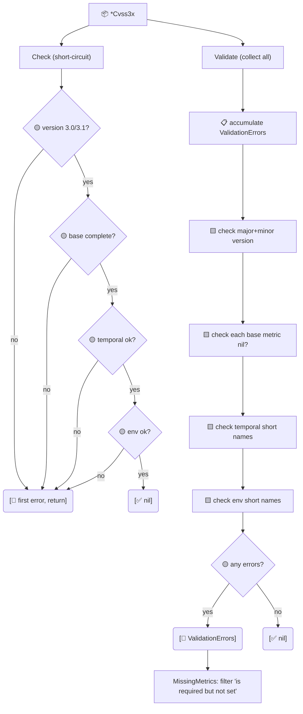

# ✅ Validation

Two validation entry points — `Check` (short-circuits) and `Validate` (collects everything) — plus structured error types and sentinel errors for `errors.Is` matching.

## Synopsis

```go
if err := cv.Validate(); err != nil {
    var ve cvss.ValidationErrors
    if errors.As(err, &ve) {
        fmt.Println("missing:", ve.MissingMetrics())
    }
}
```

## How It Works

`Check` returns at the first problem (used internally before scoring); `Validate` walks every base metric and every set temporal/environmental field, accumulating `*ValidationError` entries into a `ValidationErrors` slice that unwraps for `errors.Is`/`errors.As`. `MissingMetrics` is a convenience that re-runs `Validate` and extracts the "is required but not set" entries.



## Types

### `ValidationError`

| Field | Type | Meaning |
| --- | --- | --- |
| `Metric` | `string` | Short name of the offending metric (or `"Version"`/`"Base"`/`"Cvss3x"`) |
| `Message` | `string` | Human-readable description |

`Error()` formats as `metric <Metric>: <Message>`.

### `ValidationErrors`

`type ValidationErrors []*ValidationError` — a collected slice.

| Method | Signature | Behavior |
| --- | --- | --- |
| `Error` | `func (ve) Error() string` | Joins all entries with `; ` |
| `MissingMetrics` | `func (ve) MissingMetrics() []string` | Names of metrics with `"is required but not set"` |
| `HasErrors` | `func (ve) HasErrors() bool` | `len(ve) > 0` |
| `Unwrap` | `func (ve) Unwrap() []error` | Go 1.20+ multi-error unwrapping |

## API Reference

```go
func (x *Cvss3x) Check() error
func (x *Cvss3x) Validate() error
func (x *Cvss3x) MissingMetrics() []string
func (x *Cvss3x) IsComplete() bool
```

- `Check` validates version (3.0/3.1), then base completeness, then temporal/environmental short-name correctness. Returns at the first error.
- `Validate` runs the same checks but **accumulates** every problem into `ValidationErrors`. It never short-circuits — every missing base metric is reported individually.
- `MissingMetrics` is sugar over `Validate`: it returns just the names of base metrics that are `"is required but not set"`.
- `IsComplete` is the boolean form: all 8 base metrics non-nil. It does not check version or value legality.

### Sentinel errors (`errors.go`)

```go
var ErrNilReceiver         = errors.New("nil receiver")
var ErrIncompleteBaseMetrics = errors.New("incomplete base metrics")
var ErrUnsupportedVersion  = errors.New("unsupported CVSS version")
var ErrInvalidMetricValue  = errors.New("invalid metric value")
```

::: tip Check vs Validate — when to use which
Use `Check` when you want a fast yes/no before scoring (the `Calculator` calls it internally). Use `Validate` when you need to tell the user *everything* that's wrong in one pass — e.g. form validation, batch ingest reporting.
:::

::: warning MissingMetrics only covers base metrics
`MissingMetrics` reports only the 8 required base metrics. Temporal and environmental metrics are optional by spec, so their absence is never an error — only a wrong short name (e.g. an `E` slot holding a non-`E` vector) is flagged by `Validate`.
:::

## Example

```go
package main

import (
    "errors"
    "fmt"

    "github.com/scagogogo/cvss-skills/pkg/cvss"
)

func main() {
    // An incomplete vector: only AV and AC set.
    cv, _ := cvss.NewCvss3xWithOptions(
        cvss.WithVersion31(),
        cvss.WithAV('N'), cvss.WithAC('L'),
    )

    fmt.Println("IsComplete:", cv.IsComplete()) // false

    err := cv.Validate()
    var ve cvss.ValidationErrors
    if errors.As(err, &ve) {
        fmt.Println("missing:", ve.MissingMetrics()) // [PR UI S C I A]
        for _, e := range ve {
            fmt.Println(" -", e.Error())
        }
    }

    // Check short-circuits at the first problem.
    fmt.Println("Check:", cv.Check())

    // Sentinel matching on the receiver.
    _, _, err = (*cvss.Cvss3x)(nil).GetMetricValue("AV")
    fmt.Println(errors.Is(err, cvss.ErrNilReceiver)) // true
}
```

## Related

- [pkg/parser](/sdk/parser) — `ParseAndValidate` composes parse + validate
- [pkg/cvss](/sdk/cvss) — `Check` is the internal validation hook
- [Scoring (calculator)](/sdk/calculator) — every score method calls `Check` first
