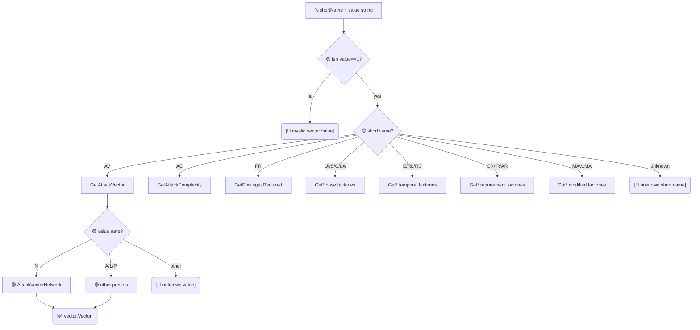

# 🏭 Vector Factory

`pkg/vector/factory.go` · 1 dispatcher + 23 typed factories

## Synopsis

The factory layer turns raw short names (`AV`, `E`, `MAV`, …) and single-character value codes (`'N'`, `'F'`, `'X'`, …) into typed `vector.Vector` presets. `GetVectorByShortName` is the generic dispatcher used by the parser; the 23 `Get*` functions are the per-metric entry points it delegates to (and that callers can use directly).

```go
v, err := vector.GetVectorByShortName("AV", "N") // -> AttackVectorNetwork, nil
v, err = vector.GetAttackVector('N')              // same, via the typed factory
```

## How It Works

`GetVectorByShortName` validates the value is a single character, then `switch`es on the short name to delegate to one of 23 typed factories. Each typed factory `switch`es on the value rune and returns the matching package-level preset variable; an unrecognized rune yields a typed error.



## API Reference

### `GetVectorByShortName`

```go
func GetVectorByShortName(shortName string, value string) (Vector, error)
```

Generic dispatcher. `value` must be a single character (otherwise `invalid vector value: ...`). It switches on `shortName` and delegates to the matching `Get*` function:

| `shortName` | Delegates to |
| --- | --- |
| `AV` | `GetAttackVector` |
| `AC` | `GetAttackComplexity` |
| `PR` | `GetPrivilegesRequired` |
| `UI` | `GetUserInteraction` |
| `S`  | `GetScope` |
| `C`  | `GetConfidentiality` |
| `I`  | `GetIntegrity` |
| `A`  | `GetAvailability` |
| `E`  | `GetExploitCodeMaturity` |
| `RL` | `GetRemediationLevel` |
| `RC` | `GetReportConfidence` |
| `CR` | `GetConfidentialityRequirement` |
| `IR` | `GetIntegrityRequirement` |
| `AR` | `GetAvailabilityRequirement` |
| `MAV` | `GetModifiedAttackVector` |
| `MAC` | `GetModifiedAttackComplexity` |
| `MPR` | `GetModifiedPrivilegesRequired` |
| `MUI` | `GetModifiedUserInteraction` |
| `MS`  | `GetModifiedScope` |
| `MC`  | `GetModifiedConfidentiality` |
| `MI`  | `GetModifiedIntegrity` |
| `MA`  | `GetModifiedAvailability` |

An unknown `shortName` yields `unknown vector short name: ...`.

### `Get*` functions (23 total)

Each typed factory has the same shape:

```go
func Get<Metric>(shortValue rune) (Vector, error)
```

It switches on `shortValue` and returns the matching preset variable, or `unknown <metric> value: %c` for anything else. The complete list, grouped by segment:

**Base metrics (8)**

| Function | Legal values |
| --- | --- |
| `GetAttackVector` | `N` `A` `L` `P` |
| `GetAttackComplexity` | `L` `H` |
| `GetPrivilegesRequired` | `N` `L` `H` |
| `GetUserInteraction` | `N` `R` |
| `GetScope` | `U` `C` |
| `GetConfidentiality` | `N` `L` `H` |
| `GetIntegrity` | `N` `L` `H` |
| `GetAvailability` | `N` `L` `H` |

**Temporal metrics (3)**

| Function | Legal values |
| --- | --- |
| `GetExploitCodeMaturity` | `X` `U` `P` `F` `H` |
| `GetRemediationLevel` | `X` `O` `T` `W` `U` |
| `GetReportConfidence` | `X` `U` `R` `C` |

**Environmental requirements (3)**

| Function | Legal values |
| --- | --- |
| `GetConfidentialityRequirement` | `X` `L` `M` `H` |
| `GetIntegrityRequirement` | `X` `L` `M` `H` |
| `GetAvailabilityRequirement` | `X` `L` `M` `H` |

**Modified base metrics (8)**

| Function | Legal values |
| --- | --- |
| `GetModifiedAttackVector` | `X` `N` `A` `L` `P` |
| `GetModifiedAttackComplexity` | `X` `L` `H` |
| `GetModifiedPrivilegesRequired` | `X` `N` `L` `H` |
| `GetModifiedUserInteraction` | `X` `N` `R` |
| `GetModifiedScope` | `X` `U` `C` |
| `GetModifiedConfidentiality` | `X` `N` `L` `H` |
| `GetModifiedIntegrity` | `X` `N` `L` `H` |
| `GetModifiedAvailability` | `X` `N` `L` `H` |

Note: every modified-metric factory treats `X` as the Not Defined fallback (see [/sdk/vector-not-defined](/sdk/vector-not-defined)) and returns the corresponding `*NotDefined` preset rather than a `Modified*` preset.

## Example

```go
package main

import (
	"fmt"

	"github.com/scagogogo/cvss-skills/pkg/vector"
)

func main() {
	// Via the generic dispatcher (what the parser uses).
	av, err := vector.GetVectorByShortName("AV", "N")
	if err != nil {
		panic(err)
	}
	fmt.Println(av.String()) // AV:N

	// Via the typed factory directly.
	e, err := vector.GetExploitCodeMaturity('F')
	if err != nil {
		panic(err)
	}
	fmt.Println(e.String()) // E:F

	// Not Defined fallback on a modified metric.
	mav, _ := vector.GetModifiedAttackVector('X')
	fmt.Println(mav.String(), mav.IsNotDefined()) // MAV:X true

	// Illegal value.
	_, err = vector.GetScope('Z')
	fmt.Println(err) // unknown scope value: Z
}
```

## Related

- [/sdk/vector](/sdk/vector) — package overview
- [/sdk/vector-interface](/sdk/vector-interface) — the `Vector` interface and `VectorImpl`
- [/sdk/vector-not-defined](/sdk/vector-not-defined) — the `X` fallback variants
- [/sdk/parser](/sdk/parser) — the parser that drives `GetVectorByShortName`
