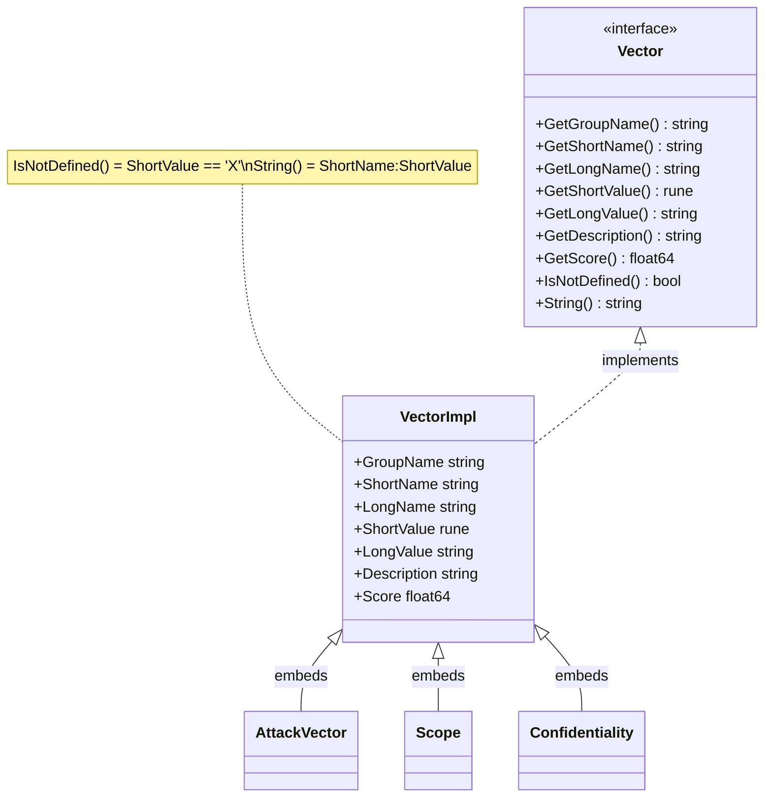

# 🎯 Vector Interface

`pkg/vector/vector.go` + `pkg/vector/vector_impl.go` · 9-method interface · base struct

> This page is the type-level reference for the `Vector` interface and `VectorImpl`. For the package overview, preset variables and `Get*` factories, see [/sdk/vector](/sdk/vector).

## Synopsis

`Vector` is the lowest-level abstraction in the SDK: every metric value in a `Cvss3x` (AV, AC, …, MA) is a `vector.Vector`. The interface exposes nine methods covering identity, value, scoring and serialization. `VectorImpl` is the concrete base struct that every named metric type (`*AttackVector`, `*Confidentiality`, …) embeds, so they all share one implementation.

```go
var v vector.Vector = vector.AttackVectorNetwork
fmt.Println(v.GetShortName(), string(v.GetShortValue())) // AV N
fmt.Printf("%.2f\n", v.GetScore())                        // 0.85
fmt.Println(v.String())                                   // AV:N
fmt.Println(v.IsNotDefined())                             // false
```

## How It Works

`Vector` is a 9-method interface; `VectorImpl` is the single shared struct every named metric type embeds, so the interface methods are implemented once and inherited everywhere.



## API Reference

### `Vector` interface

```go
type Vector interface {
    GetGroupName() string
    GetShortName() string
    GetLongName() string
    GetShortValue() rune
    GetLongValue() string
    GetDescription() string
    GetScore() float64
    IsNotDefined() bool
    String() string
}
```

| # | Method | Returns | Description |
| --- | --- | --- | --- |
| 1 | `GetGroupName()` | `string` | Metric group, e.g. `"Base Metrics"`, `"Temporal Metrics"`, `"Environmental Metrics"`. |
| 2 | `GetShortName()` | `string` | CVSS short name, e.g. `"AV"`, `"E"`, `"MAV"`. |
| 3 | `GetLongName()` | `string` | Long human-readable metric name, e.g. `"Attack Vector"`. |
| 4 | `GetShortValue()` | `rune` | Single-character value code, e.g. `'N'`, `'L'`, `'X'`. |
| 5 | `GetLongValue()` | `string` | Long value name, e.g. `"Network"`, `"Not Defined"`. |
| 6 | `GetDescription()` | `string` | Free-form description of the value. |
| 7 | `GetScore()` | `float64` | Numeric weight used by the scoring formula. |
| 8 | `IsNotDefined()` | `bool` | `true` when `GetShortValue() == 'X'` (the Not Defined fallback). |
| 9 | `String()` | `string` | Canonical `SHORT:VALUE` form, e.g. `AV:N`. |

### `VectorImpl` struct

```go
type VectorImpl struct {
    GroupName   string
    ShortName   string
    LongName    string
    ShortValue  rune
    LongValue   string
    Description string
    Score       float64
}
```

`VectorImpl` is the shared base every named metric type embeds as `*VectorImpl`. The compile-time assertion `var _ Vector = &VectorImpl{}` guarantees it satisfies the interface. Each method simply returns the corresponding struct field, with two computed behaviors:

- `IsNotDefined()` returns `x.ShortValue == 'X'`.
- `String()` returns `fmt.Sprintf("%s:%c", x.ShortName, x.ShortValue)`.

Because the named types (`*AttackVector`, `*Confidentiality`, …) embed `*VectorImpl`, they inherit all nine methods for free; the embedder only adds type identity and any preset variables.

## Example

```go
package main

import (
	"fmt"

	"github.com/scagogogo/cvss-skills/pkg/vector"
)

func describe(v vector.Vector) {
	fmt.Printf("%s (%s) = %s (%c)  score=%.2f  notDefined=%v  str=%s\n",
		v.GetShortName(), v.GetLongName(),
		v.GetLongValue(), v.GetShortValue(),
		v.GetScore(), v.IsNotDefined(), v.String(),
	)
}

func main() {
	describe(vector.AttackVectorNetwork)
	// AV (Attack Vector) = Network (N)  score=0.85  notDefined=false  str=AV:N

	describe(vector.ExploitCodeMaturityNotDefined)
	// E (Exploit Code Maturity) = Not Defined (X)  score=1.00  notDefined=true  str=E:X
}
```

## Related

- [/sdk/vector](/sdk/vector) — package overview, preset variables and the `Get*` factories
- [/sdk/vector-factory](/sdk/vector-factory) — the `GetVectorByShortName` dispatcher and 23 `Get*` functions
- [/sdk/vector-not-defined](/sdk/vector-not-defined) — the `X` (Not Defined) fallback variants
- [/sdk/cvss3x-base](/sdk/cvss3x-base) · [/sdk/cvss3x-temporal](/sdk/cvss3x-temporal) · [/sdk/cvss3x-environmental](/sdk/cvss3x-environmental) — segments whose fields are `vector.Vector`
