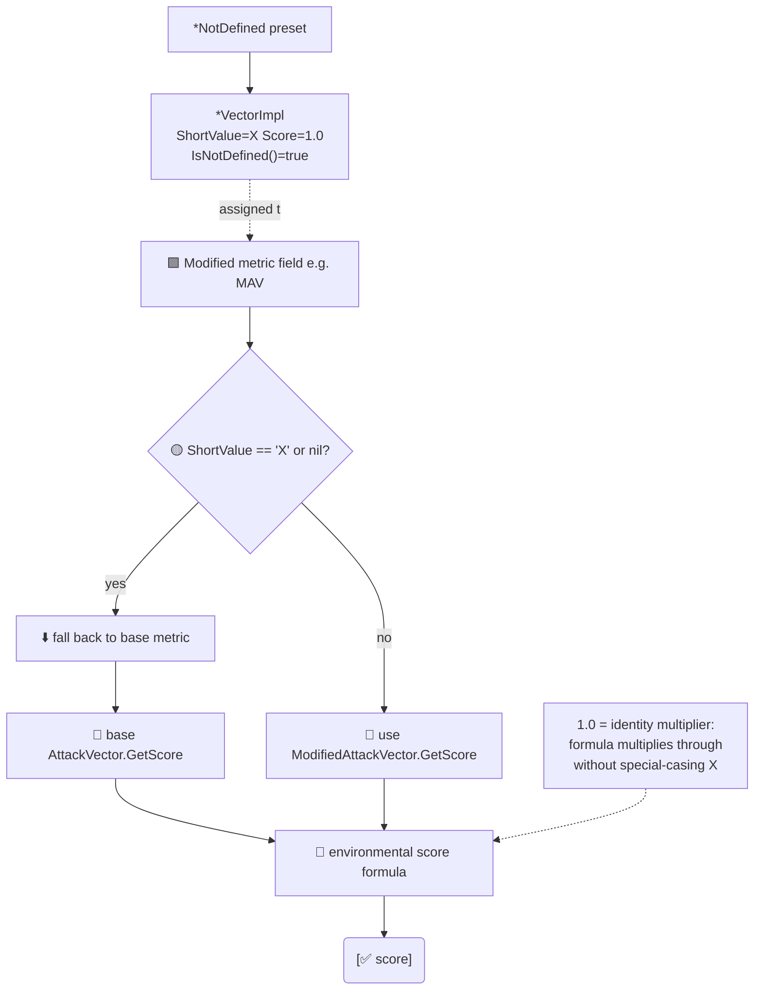

# ❎ Not Defined Vectors

`pkg/vector/not_defined_vectors.go` · 8 preset variables · score = 1.0

## Synopsis

When a CVSS 3.x environmental modified metric carries the value `X` (Not Defined), it means "do not modify the base metric — fall back to the base value". `not_defined_vectors.go` declares the eight such preset variables (one per modified base metric). Each is a typed preset with `ShortValue == 'X'`, `LongValue == "Not Defined"`, `Score == 1.0`, and `GroupName == "Environmental Metrics"`.

```go
mav := vector.AttackVectorNotDefined
fmt.Println(mav.String())        // MAV:X
fmt.Println(mav.IsNotDefined())  // true
fmt.Println(mav.GetScore())      // 1.0
```

## How It Works

Each Not Defined preset is a `*VectorImpl` with `ShortValue == 'X'` and `Score == 1.0`. The calculator's `getModified*Score` helpers check `!= 'X'` first: when the modified metric is `X` (or `nil`), they return the **base** metric's score, so the `1.0` weight is the identity multiplier that lets the formula multiply through uniformly.



## Fallback semantics

A score of `1.0` is the identity multiplier — it does not change the base metric's contribution. The CVSS 3.x specification defines `X` on a modified metric as "use the corresponding base metric value instead", and the SDK encodes that as a neutral `1.0` weight so the scoring formula can multiply through uniformly without special-casing `X`.

| Preset variable | Short name | Long name | Short value | Score |
| --- | --- | --- | --- | --- |
| `AttackVectorNotDefined` | `MAV` | Modified Attack Vector | `X` | `1.0` |
| `AttackComplexityNotDefined` | `MAC` | Modified Attack Complexity | `X` | `1.0` |
| `PrivilegesRequiredNotDefined` | `MPR` | Modified Privileges Required | `X` | `1.0` |
| `UserInteractionNotDefined` | `MUI` | Modified User Interaction | `X` | `1.0` |
| `ScopeNotDefined` | `MS` | Modified Scope | `X` | `1.0` |
| `ConfidentialityNotDefined` | `MC` | Modified Confidentiality | `X` | `1.0` |
| `IntegrityNotDefined` | `MI` | Modified Integrity | `X` | `1.0` |
| `AvailabilityNotDefined` | `MA` | Modified Availability | `X` | `1.0` |

> Note on naming: although the variable is named after the *base* metric (e.g. `AttackVectorNotDefined`), its `ShortName` is the *modified* short name (`MAV`), because these presets are only ever assigned to fields on `Cvss3xEnvironmental`. The base short name `AV` belongs to the non-modified base presets.

Each variable is a pointer to a named metric type (`*AttackVector`, `*AttackComplexity`, …) embedding a `*VectorImpl`, so it satisfies `vector.Vector` and `IsNotDefined()` returns `true` (because `ShortValue == 'X'`).

## API Reference

These are package-level `var` declarations, not functions. Access them directly:

```go
var (
    AttackVectorNotDefined       = &AttackVector{...}
    AttackComplexityNotDefined   = &AttackComplexity{...}
    PrivilegesRequiredNotDefined = &PrivilegesRequired{...}
    UserInteractionNotDefined    = &UserInteraction{...}
    ScopeNotDefined              = &Scope{...}
    ConfidentialityNotDefined    = &Confidentiality{...}
    IntegrityNotDefined          = &Integrity{...}
    AvailabilityNotDefined       = &Availability{...}
)
```

They are returned by the modified-metric `Get*` factories when called with `'X'` (see [/sdk/vector-factory](/sdk/vector-factory)).

## Example

```go
package main

import (
	"fmt"

	"github.com/scagogogo/cvss-skills/pkg/cvss"
	"github.com/scagogogo/cvss-skills/pkg/vector"
)

func main() {
	// A modified metric set to "Not Defined" -> falls back to the base metric.
	env := &cvss.Cvss3xEnvironmental{
		ModifiedAttackVector: vector.AttackVectorNotDefined,
	}
	fmt.Println(env.ModifiedAttackVector.String())       // MAV:X
	fmt.Println(env.ModifiedAttackVector.IsNotDefined()) // true
	fmt.Println(env.ModifiedAttackVector.GetScore())     // 1.0 (neutral)

	// The factory also returns the same preset for 'X'.
	mav, _ := vector.GetModifiedAttackVector('X')
	fmt.Println(mav == vector.AttackVectorNotDefined) // true
}
```

## Related

- [/sdk/vector](/sdk/vector) — package overview and the full preset catalogue
- [/sdk/vector-interface](/sdk/vector-interface) — the `Vector` interface and `IsNotDefined()`
- [/sdk/vector-factory](/sdk/vector-factory) — `Get*` factories that return these presets for `'X'`
- [/sdk/cvss3x-environmental](/sdk/cvss3x-environmental) — the segment that holds the modified-metric fields
