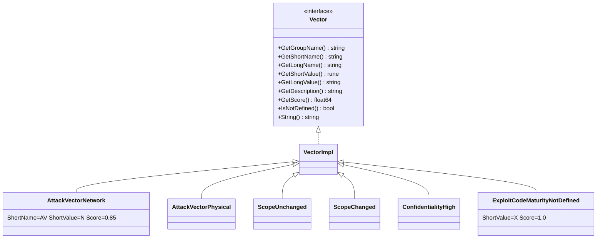

# 🎯 pkg/vector

The lowest layer of the SDK: immutable metric-value objects. Every `Cvss3x` field is a `vector.Vector`, and the `Get*` factory functions are how the parser, builder and options resolve a short value (`'N'`, `'L'`, …) into a typed preset.

## Synopsis

```go
av, err := vector.GetAttackVector('N') // -> AttackVectorNetwork, nil
fmt.Println(av.GetLongValue())          // Network
fmt.Printf("%.2f\n", av.GetScore())      // 0.85
```

## How It Works

The package is one interface (`Vector`), one shared struct (`VectorImpl`), and a catalog of package-level preset variables grouped by metric. The `Get*` factories return those presets by value; because presets are immutable pointers, cloning a `Cvss3x` just copies the pointers.



## Types

### `Vector` interface

```go
type Vector interface {
    GetGroupName() string
    GetShortName() string
    GetLongName() string
    GetShortValue() rune
    GetLongValue() string
    GetDescription() string
    GetScore() float64
    IsNotDefined() bool   // true when ShortValue == 'X'
    String() string        // "AV:N"
}
```

### `VectorImpl`

The concrete base struct that every metric type embeds (`*VectorImpl`). Fields:

| Field | Type | Meaning |
| --- | --- | --- |
| `GroupName` | `string` | "Base Metrics" / "Temporal Metrics" / "Environmental Metrics" |
| `ShortName` | `string` | e.g. "AV", "MAV" |
| `LongName` | `string` | e.g. "Attack Vector" |
| `ShortValue` | `rune` | e.g. `'N'` |
| `LongValue` | `string` | e.g. "Network" |
| `Description` | `string` | Spec prose |
| `Score` | `float64` | Static metric score (see caveat below) |

`IsNotDefined()` returns `true` when `ShortValue == 'X'` (the "Not Defined" sentinel, score 1.0).

## Preset variables

Each metric value is a package-level `var` pointer, e.g. `vector.AttackVectorNetwork`. Naming convention:

- Base: `<Metric><Value>` — `AttackVectorNetwork`, `AttackComplexityLow`, `PrivilegesRequiredNone`, `UserInteractionNone`, `ScopeUnchanged`, `ConfidentialityHigh`, `IntegrityLow`, `AvailabilityNone`, …
- Temporal: `<Metric><Value>` — `ExploitCodeMaturityHigh`, `RemediationLevelOfficialFix`, `ReportConfidenceConfirmed`, plus `*NotDefined`.
- Environmental requirements: `ConfidentialityRequirementHigh`, `IntegrityRequirementMedium`, `AvailabilityRequirementLow`, plus `*NotDefined`.
- Modified (`M*`): `ModifiedAttackVectorNetwork`, `ModifiedScopeChanged`, `ModifiedConfidentialityNone`, … plus the `*NotDefined` variants (`AttackVectorNotDefined`, `ScopeNotDefined`, …) used for the `X` value of modified metrics.

## API Reference

### Factory by short name

```go
func GetVectorByShortName(shortName string, value string) (Vector, error)
```
The dispatcher used by the parser and JSON deserializer. `value` must be a single character; returns an error for unknown names or values.

### Per-metric factory functions

```go
func GetAttackVector(shortValue rune) (Vector, error)
func GetAttackComplexity(shortValue rune) (Vector, error)
func GetPrivilegesRequired(shortValue rune) (Vector, error)
func GetUserInteraction(shortValue rune) (Vector, error)
func GetScope(shortValue rune) (Vector, error)
func GetConfidentiality(shortValue rune) (Vector, error)
func GetIntegrity(shortValue rune) (Vector, error)
func GetAvailability(shortValue rune) (Vector, error)
func GetExploitCodeMaturity(shortValue rune) (Vector, error)
func GetRemediationLevel(shortValue rune) (Vector, error)
func GetReportConfidence(shortValue rune) (Vector, error)
func GetConfidentialityRequirement(shortValue rune) (Vector, error)
func GetIntegrityRequirement(shortValue rune) (Vector, error)
func GetAvailabilityRequirement(shortValue rune) (Vector, error)
func GetModifiedAttackVector(shortValue rune) (Vector, error)
func GetModifiedAttackComplexity(shortValue rune) (Vector, error)
func GetModifiedPrivilegesRequired(shortValue rune) (Vector, error)
func GetModifiedUserInteraction(shortValue rune) (Vector, error)
func GetModifiedScope(shortValue rune) (Vector, error)
func GetModifiedConfidentiality(shortValue rune) (Vector, error)
func GetModifiedIntegrity(shortValue rune) (Vector, error)
func GetModifiedAvailability(shortValue rune) (Vector, error)
```
Each returns the matching preset var, or an error describing the unknown value (e.g. `unknown attack vector value: Z`).

### Context-dependent score helpers

Some metrics have scores that depend on the surrounding context rather than a fixed value. The package exposes helper functions for those:

```go
func GetPrivilegesRequiredScore(pr Vector, scopeChanged bool) float64
func IsScopeChanged(scope Vector) bool
func IsModifiedScopeChanged(modifiedScope Vector, baseScope Vector) bool
func GetUserInteractionScore(ui Vector, minorVersion int) float64
```

| Metric | Context | Effect |
| --- | --- | --- |
| PR | Scope Changed vs Unchanged | PR:L = 0.62 (Unchanged) / 0.68 (Changed); PR:H = 0.27 / 0.5 |
| UI | CVSS version | UI:R = 0.56 in v3.0, 0.62 in v3.1; UI:N = 0.85 in both |
| MS | falls back to base Scope | If MS is `X`/nil, uses `baseScope` |

::: warning GetScore() is not always the effective score
`Vector.GetScore()` returns the **static** score stored on the preset. For PR and UI the effective score is context-dependent — always use `GetPrivilegesRequiredScore` / `GetUserInteractionScore` (the calculator does this internally) instead of reading `GetScore()` directly for those two metrics.
:::

## Example

```go
package main

import (
    "fmt"

    "github.com/scagogogo/cvss-skills/pkg/vector"
)

func main() {
    // Resolve from a short name + value string (as the parser does).
    v, err := vector.GetVectorByShortName("AV", "N")
    if err != nil {
        panic(err)
    }
    fmt.Printf("%s = %s (%.2f)\n", v.GetShortName(), v.GetLongValue(), v.GetScore())

    // Use the per-metric factory directly.
    scope, _ := vector.GetScope('C')
    fmt.Println(vector.IsScopeChanged(scope)) // true

    // PR score depends on Scope.
    pr, _ := vector.GetPrivilegesRequired('L')
    fmt.Println(vector.GetPrivilegesRequiredScore(pr, false)) // 0.62
    fmt.Println(vector.GetPrivilegesRequiredScore(pr, true))  // 0.68

    // UI score depends on version.
    ui, _ := vector.GetUserInteraction('R')
    fmt.Println(vector.GetUserInteractionScore(ui, 0)) // 0.56 (v3.0)
    fmt.Println(vector.GetUserInteractionScore(ui, 1)) // 0.62 (v3.1)

    // Use a preset variable directly.
    fmt.Println(vector.AttackVectorNetwork.String()) // AV:N
}
```

## Related

- [pkg/cvss](/sdk/cvss) — consumes these vectors as struct fields
- [Builder Pattern](/sdk/builder) — `AV('N')` calls `GetAttackVector` under the hood
- [Enumeration](/sdk/enumerate) — lists every legal value per metric
