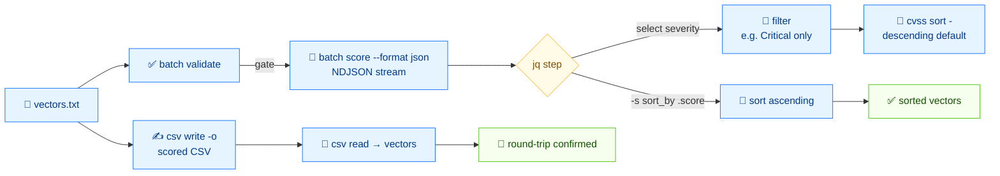

# 📦 Batch Scripting

⏱️ 20 min · intermediate · CLI

Scoring one vector by hand is fine for triage; scoring a thousand is the job. This tutorial walks the full operations loop: write a `vectors.txt`, batch-score it as JSON, filter with `jq`, sort the results, and round-trip through CSV so a spreadsheet or SIEM can consume them.

## Prerequisites

- The `cvss` binary on your `$PATH` (or `./cvss-cli` from the repo root)
- `jq` installed (for the JSON filtering steps)
- Finish [getting-started](./getting-started) and [validation-workflow](./validation-workflow)

## Flow



## Step 1 — Build `vectors.txt`

Create a file with one vector per line. We use six vectors spanning the whole severity range:

```bash
cat > vectors.txt <<'EOF'
CVSS:3.1/AV:N/AC:L/PR:N/UI:N/S:U/C:H/I:H/A:H
CVSS:3.1/AV:N/AC:L/PR:N/UI:N/S:C/C:H/I:H/A:H
CVSS:3.1/AV:N/AC:L/PR:N/UI:N/S:U/C:L/I:N/A:N
CVSS:3.1/AV:L/AC:H/PR:H/UI:R/S:U/C:L/I:L/A:L
CVSS:3.1/AV:P/AC:H/PR:H/UI:R/S:U/C:N/I:N/A:L
CVSS:3.1/AV:N/AC:L/PR:N/UI:N/S:U/C:N/I:N/A:N
EOF
```

::: tip One vector per line, no comments
`batch` reads one vector per line. Blank lines and `#` comments are not supported — keep the file clean.
:::

## Step 2 — Batch score in text

```bash
cvss batch score vectors.txt
```

```
9.8 (Critical)  CVSS:3.1/AV:N/AC:L/PR:N/UI:N/S:U/C:H/I:H/A:H
10.0 (Critical)  CVSS:3.1/AV:N/AC:L/PR:N/UI:N/S:C/C:H/I:H/A:H
5.3 (Medium)  CVSS:3.1/AV:N/AC:L/PR:N/UI:N/S:U/C:L/I:N/A:N
3.8 (Low)  CVSS:3.1/AV:L/AC:H/PR:H/UI:R/S:U/C:L/I:L/A:L
1.6 (Low)  CVSS:3.1/AV:P/AC:H/PR:H/UI:R/S:U/C:N/I:N/A:L
0.0 (None)  CVSS:3.1/AV:N/AC:L/PR:N/UI:N/S:U/C:N/I:N/A:N
```

Each line is `SCORE (SEVERITY)  VECTOR`. Output order matches input order — the parallel workers do not reorder results.

## Step 3 — Batch score in JSON and filter with `jq`

Switch to JSON for pipeline-friendly filtering:

```bash
cvss batch score --format json vectors.txt
```

```json
{
  "line": 1,
  "score": 9.8,
  "severity": "Critical",
  "vector": "CVSS:3.1/AV:N/AC:L/PR:N/UI:N/S:U/C:H/I:H/A:H"
}
{
  "line": 2,
  "score": 10,
  "severity": "Critical",
  "vector": "CVSS:3.1/AV:N/AC:L/PR:N/UI:N/S:C/C:H/I:H/A:H"
}
{
  "line": 3,
  "score": 5.3,
  "severity": "Medium",
  "vector": "CVSS:3.1/AV:N/AC:L/PR:N/UI:N/S:U/C:L/I:N/A:N"
}
{
  "line": 4,
  "score": 3.8,
  "severity": "Low",
  "vector": "CVSS:3.1/AV:L/AC:H/PR:H/UI:R/S:U/C:L/I:L/A:L"
}
{
  "line": 5,
  "score": 1.6,
  "severity": "Low",
  "vector": "CVSS:3.1/AV:P/AC:H/PR:H/UI:R/S:U/C:N/I:N/A:L"
}
{
  "line": 6,
  "score": 0,
  "severity": "None",
  "vector": "CVSS:3.1/AV:N/AC:L/PR:N/UI:N/S:U/C:N/I:N/A:N"
}
```

::: warning The output is a stream of objects, not an array
`batch score --format json` emits one JSON object per line (a stream). Use `jq -s` to collect into an array, or `jq 'select(...)'` to filter the stream directly.
:::

### Filter: only Critical

```bash
cvss batch score --format json vectors.txt | jq -c 'select(.severity == "Critical")'
```

```json
{"line":1,"score":9.8,"severity":"Critical","vector":"CVSS:3.1/AV:N/AC:L/PR:N/UI:N/S:U/C:H/I:H/A:H"}
{"line":2,"score":10,"severity":"Critical","vector":"CVSS:3.1/AV:N/AC:L/PR:N/UI:N/S:C/C:H/I:H/A:H"}
```

### Filter: score ≥ 7

```bash
cvss batch score --format json vectors.txt | jq -c 'select(.score >= 7)'
```

```json
{"line":1,"score":9.8,"severity":"Critical","vector":"CVSS:3.1/AV:N/AC:L/PR:N/UI:N/S:U/C:H/I:H/A:H"}
{"line":2,"score":10,"severity":"Critical","vector":"CVSS:3.1/AV:N/AC:L/PR:N/UI:N/S:C/C:H/I:H/A:H"}
```

### Collect and sort by score ascending

```bash
cvss batch score --format json vectors.txt | jq -s 'sort_by(.score)'
```

```json
[
  { "line": 6, "score": 0,   "severity": "None",     "vector": "CVSS:3.1/AV:N/AC:L/PR:N/UI:N/S:U/C:N/I:N/A:N" },
  { "line": 5, "score": 1.6, "severity": "Low",      "vector": "CVSS:3.1/AV:P/AC:H/PR:H/UI:R/S:U/C:N/I:N/A:L" },
  { "line": 4, "score": 3.8, "severity": "Low",      "vector": "CVSS:3.1/AV:L/AC:H/PR:H/UI:R/S:U/C:L/I:L/A:L" },
  { "line": 3, "score": 5.3, "severity": "Medium",   "vector": "CVSS:3.1/AV:N/AC:L/PR:N/UI:N/S:U/C:L/I:N/A:N" },
  { "line": 1, "score": 9.8, "severity": "Critical", "vector": "CVSS:3.1/AV:N/AC:L/PR:N/UI:N/S:U/C:H/I:H/A:H" },
  { "line": 2, "score": 10,  "severity": "Critical", "vector": "CVSS:3.1/AV:N/AC:L/PR:N/UI:N/S:C/C:H/I:H/A:H" }
]
```

`jq -s` slurps the stream into one array; `sort_by(.score)` sorts ascending. For descending, pipe through `| reverse`.

## Step 4 — Sort vectors directly with `sort`

`sort` reads vectors and prints them ordered by score — no JSON needed:

```bash
cvss sort vectors.txt
```

```
10.0  CVSS:3.1/AV:N/AC:L/PR:N/UI:N/S:C/C:H/I:H/A:H
9.8  CVSS:3.1/AV:N/AC:L/PR:N/UI:N/S:U/C:H/I:H/A:H
5.3  CVSS:3.1/AV:N/AC:L/PR:N/UI:N/S:U/C:L/I:N/A:N
3.8  CVSS:3.1/AV:L/AC:H/PR:H/UI:R/S:U/C:L/I:L/A:L
1.6  CVSS:3.1/AV:P/AC:H/PR:H/UI:R/S:U/C:N/I:N/A:L
0.0  CVSS:3.1/AV:N/AC:L/PR:N/UI:N/S:U/C:N/I:N/A:N
```

Default order is **descending** (highest score first) — what an on-call wants. Flip it with `--asc`:

```bash
cvss sort --asc vectors.txt
```

```
0.0  CVSS:3.1/AV:N/AC:L/PR:N/UI:N/S:U/C:N/I:N/A:N
1.6  CVSS:3.1/AV:P/AC:H/PR:H/UI:R/S:U/C:N/I:N/A:L
3.8  CVSS:3.1/AV:L/AC:H/PR:H/UI:R/S:U/C:L/I:L/A:L
5.3  CVSS:3.1/AV:N/AC:L/PR:N/UI:N/S:U/C:L/I:N/A:N
9.8  CVSS:3.1/AV:N/AC:L/PR:N/UI:N/S:U/C:H/I:H/A:H
10.0  CVSS:3.1/AV:N/AC:L/PR:N/UI:N/S:C/C:H/I:H/A:H
```

`sort` also reads stdin — pipe the output of any filter back through it:

```bash
cvss batch score --format json vectors.txt \
  | jq -r 'select(.severity == "Low" or .severity == "Medium") | .vector' \
  | cvss sort -
```

## Step 5 — Write a scored CSV report

`csv write` reads **pure vector strings** from stdin (one per line) and writes a scored CSV. Note that `sort` prints `score  vector` lines, so feed `csv write` from `vectors.txt` (or from a `jq` extraction), not from `sort`:

```bash
cat vectors.txt | cvss csv write -o report.csv
```

```bash
cat report.csv
```

```csv
vector_string,version,base_score,base_severity,temporal_score,temporal_severity,environmental_score,environmental_severity,impact_sub_score,exploitability_sub_score
CVSS:3.1/AV:N/AC:L/PR:N/UI:N/S:U/C:H/I:H/A:H,3.1,9.8,Critical,,,,,5.8731,3.8870
CVSS:3.1/AV:N/AC:L/PR:N/UI:N/S:C/C:H/I:H/A:H,3.1,10.0,Critical,,,,,6.1280,3.8870
CVSS:3.1/AV:N/AC:L/PR:N/UI:N/S:U/C:L/I:N/A:N,3.1,5.3,Medium,,,,,1.4124,3.8870
CVSS:3.1/AV:L/AC:H/PR:H/UI:R/S:U/C:L/I:L/A:L,3.1,3.8,Low,,,,,3.3734,0.3330
CVSS:3.1/AV:P/AC:H/PR:H/UI:R/S:U/C:N/I:N/A:L,3.1,1.6,Low,,,,,1.4124,0.1211
CVSS:3.1/AV:N/AC:L/PR:N/UI:N/S:U/C:N/I:N/A:N,3.1,0.0,None,,,,,0.0000,3.8870
```

The row order follows the input order (the file's order), not the score. To get a scored CSV ordered by score, sort the **vectors** before writing — but `sort` prints `score  vector`, which `csv write` rejects. Use `jq` to extract bare vectors from a sorted JSON stream instead (see the full loop below).

::: tip csv write reads stdin, takes no vector arguments
`cvss csv write` reads vectors from stdin (one per line) and accepts no positional arguments. Pipe into it; do not pass vectors as args. The input must be bare vector strings — `sort` output (which prepends the score) will be rejected.
:::

The empty `temporal_*` / `environmental_*` columns are expected — these base-only vectors have no temporal or environmental metrics, so those columns are blank.

## Step 6 — Read the CSV back

`csv read` parses a scored CSV back into vector strings — one per line:

```bash
cvss csv read report.csv
```

```
CVSS:3.1/AV:N/AC:L/PR:N/UI:N/S:C/C:H/I:H/A:H
CVSS:3.1/AV:N/AC:L/PR:N/UI:N/S:U/C:H/I:H/A:H
CVSS:3.1/AV:N/AC:L/PR:N/UI:N/S:U/C:L/I:N/A:N
CVSS:3.1/AV:L/AC:H/PR:H/UI:R/S:U/C:L/I:L/A:L
CVSS:3.1/AV:P/AC:H/PR:H/UI:R/S:U/C:N/I:N/A:L
CVSS:3.1/AV:N/AC:L/PR:N/UI:N/S:U/C:N/I:N/A:N
```

Round-trip confirmed: the vectors you wrote are the vectors you get back. Use `--lax` to skip malformed rows instead of failing:

```bash
cvss csv read report.csv --lax
```

## Step 7 — Batch validate before scoring

Before you score a batch, validate it — one bad vector should not abort the run. `batch validate` reports every line's status and the specific failure reason:

```bash
cat > val.txt <<'EOF'
CVSS:3.1/AV:N/AC:L/PR:N/UI:N/S:U/C:H/I:H/A:H
CVSS:3.1/AV:N/AC:L/PR:N/UI:N/S:U/C:H/I:H/A:X
CVSS:3.1/AV:N/AC:L/PR:N/S:U/C:H/I:H/A:H
EOF

cvss batch validate val.txt
```

```
PASS Line 1: CVSS:3.1/AV:N/AC:L/PR:N/UI:N/S:U/C:H/I:H/A:H
FAIL Line 2: CVSS:3.1/AV:N/AC:L/PR:N/UI:N/S:U/C:H/I:H/A:X
  - unknown availability value: X
FAIL Line 3: CVSS:3.1/AV:N/AC:L/PR:N/S:U/C:H/I:H/A:H
  - metric UI: is required but not set
```

See the [validation-workflow](./validation-workflow) tutorial for the full error model behind these messages.

## The full loop, one pipeline

Tie it together — score, filter to High-or-worse (≥ 7), sort descending, and write the CSV. Because `csv write` needs bare vector strings (and `sort` prepends the score), do the sort inside `jq` and extract `.vector`:

```bash
cvss batch score --format json vectors.txt \
  | jq -rs 'sort_by(-.score) | .[] | select(.score >= 7) | .vector' \
  | cvss csv write -o high-severity.csv
```

`jq -rs` slurps the stream into one array, `sort_by(-.score)` sorts descending, then each matching `.vector` is emitted as a bare string. The result lands in the CSV, highest first:

```bash
cat high-severity.csv
```

```csv
vector_string,version,base_score,base_severity,temporal_score,temporal_severity,environmental_score,environmental_severity,impact_sub_score,exploitability_sub_score
CVSS:3.1/AV:N/AC:L/PR:N/UI:N/S:C/C:H/I:H/A:H,3.1,10.0,Critical,,,,,6.1280,3.8870
CVSS:3.1/AV:N/AC:L/PR:N/UI:N/S:U/C:H/I:H/A:H,3.1,9.8,Critical,,,,,5.8731,3.8870
```

## Recap

- `batch score --format json` emits a **stream** of objects; `jq 'select(...)'` filters, `jq -s 'sort_by(...)'` collects and sorts.
- `sort` orders vectors by score, descending by default, `--asc` to flip.
- `csv write` reads vectors from **stdin** (no args) and writes a scored CSV; `csv read` reverses it.
- `batch validate` gates a batch — run it before scoring in production.

## Next

- Compare two vectors in detail in [comparison-guide](./comparison-guide)
- Build vectors programmatically in [building-vectors](./building-vectors)
