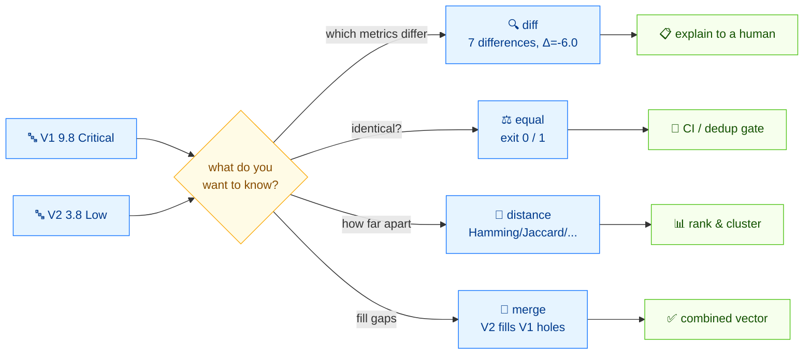

# ⚖️ Comparison Guide

⏱️ 15 min · intermediate · CLI

CVSS vectors rarely live alone. A vendor advisory and an internal triage often disagree on a single metric; two scanners may emit the same bug with different environmental context. This tutorial takes two concrete vectors and runs all four comparison commands — `diff`, `equal`, `distance`, `merge` — so you know exactly which one answers which question.

## Prerequisites

- The `cvss` binary on your `$PATH` (or `./cvss-cli` from the repo root)
- Finish [getting-started](./getting-started) and [your-first-vector](./your-first-vector)

## Flow



## The two vectors

Throughout this tutorial we compare a "worst-case remote RCE" against a "low-privilege local prank":

```
V1 = CVSS:3.1/AV:N/AC:L/PR:N/UI:N/S:U/C:H/I:H/A:H   (9.8 Critical)
V2 = CVSS:3.1/AV:L/AC:H/PR:H/UI:R/S:U/C:L/I:L/A:L   (3.8 Low)
```

They share only `S:U` — everything else differs. That makes them a good fixture: every command has something to report.

## Step 1 — `diff`: see *which* metrics differ

`diff` is the human-readable comparison. It lists every metric whose value changed and the score swing at the bottom.

```bash
cvss diff "CVSS:3.1/AV:N/AC:L/PR:N/UI:N/S:U/C:H/I:H/A:H" "CVSS:3.1/AV:L/AC:H/PR:H/UI:R/S:U/C:L/I:L/A:L"
```

```
Found 7 difference(s):

  AV: N (Network) → L (Local)
  AC: L (Low) → H (High)
  PR: N (None) → H (High)
  UI: N (None) → R (Required)
  C: H (High) → L (Low)
  I: H (High) → L (Low)
  A: H (High) → L (Low)

Score: 9.8 (Critical) → 3.8 (Low)  [Δ=-6.0]
```

Read it line by line:

- `Found 7 difference(s)` — seven of the eight base metrics differ; `S` is the only one that matches.
- Each row shows `METRIC: V1 (long) → V2 (long)`.
- The footer summarizes the score move: **9.8 Critical → 3.8 Low, Δ = −6.0**.

::: tip diff is the "explain it to me" command
Use `diff` when a human needs to understand *why* two scores disagree — in a code review, an advisory reconciliation, or a triage discussion.
:::

### JSON form for tooling

```bash
cvss diff --format json "CVSS:3.1/AV:N/AC:L/PR:N/UI:N/S:U/C:H/I:H/A:H" "CVSS:3.1/AV:L/AC:H/PR:H/UI:R/S:U/C:L/I:L/A:L"
```

```json
{
  "differences": [
    { "metric": "AV", "v1": "N", "v1_long": "Network",   "v2": "L", "v2_long": "Local" },
    { "metric": "AC", "v1": "L", "v1_long": "Low",        "v2": "H", "v2_long": "High" },
    { "metric": "PR", "v1": "N", "v1_long": "None",       "v2": "H", "v2_long": "High" },
    { "metric": "UI", "v1": "N", "v1_long": "None",       "v2": "R", "v2_long": "Required" },
    { "metric": "C",  "v1": "H", "v1_long": "High",       "v2": "L", "v2_long": "Low" },
    { "metric": "I",  "v1": "H", "v1_long": "High",       "v2": "L", "v2_long": "Low" },
    { "metric": "A",  "v1": "H", "v1_long": "High",       "v2": "L", "v2_long": "Low" }
  ],
  "score1": 9.8,
  "score2": 3.8,
  "score_delta": -6.000000000000001,
  "severity1": "Critical",
  "severity2": "Low"
}
```

The `differences` array is machine-iterable; `score_delta` carries the signed swing.

## Step 2 — `equal`: are they *identical*?

`equal` answers a narrower question: are the two vectors the same string-for-string (after normalization). It exits `0` when equal, `1` when not — so it composes with `&&` and shell scripts.

```bash
cvss equal "CVSS:3.1/AV:N/AC:L/PR:N/UI:N/S:U/C:H/I:H/A:H" "CVSS:3.1/AV:N/AC:L/PR:N/UI:N/S:U/C:H/I:H/A:H"
echo "exit=$?"
```

```
Equal
exit=0
```

```bash
cvss equal "CVSS:3.1/AV:N/AC:L/PR:N/UI:N/S:U/C:H/I:H/A:H" "CVSS:3.1/AV:L/AC:H/PR:H/UI:R/S:U/C:L/I:L/A:L"
echo "exit=$?"
```

```
Not equal
exit=1
```

::: warning equal prints to both streams when not equal
On a mismatch, `equal` writes `Not equal` to stdout and `not equal` to stderr. If you parse the JSON form, read stdout.
:::

The JSON form keeps the vectors for the record:

```bash
cvss equal --format json "CVSS:3.1/AV:N/AC:L/PR:N/UI:N/S:U/C:H/I:H/A:H" "CVSS:3.1/AV:L/AC:H/PR:H/UI:R/S:U/C:L/I:L/A:L"
echo "exit=$?"
```

```json
{
  "equal": false,
  "vector1": "CVSS:3.1/AV:N/AC:L/PR:N/UI:N/S:U/C:H/I:H/A:H",
  "vector2": "CVSS:3.1/AV:L/AC:H/PR:H/UI:R/S:U/C:L/I:L/A:L"
}
not equal
exit=1
```

::: tip When to use equal vs diff
`equal` is a yes/no gate — use it in a CI step or a dedup pass. `diff` is for explaining a mismatch. Run `equal` first; if it fails, run `diff` to see why.
:::

## Step 3 — `distance`: how *far* apart, numerically

`distance` reduces the comparison to numbers — five of them — so you can rank, sort, and cluster vectors.

```bash
cvss distance "CVSS:3.1/AV:N/AC:L/PR:N/UI:N/S:U/C:H/I:H/A:H" "CVSS:3.1/AV:L/AC:H/PR:H/UI:R/S:U/C:L/I:L/A:L"
```

```
Euclidean:  0.9670
Manhattan:  2.4600
Hamming:    7
Jaccard:    0.1250
Score diff: 6.0
```

| Metric | What it measures | Range |
| --- | --- | --- |
| `Euclidean` | Root-sum-of-squares of per-metric numeric deltas | ≥ 0 |
| `Manhattan` | Sum of absolute per-metric numeric deltas | ≥ 0 |
| `Hamming` | Count of metrics that differ | 0–8 (base) |
| `Jaccard` | Similarity ratio: `same / (union)` | 0–1 (1 = identical) |
| `Score diff` | Absolute difference of the overall scores | ≥ 0 |

For our pair: `Hamming = 7` (seven metrics differ), `Jaccard = 0.125` (only `S` is shared, so `1/8 = 0.125`), and `Score diff = 6.0` (9.8 − 3.8).

### JSON form

```bash
cvss distance --format json "CVSS:3.1/AV:N/AC:L/PR:N/UI:N/S:U/C:H/I:H/A:H" "CVSS:3.1/AV:L/AC:H/PR:H/UI:R/S:U/C:L/I:L/A:L"
```

```json
{
  "euclidean": 0.9669539802906858,
  "hamming": 7,
  "jaccard": 0.125,
  "manhattan": 2.46,
  "score_diff": 6.000000000000001,
  "vector1": "CVSS:3.1/AV:N/AC:L/PR:N/UI:N/S:U/C:H/I:H/A:H",
  "vector2": "CVSS:3.1/AV:L/AC:H/PR:H/UI:R/S:U/C:L/I:L/A:L"
}
```

::: tip Which distance do I want?
- **Hamming / Jaccard** — clustering and dedup of similar advisories.
- **Score diff** — "are these two bugs in the same severity bucket?"
- **Euclidean / Manhattan** — research and sensitivity analysis; rarely needed operationally.
:::

### Include environmental metrics with `--env`

When both vectors carry environmental metrics (`MAV`, `CR`, ...), add `--env` to fold those into the distance:

```bash
cvss distance --env \
  "CVSS:3.1/AV:N/AC:L/PR:N/UI:N/S:U/C:H/I:H/A:H/CR:H" \
  "CVSS:3.1/AV:N/AC:L/PR:N/UI:N/S:U/C:H/I:H/A:H/CR:L"
```

Without `--env`, the differing `CR` is ignored; with `--env`, it contributes to the distance.

## Step 4 — `merge`: fill gaps from a second vector

`merge` is the odd one out — it does not compare, it combines. Fields from vector 2 fill in **missing** fields in vector 1; existing fields in vector 1 are never overwritten.

A common pattern: you have a base vector and a separate temporal overlay, and you want one combined vector.

```bash
cvss merge "CVSS:3.1/AV:N/AC:L/PR:N/UI:N/S:U/C:H/I:H/A:H" "CVSS:3.1/E:F/RL:T/RC:C"
```

```
CVSS:3.1/AV:N/AC:L/PR:N/UI:N/S:U/C:H/I:H/A:H/E:F/RL:T/RC:C
```

The base vector had no `E`/`RL`/`RC`, so all three temporal metrics flow in. The base metrics are untouched.

### Merge shows you the new score

The JSON form reveals what the merge did to the score:

```bash
cvss merge --format json "CVSS:3.1/AV:N/AC:L/PR:N/UI:N/S:U/C:H/I:H/A:H" "CVSS:3.1/E:F/RL:T/RC:C"
```

```json
{
  "version": "3.1",
  "vectorString": "CVSS:3.1/AV:N/AC:L/PR:N/UI:N/S:U/C:H/I:H/A:H/E:F/RL:T/RC:C",
  "baseScore": 9.8,
  "temporalScore": 9.2,
  "baseSeverity": "Critical",
  "temporalSeverity": "Critical",
  "metrics": {
    "base": {
      "attackVector": "Network", "attackComplexity": "Low", "privilegesRequired": "None",
      "userInteraction": "None", "scope": "Unchanged", "confidentiality": "High",
      "integrity": "High", "availability": "High",
      "exploitabilityScore": 3.8870427750000003, "impactScore": 5.873118720000001
    },
    "temporal": {
      "exploitCodeMaturity": "Functional", "remediationLevel": "Temporary Fix",
      "reportConfidence": "Confirmed"
    }
  }
}
```

Base stays 9.8; the merged-in temporal metrics produce a **9.2** temporal score.

::: warning Merge never overwrites
If vector 1 already has `E:U` and vector 2 has `E:F`, the result keeps `E:U`. Merge is "fill the holes," not "apply a patch." To override a metric, use `cvss modify` instead.
:::

## Which command when?

| You want to… | Use | Exit code |
| --- | --- | --- |
| Explain *which* metrics differ to a human | `diff` | 0 always |
| Ask "are these two identical?" in a script | `equal` | 0 = equal, 1 = not |
| Rank or cluster vectors by similarity | `distance` | 0 always |
| Combine a base vector with a temporal/environmental overlay | `merge` | 0 always |

## Recap

- `diff` → the *human* view: which metrics, what score swing.
- `equal` → the *gate*: yes/no, scriptable exit code.
- `distance` → the *numbers*: five metrics for ranking and clustering.
- `merge` → the *combiner*: fill missing fields, never overwrite.

For our fixture pair (`V1` 9.8 Critical vs `V2` 3.8 Low): `diff` found 7 differences and Δ = −6.0; `equal` returned exit 1; `distance` reported Hamming 7, Jaccard 0.125, Score diff 6.0; `merge` was a separate demo showing temporal overlay raising base 9.8 into a 9.2 temporal.

## Next

- Run these comparisons at scale in [batch-scripting](./batch-scripting)
- Build the vectors from scratch in Go in [building-vectors](./building-vectors)
