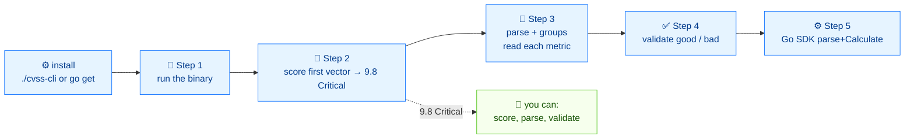

# 🚀 Getting Started

⏱️ 30 min · beginner · CLI + SDK

You will install the `cvss` binary and the Go module, parse a real vector, score it, and understand every field of the output. Nothing here is hypothetical — every block is a command followed by its real output.

## Prerequisites

- A POSIX shell (bash/zsh) on Linux or macOS
- Go 1.21 or newer (only for the SDK section)
- The repo checked out so you have `./cvss-cli` at the root

::: tip No build needed
The repository ships a prebuilt `./cvss-cli`. You can follow the CLI half of this tutorial without ever running `go build`.
:::

## Flow



## Step 1 — Run the binary

From the repository root:

```bash
./cvss-cli --help
```

```
CVSS CLI — parse, score, validate, compare, and serialize CVSS v3.0/v3.1 vectors.

Supports all CVSS 3.x capabilities:
  • Parse and validate vector strings
  • Calculate base, temporal, and environmental scores
  • Compute severity ratings
  • Compare vectors (diff, merge, distance)
  • Serialize to JSON, XML, or vector string format
  • Generate random vectors and presets

Usage:
  cvss [command]
...
```

The top-level help lists every subcommand. You only need three to start: `score`, `parse`, and `validate`.

### Install it as `cvss` (optional)

If you want to type `cvss` instead of `./cvss-cli`:

```bash
cp ./cvss-cli ~/.local/bin/cvss   # or any directory on your $PATH
cvss --version
```

The rest of this tutorial uses `cvss`; substitute `./cvss-cli` if you skipped this step.

## Step 2 — Score your first vector

The canonical "remote code execution" vector:

```bash
cvss score "CVSS:3.1/AV:N/AC:L/PR:N/UI:N/S:U/C:H/I:H/A:H"
```

```
9.8 (Critical)
```

That is the headline: **9.8, Critical**. The score comes from the eight base metrics inside the vector string. To see them broken out:

```bash
cvss score --all "CVSS:3.1/AV:N/AC:L/PR:N/UI:N/S:U/C:H/I:H/A:H"
```

```
Base: 9.8 (Critical)
```

Only `Base` appears because this vector has no temporal or environmental metrics. The [scoring-walkthrough](./scoring-walkthrough) tutorial adds them one at a time.

### JSON output

```bash
cvss score --format json "CVSS:3.1/AV:N/AC:L/PR:N/UI:N/S:U/C:H/I:H/A:H"
```

```json
{
  "score": 9.8,
  "severity": "Critical"
}
```

::: tip JSON is pipeline-friendly
Pipe `--format json` into `jq` for filtering and sorting. The [batch-scripting](./batch-scripting) tutorial shows the full pattern.
:::

## Step 3 — Parse the vector

`score` gives you the number; `parse` explains what the string means.

```bash
cvss parse "CVSS:3.1/AV:N/AC:L/PR:N/UI:N/S:U/C:H/I:H/A:H"
```

```
Version: 3.1
Complete: true
Has Temporal: false
Has Environmental: false

Vector String: CVSS:3.1/AV:N/AC:L/PR:N/UI:N/S:U/C:H/I:H/A:H

Description:
Attack Vector: Network, Attack Complexity: Low, Privileges Required: None, User Interaction: None, Scope: Unchanged, Confidentiality: High, Integrity: High, Availability: High
```

Read this output as a checklist:

| Field | Meaning |
| --- | --- |
| `Version: 3.1` | CVSS spec version |
| `Complete: true` | All required base metrics are present |
| `Has Temporal: false` | No `E`/`RL`/`RC` metrics |
| `Has Environmental: false` | No `CR`/`IR`/.../`MAV` metrics |
| `Description:` | Human-readable form of each metric |

To see the metrics grouped by tier (Base / Temporal / Environmental):

```bash
cvss groups "CVSS:3.1/AV:N/AC:L/PR:N/UI:N/S:U/C:H/I:H/A:H/E:U/RL:O/RC:C/CR:H"
```

```
[Base]
  AV:N  Attack Vector = Network
  AC:L  Attack Complexity = Low
  PR:N  Privileges Required = None
  UI:N  User Interaction = None
  S:U  Scope = Unchanged
  C:H  Confidentiality = High
  I:H  Integrity = High
  A:H  Availability = High

[Temporal]
  E:U  Exploit Code Maturity = Unproven
  RL:O  Remediation Level = Official Fix
  RC:C  Report Confidence = Confirmed

[Environmental]
  CR:H  Confidentiality Requirement = High
  ...
```

## Step 4 — Validate a vector

`parse` is permissive; `validate` is the gatekeeper. On a good vector:

```bash
cvss validate "CVSS:3.1/AV:N/AC:L/PR:N/UI:N/S:U/C:H/I:H/A:H"
```

```
Valid [PASS]
  Version: 3.1
  Complete: true
```

On a bad one — note the illegal `A:X`:

```bash
cvss validate "CVSS:3.1/AV:N/AC:L/PR:N/UI:N/S:U/C:H/I:H/A:X"
```

```
Validation failed: unknown availability value: X
```

The [validation-workflow](./validation-workflow) tutorial takes a broken vector end-to-end: error → diagnose → fix → re-check.

## Step 5 — Use the Go SDK

Install the module:

```bash
go get github.com/scagogogo/cvss-skills
```

Now reproduce Step 2 in Go. Three lines do the work: parse, build a calculator, calculate.

```go
package main

import (
	"fmt"

	"github.com/scagogogo/cvss-skills/pkg/cvss"
	"github.com/scagogogo/cvss-skills/pkg/parser"
)

func main() {
	cv, err := parser.ParseString("CVSS:3.1/AV:N/AC:L/PR:N/UI:N/S:U/C:H/I:H/A:H")
	if err != nil {
		panic(err)
	}
	calc := cvss.NewCalculator(cv)
	score, _ := calc.Calculate()
	fmt.Printf("%.1f\n", score) // 9.8
}
```

```
9.8
```

For all three tiers at once, use `GetAllScores`:

```go
all, _ := calc.GetAllScores()
fmt.Printf("Base=%.1f(%s) Temporal=%.1f Environmental=%.1f\n",
	all.BaseScore, all.BaseSeverity, all.TemporalScore, all.EnvironmentalScore)
// Base=9.8(Critical) Temporal=0.0 Environmental=0.0
```

The `AllScores` struct carries the severities and sub-scores too:

```go
type AllScores struct {
	BaseScore                       float64
	TemporalScore                   float64
	EnvironmentalScore              float64
	BaseSeverity, TemporalSeverity  Severity
	EnvironmentalSeverity           Severity
	ImpactSubScore                  float64
	ExploitabilitySubScore          float64
	// ...modified sub-scores, HasTemporal, HasEnvironmental
}
```

::: warning Calculate returns the overall score
`Calculate()` returns the environmental score when environmental metrics are present, the temporal score when only temporal metrics are present, and the base score otherwise. Use `GetBaseScore` / `GetTemporalScore` / `GetEnvironmentalScore` if you want a specific tier.
:::

## Recap

You can now:

- Run `cvss` and read its top-level help
- `score` a vector in text and JSON
- `parse` a vector to see what each metric means
- `validate` a vector and read the error
- Do the same from Go with `parser.ParseString` + `cvss.NewCalculator`

## Next

- Read every segment of that 9.8 vector in [your-first-vector](./your-first-vector)
- Watch the score move tier-by-tier in [scoring-walkthrough](./scoring-walkthrough)
