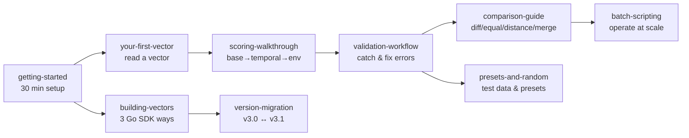

# 📚 Tutorials

⏱️ self-paced · 10 tutorials · beginner → advanced

These tutorials are hands-on: every step has a command you can copy and real output captured from the bundled `cvss` binary. By the end you will be able to parse, score, validate, compare, and build CVSS v3.0 / v3.1 vectors from the command line and from Go.

## Learning path

## Track 1 — Use the CLI (operations)

If you score vulnerabilities in a pipeline or on-call workflow, take these in order:

1. [getting-started](./getting-started) — install, first parse, first score
2. [your-first-vector](./your-first-vector) — dissect `CVSS:3.1/AV:N/AC:L/PR:N/UI:N/S:U/C:H/I:H/A:H` to 9.8 Critical
3. [scoring-walkthrough](./scoring-walkthrough) — watch base→temporal→environmental evolve
4. [validation-workflow](./validation-workflow) — break a vector, read the error, fix it
5. [comparison-guide](./comparison-guide) — diff, equal, distance, merge
6. [batch-scripting](./batch-scripting) — `vectors.txt` + `batch` + `sort` + `csv`

## Track 2 — Use the Go SDK (programming)

If you embed scoring into a Go service:

1. [getting-started](./getting-started) — `go get` the module, run the first snippet
2. [building-vectors](./building-vectors) — `FromMap` vs `Builder` vs functional `Options`
3. [version-migration](./version-migration) — `UpgradeTo31` / `DowngradeTo30`
4. [presets-and-random](./presets-and-random) — `mock.RandomCvss3x` for tests

## What you need

- The bundled binary at the repo root, `./cvss-cli`, runnable on Linux/macOS
- Go 1.21+ for the SDK tutorials (module path `github.com/scagogogo/cvss-skills`)
- 30 minutes for the first two tutorials; about 2 hours for the full set

::: tip Prefer the CLI first
Even SDK users benefit from running the CLI a few times — the CLI output is the ground truth for what the SDK produces.
:::

## Conventions

- Every command block is copy-pasteable; the output block beneath it is real.
- `cvss` is the installed binary; `./cvss-cli` is the one in the repo root — same program.
- Vectors are always written verbatim, e.g. `CVSS:3.1/AV:N/...`.

## Next

Start with [getting-started](./getting-started).
