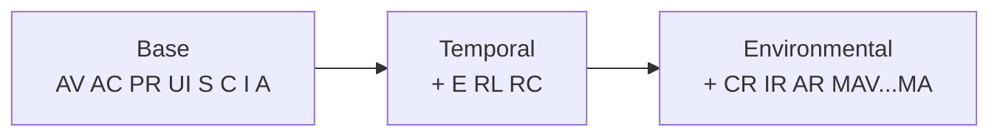

# 📈 Scoring Walkthrough

⏱️ 15 min · intermediate · CLI

CVSS gives you three scoring tiers — **Base**, **Temporal**, **Environmental** — computed from progressively more metric groups. This tutorial takes a single vector and grows it one metric at a time, capturing the real score at every step so you can see exactly what each metric contributes.

## Prerequisites

- The `cvss` binary on your `$PATH` (or `./cvss-cli`)
- Read [your-first-vector](./your-first-vector) so the base metrics are familiar

## The three tiers



- **Base** — intrinsic, "what kind of bug is this." Always present.
- **Temporal** — "what do we know about it right now" (exploit maturity, fix availability, confidence).
- **Environmental** — "what does it mean **to us**" (which CIA dimensions we care about, modified metrics).

The overall score is: Environmental if present, else Temporal if present, else Base.

::: tip Scores only go down from Base, then Environmental can pull them back up
Temporal metrics (an unproven exploit, a fix available) usually *lower* the score. Environmental requirements (`CR:H`) can *raise* it back, because they say "for us, this matters more."
:::

## Step 1 — Base score

Start with the same eight-metric base vector from the previous tutorial:

```bash
cvss score --all "CVSS:3.1/AV:N/AC:L/PR:N/UI:N/S:U/C:H/I:H/A:H"
```

```
Base: 9.8 (Critical)
```

No temporal, no environmental — only `Base` prints. **9.8 Critical.**

## Step 2 — Add `E:U` (Exploit Code Maturity = Unproven)

The first temporal metric. `E` says how mature the exploit code is.

| Value | Meaning |
| --- | --- |
| `X` | Not defined (default — treated as `H`) |
| `H` | High — functional exploit exists |
| `F` | Functional |
| `P` | Proof-of-concept |
| `U` | Unproven — no known exploit |

```bash
cvss score --all "CVSS:3.1/AV:N/AC:L/PR:N/UI:N/S:U/C:H/I:H/A:H/E:U"
```

```
Base: 9.8 (Critical), Temporal: 9.0 (Critical)
```

The Base is untouched at 9.8; the **Temporal** column appears at **9.0**. The score dropped 0.8 because the exploit is unproven — but it stays Critical.

## Step 3 — Add `RL:O` (Remediation Level = Official Fix)

`RL` describes whether a fix exists.

| Value | Meaning |
| --- | --- |
| `X` | Not defined (default `U`) |
| `U` | Unavailable |
| `W` | Workaround |
| `T` | Temporary fix |
| `O` | Official fix |

```bash
cvss score --all "CVSS:3.1/AV:N/AC:L/PR:N/UI:N/S:U/C:H/I:H/A:H/E:U/RL:O"
```

```
Base: 9.8 (Critical), Temporal: 8.5 (High)
```

An official fix is available, so urgency drops further — Temporal is now **8.5 High**. We just crossed from Critical into High.

## Step 4 — Add `RC:C` (Report Confidence = Confirmed)

`RC` is how sure we are the report is accurate.

| Value | Meaning |
| --- | --- |
| `X` | Not defined (default `C`) |
| `C` | Confirmed |
| `R` | Reasonable |
| `U` | Unknown |

```bash
cvss score --all "CVSS:3.1/AV:N/AC:L/PR:N/UI:N/S:U/C:H/I:H/A:H/E:U/RL:O/RC:C"
```

```
Base: 9.8 (Critical), Temporal: 8.5 (High)
```

No change — `RC:C` is the default assumption, so adding it explicitly keeps Temporal at **8.5**. This step is here to show the default in action.

## Step 5 — Add `CR:H` (Confidentiality Requirement = High)

Now we enter **Environmental**. `CR`/`IR`/`AR` say how important each CIA dimension is *to your environment*. They re-weight the impact.

| Value | Meaning |
| --- | --- |
| `X` | Not defined (default `M` Medium) |
| `H` | High |
| `M` | Medium |
| `L` | Low |

```bash
cvss score --all "CVSS:3.1/AV:N/AC:L/PR:N/UI:N/S:U/C:H/I:H/A:H/E:U/RL:O/RC:C/CR:H"
```

```
Base: 9.8 (Critical), Temporal: 8.5 (High), Environmental: 8.7 (High)
```

The **Environmental** column appears at **8.7** — higher than Temporal's 8.5, because we just declared that confidentiality matters a lot to us. The fix-availability penalty is partly offset by "this is a high-stakes asset."

::: warning Requirements only re-weight existing impact
`CR:H` raises the score here because `C:H` is already in the vector. It will not invent impact that isn't there. The next step shows the same idea on `IR`/`AR`.
:::

## Step 6 — Add `IR:H` and `AR:H`

Our vector already has `I:H` and `A:H`, so declaring that integrity and availability also matter highly should not change much — they are already counted at maximum impact weight:

```bash
cvss score --all "CVSS:3.1/AV:N/AC:L/PR:N/UI:N/S:U/C:H/I:H/A:H/E:U/RL:O/RC:C/CR:H/IR:H/AR:H"
```

```
Base: 9.8 (Critical), Temporal: 8.5 (High), Environmental: 8.7 (High)
```

Confirmed — Environmental stays **8.7**. The requirements cannot push beyond what the underlying `C:H/I:H/A:H` impact already allows.

### See requirements actually move the score

To watch a requirement *change* the Environmental score, drop it instead of raising it:

```bash
cvss score --all "CVSS:3.1/AV:N/AC:L/PR:N/UI:N/S:U/C:H/I:H/A:H/E:U/RL:O/RC:C/CR:L"
```

```
Base: 9.8 (Critical), Temporal: 8.5 (High), Environmental: 8.3 (High)
```

`CR:L` says "confidentiality is low-stakes here," and Environmental falls to **8.3**. Compare that to `CR:M` (the implicit default), which leaves it at 8.5:

```bash
cvss score --all "CVSS:3.1/AV:N/AC:L/PR:N/UI:N/S:U/C:H/I:H/A:H/E:U/RL:O/RC:C/CR:M"
```

```
Base: 9.8 (Critical), Temporal: 8.5 (High), Environmental: 8.5 (High)
```

So `CR` moves Environmental: `L` → 8.3, `M` → 8.5, `H` → 8.7.

## Step 7 — The other environmental lever: modified metrics

Environmental also includes **modified** base metrics (`MAV`, `MAC`, `MUI`, ...). These say "in *our* deployment the effective Attack Vector is different." They override the base value in the environmental formula.

For example, even though the base says `AV:N` (network-reachable), suppose our deployment puts the service behind a physical-only console, so the *effective* attack vector is Physical:

```bash
cvss score --all "CVSS:3.1/AV:N/AC:L/PR:N/UI:N/S:U/C:H/I:H/A:H/E:U/RL:O/RC:C/MAV:P"
```

```
Base: 9.8 (Critical), Temporal: 8.5 (High), Environmental: 5.9 (Medium)
```

`MAV:P` cuts Environmental from 8.7 all the way to **5.9 Medium** — the modified attack vector replaces the base one when computing environmental impact. This is the most powerful environmental lever.

## The journey, summarized

| Step | Added | Base | Temporal | Environmental |
| --- | --- | --- | --- | --- |
| 1 | — | 9.8 Crit | — | — |
| 2 | `E:U` | 9.8 | 9.0 Crit | — |
| 3 | `RL:O` | 9.8 | 8.5 High | — |
| 4 | `RC:C` | 9.8 | 8.5 High | — |
| 5 | `CR:H` | 9.8 | 8.5 | 8.7 High |
| 6 | `IR:H/AR:H` | 9.8 | 8.5 | 8.7 High |
| 7 | `MAV:P` (instead) | 9.8 | 8.5 | 5.9 Medium |

## Recap

- **Base** is intrinsic and never changes once the 8 base metrics are set.
- **Temporal** layers in `E`/`RL`/`RC`; it usually lowers the score toward reality.
- **Environmental** layers in `CR`/`IR`/`AR` (re-weight impact) and `MAV`...`MA` (override base metrics); it can raise *or* lower the score to reflect your context.
- The overall score returned by `cvss score` is the most-specific tier present.

## Next

- Catch a malformed vector and fix it in [validation-workflow](./validation-workflow)
- Reproduce this whole walkthrough in Go — see [building-vectors](./building-vectors) for the SDK entry points
