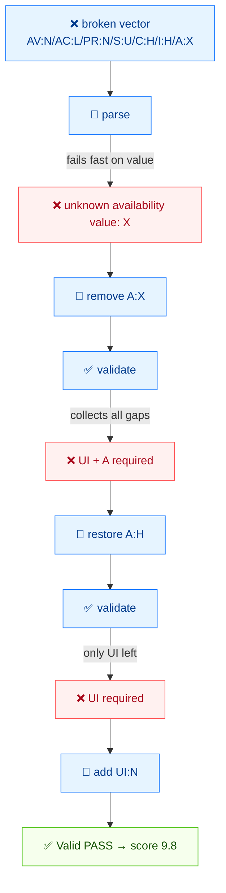

# 🔍 Validation Workflow

⏱️ 12 min · beginner · CLI + SDK

You will deliberately write a broken vector, watch the CLI reject it two different ways, fix it metric by metric, and learn why `Check` and `Validate` exist as separate operations.

## Prerequisites

- The `cvss` binary (or `./cvss-cli`)
- Finish [getting-started](./getting-started) and [your-first-vector](./your-first-vector)

## Flow



## Step 1 — Start from a wrong vector

Suppose a junior analyst hands you this for a "remote crash" bug:

```
CVSS:3.1/AV:N/AC:L/PR:N/S:U/C:H/I:H/A:X
```

Two problems are hiding in it:

1. `UI` is **missing** (a required base metric).
2. `A:X` — `X` is **not a legal Availability value** (legal values are `H`/`L`/`N`).

Let the CLI find them.

## Step 2 — `parse` it

`parse` is the permissive reader. It accepts the string and tells you what it understood:

```bash
cvss parse "CVSS:3.1/AV:N/AC:L/PR:N/S:U/C:H/I:H/A:X"
```

```
Parse error: unknown availability value: X
```

`parse` stops at the **first illegal value** it encounters — here, `A:X`. It does not yet complain about the missing `UI`, because it never got that far.

::: tip parse fails fast on bad values
`parse` validates values as it reads them. Use it when you want the most direct "where does the string break" answer.
:::

## Step 3 — `validate` it

`validate` is the strict gatekeeper. Try the same broken vector:

```bash
cvss validate "CVSS:3.1/AV:N/AC:L/PR:N/S:U/C:H/I:H/A:X"
```

```
Validation failed: unknown availability value: X
```

Same value error. Now remove the illegal `A:X` segment entirely and watch what `validate` reports next:

```bash
cvss validate "CVSS:3.1/AV:N/AC:L/PR:N/S:U/C:H/I:H"
```

```
Validation failed: validation failed: metric UI: is required but not set; metric A: is required but not set
```

Two missing metrics surface at once: `UI` (which was never in the vector) and `A` (which we just removed). The value error is gone; what remains is purely **structural** — required base metrics that are absent.

::: tip validate collects all structural gaps
Unlike `parse`, which stops at the first problem, `validate` reports every missing required metric in one pass. That is what makes it the right tool for a CI gate.
:::

## Step 4 — Restore Availability

Add `A` back with a legal value — `A:H` (full availability loss, matching a crash):

```bash
cvss validate "CVSS:3.1/AV:N/AC:L/PR:N/S:U/C:H/I:H/A:H"
```

```
Validation failed: validation failed: metric UI: is required but not set
```

The `A` gap is closed; only the **real** missing metric, `UI`, remains.

## Step 5 — Add the missing metric

`UI:N` (no user interaction needed):

```bash
cvss validate "CVSS:3.1/AV:N/AC:L/PR:N/UI:N/S:U/C:H/I:H/A:H"
```

```
Valid [PASS]
  Version: 3.1
  Complete: true
```

Fixed. Score it to confirm:

```bash
cvss score "CVSS:3.1/AV:N/AC:L/PR:N/UI:N/S:U/C:H/I:H/A:H"
```

```
9.8 (Critical)
```

## Step 6 — `Check` vs `Validate` (the SDK distinction)

In the Go SDK there are **two** related operations. The CLI's `validate` command runs both; in code you call them separately:

| Operation | What it checks | Example failure |
| --- | --- | --- |
| `parser.ParseString` | Reads the string; rejects **illegal values** | `unknown availability value: X` |
| `Cvss3x.Check()` | Structural **completeness** after parsing | `Availability can not empty` |

Crucially, `ParseString` does **not** require all base metrics to be present — it succeeds on a partial vector:

```go
package main

import (
	"errors"
	"fmt"

	"github.com/scagogogo/cvss-skills/pkg/cvss"
	"github.com/scagogogo/cvss-skills/pkg/parser"
)

func main() {
	// Partial: AV/AC/PR/UI/S/C/I present, A missing
	cv, err := parser.ParseString("CVSS:3.1/AV:N/AC:L/PR:N/UI:N/S:U/C:H/I:H")
	fmt.Println("ParseString err:", err) // <nil>  — parsing succeeded
	fmt.Println("Check():", cv.Check())  // Availability can not empty

	// Validate collects all problems instead of short-circuiting.
	if err := cv.Validate(); err != nil {
		var ve cvss.ValidationErrors
		if errors.As(err, &ve) {
			fmt.Println("Missing:", ve.MissingMetrics()) // [A]
		}
	}
}
```

```
ParseString err: <nil>
Check(): Availability can not empty
```

So the pattern is:

```go
cv, err := parser.ParseString(input) // 1. value-level errors
if err != nil {
	return err
}
if err := cv.Check(); err != nil {    // 2. structure-level errors
	return err
}
// cv is now safe to score
```

::: tip Why split them?
You sometimes want to parse a *partial* vector on purpose — to compute a score [range](../cli/commands/range) or to merge metrics later. `ParseString` lets you do that; `Check()` is the explicit "is this complete enough to score?" question.
:::

## Step 7 — Batch-validate a file

When you have many vectors, validate them all at once:

```bash
cat > /tmp/vec.txt <<'EOF'
CVSS:3.1/AV:N/AC:L/PR:N/UI:N/S:U/C:H/I:H/A:H
CVSS:3.1/AV:N/AC:L/PR:N/UI:N/S:U/C:H/I:H/A:X
CVSS:3.1/AV:N/AC:L/PR:N/S:U/C:H/I:H/A:H
EOF

cvss batch validate /tmp/vec.txt
```

```
PASS Line 1: CVSS:3.1/AV:N/AC:L/PR:N/UI:N/S:U/C:H/I:H/A:H
FAIL Line 2: CVSS:3.1/AV:N/AC:L/PR:N/UI:N/S:U/C:H/I:H/A:X
  - unknown availability value: X
FAIL Line 3: CVSS:3.1/AV:N/AC:L/PR:N/S:U/C:H/I:H/A:H
  - metric UI: is required but not set
```

Line 1 passes; line 2 fails on the illegal `A:X` value; line 3 fails on the missing `UI` metric. `batch validate` runs the **full** validation (values + completeness) on every line and prints the specific reason under each failure.

## Recap

- `parse` fails fast on **illegal values**; use it to find the first bad value.
- `validate` is the full gatekeeper: value errors **and** missing-metric errors.
- In the SDK, `parser.ParseString` (values) and `Cvss3x.Check()` (completeness) are separate on purpose, so you can work with partial vectors.
- Fix value errors before chasing missing-metric errors — a malformed segment can cascade.

## Next

- Compare and merge vectors in [comparison-guide](./comparison-guide)
- Run validation at scale in [batch-scripting](./batch-scripting)
