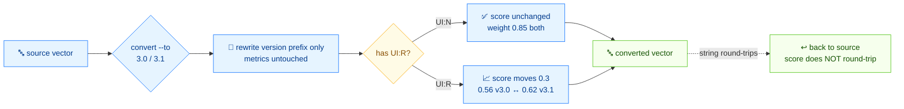

# 🔁 Version Migration

⏱️ 12 min · intermediate · CLI + SDK

CVSS v3.0 and v3.1 use almost identical metric sets, but one weight differs: `UI:R` (User Interaction = Required) contributes `0.56` in v3.0 and `0.62` in v3.1. That single change shifts the score of any `UI:R` vector. This tutorial shows how to convert between versions, where the score moves, and how to do it from Go.

## Prerequisites

- The `cvss` binary on your `$PATH` (or `./cvss-cli` from the repo root)
- Finish [getting-started](./getting-started) and [your-first-vector](./your-first-vector)
- For the SDK section: Go 1.18+

## Flow



## The one weight that changes

| Metric value | v3.0 weight | v3.1 weight |
| --- | --- | --- |
| `UI:N` (None) | 0.85 | 0.85 |
| `UI:R` (Required) | 0.56 | **0.62** |

Every other metric keeps its weight across versions. So a vector with `UI:N` scores the **same** in v3.0 and v3.1; only `UI:R` vectors move. The `convert` command changes only the version prefix — metric values are preserved — and the score recomputes against the target version's weights.

## Step 1 — Convert v3.0 → v3.1 (a `UI:N` vector, no score change)

```bash
cvss convert "CVSS:3.0/AV:N/AC:L/PR:N/UI:N/S:U/C:H/I:H/A:H" --to 3.1
```

```
Original:  CVSS:3.0/AV:N/AC:L/PR:N/UI:N/S:U/C:H/I:H/A:H (9.8)
Converted: CVSS:3.1/AV:N/AC:L/PR:N/UI:N/S:U/C:H/I:H/A:H (9.8)
```

`UI:N` is unaffected by the weight change, so the score stays **9.8**. Only the version prefix flips from `CVSS:3.0` to `CVSS:3.1`.

## Step 2 — Convert v3.0 → v3.1 (a `UI:R` vector, score moves)

Now take a vector with `UI:R`. This is where the conversion is interesting:

```bash
cvss convert "CVSS:3.0/AV:N/AC:L/PR:N/UI:R/S:U/C:H/I:H/A:H" --to 3.1
```

```
Original:  CVSS:3.0/AV:N/AC:L/PR:N/UI:R/S:U/C:H/I:H/A:H (8.5)
Converted: CVSS:3.1/AV:N/AC:L/PR:N/UI:R/S:U/C:H/I:H/A:H (8.8)
```

The metric values are byte-for-byte identical; only `CVSS:3.0` → `CVSS:3.1` changed. But the score moved **8.5 → 8.8** because `UI:R`'s weight rose from `0.56` to `0.62`, lifting the Exploitability Sub-Score.

::: tip convert never changes metric values
`convert` rewrites only the version prefix. The score delta you see is purely the v3.0-vs-v3.1 weight difference applied to the same metrics.
:::

## Step 3 — Convert v3.1 → v3.0 (downgrade)

Reverse the direction with `--to 3.0`:

```bash
cvss convert "CVSS:3.1/AV:N/AC:L/PR:N/UI:R/S:U/C:H/I:H/A:H" --to 3.0
```

```
Original:  CVSS:3.1/AV:N/AC:L/PR:N/UI:R/S:U/C:H/I:H/A:H (8.8)
Converted: CVSS:3.0/AV:N/AC:L/PR:N/UI:R/S:U/C:H/I:H/A:H (8.5)
```

Same vector, same direction of the score change — `8.8 → 8.5`. Downgrading to v3.0 lowers the `UI:R` weight back to `0.56`.

## Step 4 — Scope-changed amplifies the gap

When `S:C` (Scope = Changed) is in play, the `UI:R` delta is amplified through the changed-scope impact formula:

```bash
cvss convert "CVSS:3.1/AV:N/AC:L/PR:N/UI:R/S:C/C:H/I:H/A:H" --to 3.0
```

```
Original:  CVSS:3.1/AV:N/AC:L/PR:N/UI:R/S:C/C:H/I:H/A:H (9.7)
Converted: CVSS:3.0/AV:N/AC:L/PR:N/UI:R/S:C/C:H/I:H/A:H (9.4)
```

Still a `0.3` gap (`9.7 → 9.4`) — the same absolute change as the `S:U` case, because the `UI:R` weight delta feeds the Exploitability Sub-Score linearly. The point is that the gap shows up at the top of the Critical band, which can matter for prioritization thresholds.

## Step 5 — Do it in Go: `UpgradeTo31` / `DowngradeTo30`

The SDK mirrors the CLI. `ConvertToVersion(major, minor)` is the general form; `UpgradeTo31()` and `DowngradeTo30()` are convenience wrappers.

```go
package main

import (
	"fmt"

	"github.com/scagogogo/cvss-skills/pkg/cvss"
	"github.com/scagogogo/cvss-skills/pkg/parser"
)

func main() {
	// Start from a v3.0 vector with UI:R
	cv30, err := parser.ParseString("CVSS:3.0/AV:N/AC:L/PR:N/UI:R/S:U/C:H/I:H/A:H")
	if err != nil {
		panic(err)
	}
	s30, _ := cvss.NewCalculator(cv30).Calculate()

	// Upgrade to 3.1
	cv31, err := cv30.UpgradeTo31()
	if err != nil {
		panic(err)
	}
	s31, _ := cvss.NewCalculator(cv31).Calculate()

	fmt.Printf("v3.0 vector: %s\n", cv30.String())
	fmt.Printf("v3.1 vector: %s\n", cv31.String())
	fmt.Printf("v3.0 score: %.1f\n", s30)
	fmt.Printf("v3.1 score: %.1f\n", s31)

	// Downgrade back
	back, _ := cv31.DowngradeTo30()
	fmt.Printf("downgraded: %s\n", back.String())
}
```

```
v3.0 vector: CVSS:3.0/AV:N/AC:L/PR:N/UI:R/S:U/C:H/I:H/A:H
v3.1 vector: CVSS:3.1/AV:N/AC:L/PR:N/UI:R/S:U/C:H/I:H/A:H
v3.0 score: 8.5
v3.1 score: 8.8
downgraded: CVSS:3.0/AV:N/AC:L/PR:N/UI:R/S:U/C:H/I:H/A:H
```

The Go output matches the CLI exactly: `8.5` in v3.0, `8.8` in v3.1. `DowngradeTo30()` round-trips back to the original string.

::: warning Conversion is not always lossless for scoring
The vector *string* round-trips perfectly (`v3.0 → v3.1 → v3.0` gives the same string), but the *score* does not — a `UI:R` vector scores differently in each version. If you store scores alongside vectors, recompute after conversion instead of carrying the old score.
:::

## When to convert

| Situation | Convert to | Why |
| --- | --- | --- |
| You ingest advisories that mix v3.0 and v3.1 | 3.1 | Normalize to the newer, more conservative weights |
| A downstream tool only understands v3.0 | 3.0 | Compatibility with legacy consumers |
| You are reproducing a published v3.0 score | 3.0 | Match the original calculation exactly |

::: tip Prefer 3.1 unless you must
v3.1 is the current standard. Convert to 3.0 only when a legacy consumer requires it, and document that `UI:R` scores will drop by `0.3` for unchanged-scope vectors.
:::

## Recap

- v3.0 ↔ v3.1 differ only in the `UI:R` weight: `0.56` (v3.0) vs `0.62` (v3.1).
- `cvss convert <vector> --to 3.1|3.0` rewrites the version prefix and recomputes the score; metric values are untouched.
- `UI:N` vectors score the same in both versions; `UI:R` vectors shift by `0.3` (unchanged scope).
- In Go: `cv.UpgradeTo31()`, `cv.DowngradeTo30()`, or the general `cv.ConvertToVersion(major, minor)`.
- The vector string round-trips; the score does not — recompute after conversion.

## Next

- Generate test data across both versions with [presets-and-random](./presets-and-random)
- Build vectors in either version with the SDK in [building-vectors](./building-vectors)
